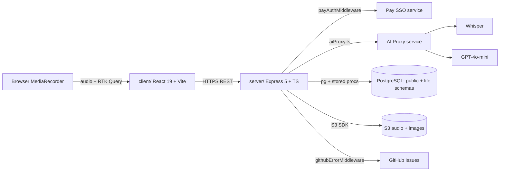

# Architecture

Life is a two-workspace monorepo: a React/Vite client and an Express/TypeScript server, with PostgreSQL behind the server and an external AI Proxy fronting Whisper and GPT-4o-mini ([README.md:30-34](https://github.com/Jeffrey-Keyser/Life/blob/master/README.md#L30-L34)).

## Component map

## Role contracts

### Client — voice + journal UI

- `client/src/App.tsx` mounts the React 19 root; routing lives in `client/src/Router.tsx` and the Redux store + RTK Query slices live under `client/src/reducers/` (`entries.api.ts`, `voice.api.ts`, `persons.api.ts`, `tags.api.ts`, etc.) ([client/src directory](https://github.com/Jeffrey-Keyser/Life/tree/master/client/src)).
- The API base is configured at build time via `VITE_API_URL` and `VITE_PAY_URL`, baked into the bundle by Vite ([README.md:64-67](https://github.com/Jeffrey-Keyser/Life/blob/master/README.md#L64-L67)).
- RTK Query's base query unwraps the standard `{ success, data }` server envelope so reducers see plain payloads ([CLAUDE.md:143-144](https://github.com/Jeffrey-Keyser/Life/blob/master/CLAUDE.md#L143-L144)).
- Graph rendering uses Cytoscape with the `cose-bilkent` layout ([client/package.json:22-23](https://github.com/Jeffrey-Keyser/Life/blob/master/client/package.json#L22-L23)).

### Server — Express app, routes, services

- `server/app.ts` is the composition root: it wires correlation IDs, session store, CORS, body parsers, Swagger UI, all routers, the GitHub-error middleware, and the final error handler ([server/app.ts:44-127](https://github.com/Jeffrey-Keyser/Life/blob/master/server/app.ts#L44-L127)).
- Routes are mounted under `/api/v1` and split by resource. Journals (nested resources: entries, persons, tags, edges, audio, images, search, time-tags) live under `server/routes/journals/` ([server/app.ts:97-110](https://github.com/Jeffrey-Keyser/Life/blob/master/server/app.ts#L97-L110)).
- Domain logic lives in `server/services/` (e.g. `voiceEntry.ts`, `aiProxy.ts`, `entries.service.ts`, `edges.service.ts`, `search.service.ts`) — routes stay thin and delegate ([server/services directory](https://github.com/Jeffrey-Keyser/Life/tree/master/server/services)).
- All AI traffic goes through `server/services/aiProxy.ts`; nothing in the server calls OpenAI directly ([README.md:84-85](https://github.com/Jeffrey-Keyser/Life/blob/master/README.md#L84-L85)).

### Middleware stack

- `correlationId` is registered first so every downstream log line carries `requestId` ([server/app.ts:56-57](https://github.com/Jeffrey-Keyser/Life/blob/master/server/app.ts#L56-L57)).
- `payAuthMiddleware` validates Pay-issued tokens and resolves them into a local Life user, auto-provisioning a row in `life.users` and a default journal on first hit ([CLAUDE.md:155-159](https://github.com/Jeffrey-Keyser/Life/blob/master/CLAUDE.md#L155-L159)).
- Rate limiting is applied generally in production and tighter on `/user/login` and `/user/register` ([server/app.ts:60-64](https://github.com/Jeffrey-Keyser/Life/blob/master/server/app.ts#L60-L64), [server/app.ts:90-91](https://github.com/Jeffrey-Keyser/Life/blob/master/server/app.ts#L90-L91)).
- `errorHandler` is last in the chain, after the GitHub-error reporter that opens issues for production exceptions ([server/app.ts:117-125](https://github.com/Jeffrey-Keyser/Life/blob/master/server/app.ts#L117-L125)).

### Database — stored procedures as the only contract

- All write paths go through PostgreSQL stored procedures; there are two schemas: `public` for application data and `life` for user mapping ([CLAUDE.md:118-141](https://github.com/Jeffrey-Keyser/Life/blob/master/CLAUDE.md#L118-L141)).
- `life.get_or_create_user(pay_uuid, email)` is the atomic upsert used during auto-provisioning ([CLAUDE.md:124](https://github.com/Jeffrey-Keyser/Life/blob/master/CLAUDE.md#L124)).
- Edges between journal entries (people/tag overlap) are bidirectional and recalculated automatically on entry change ([CLAUDE.md:107-110](https://github.com/Jeffrey-Keyser/Life/blob/master/CLAUDE.md#L107-L110)).

### Storage and observability adjuncts

- S3 (via `@aws-sdk/client-s3` and `s3-request-presigner`) stores audio and image bytes; the DB only holds object keys and dominant colors ([server/package.json:21-22](https://github.com/Jeffrey-Keyser/Life/blob/master/server/package.json#L21-L22), [CLAUDE.md:140](https://github.com/Jeffrey-Keyser/Life/blob/master/CLAUDE.md#L140)).
- Winston is the structured logger; Morgan logs HTTP lines ([server/package.json:39](https://github.com/Jeffrey-Keyser/Life/blob/master/server/package.json#L39), [server/package.json:47](https://github.com/Jeffrey-Keyser/Life/blob/master/server/package.json#L47)).
- Production exceptions are auto-reported as GitHub Issues via `@jeffrey-keyser/github-error-issues` ([server/app.ts:117-123](https://github.com/Jeffrey-Keyser/Life/blob/master/server/app.ts#L117-L123)).
