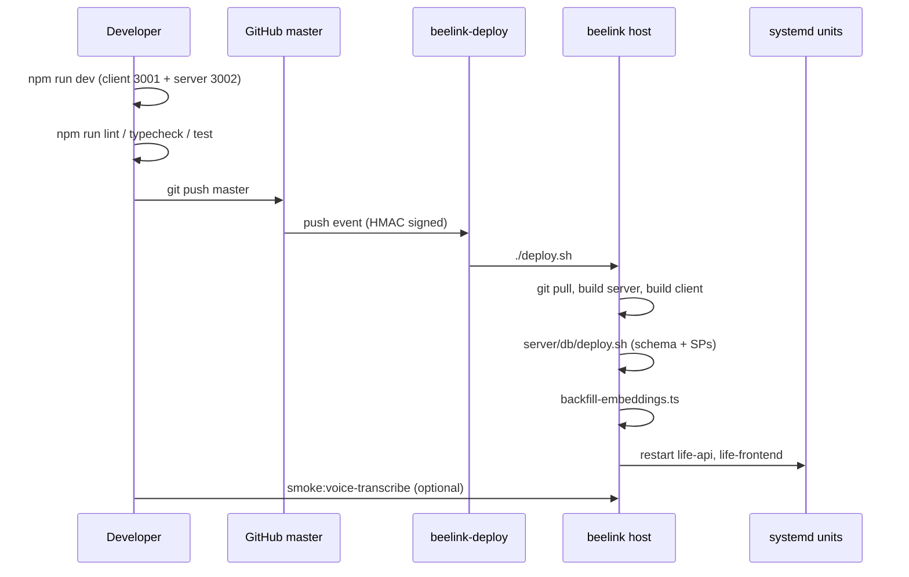

# Iteration Loop

Life ships from a single `master` branch into a self-hosted production host. The loop is short: edit locally with both halves running, run tests/typecheck/lint at the root, push to `master`, and the beelink-deploy webhook does the rest ([CLAUDE.md:79-83](https://github.com/Jeffrey-Keyser/Life/blob/master/CLAUDE.md#L79-L83)).

## The cycle, step by step

1. **Run both halves locally.** `npm run dev` at the repo root concurrently starts `dev:server` and `dev:client` ([package.json:8-10](https://github.com/Jeffrey-Keyser/Life/blob/master/package.json#L8-L10)). Defaults: client on 3001, server on 3002, API docs at `/api-docs`, debug dashboard at `/debug` ([README.md:51-56](https://github.com/Jeffrey-Keyser/Life/blob/master/README.md#L51-L56)).
2. **Edit.** Server code under `server/` (routes thin, services fat). Client code under `client/src/` (RTK Query slices in `reducers/`, screens in `containers/`, components in `components/`). New endpoints get a route, a service, a stored procedure, then an RTK Query slice on the client ([CLAUDE.md:171-176](https://github.com/Jeffrey-Keyser/Life/blob/master/CLAUDE.md#L171-L176)).
3. **Local verification.** Root scripts run both workspaces in series: `npm run lint`, `npm run typecheck`, `npm test`, optional `npm run e2e` for Playwright ([package.json:14-27](https://github.com/Jeffrey-Keyser/Life/blob/master/package.json#L14-L27)).
4. **Push to `master`.** This is the only release branch. Pushes trigger the deploy webhook ([CLAUDE.md:79-83](https://github.com/Jeffrey-Keyser/Life/blob/master/CLAUDE.md#L79-L83)). To bypass auto-deploy, include `[skip deploy]` or `[no deploy]` in the commit message ([CLAUDE.md:83](https://github.com/Jeffrey-Keyser/Life/blob/master/CLAUDE.md#L83)).
5. **`deploy.sh` runs on the beelink host.** It unsets `NODE_ENV` so dev deps install, pulls, builds the server, prepares the local embedding model, builds the client with production `VITE_*` values, runs DB deploy, runs the idempotent synopsis embedding backfill, then restarts both systemd units ([deploy.sh:4-37](https://github.com/Jeffrey-Keyser/Life/blob/master/deploy.sh#L4-L37)).
6. **DB changes apply in order.** `server/db/deploy.sh` applies `schema/`, then `migrations/` (append-only), then `stored_procedures/` (re-applyable) ([docs/DEPLOYMENT.md:77-85](https://github.com/Jeffrey-Keyser/Life/blob/master/docs/DEPLOYMENT.md#L77-L85)).
7. **Smoke test.** The `smoke:voice-transcribe` script exercises the full transcription path against production; non-zero exit codes distinguish failure from config errors ([docs/DEPLOYMENT.md:49-65](https://github.com/Jeffrey-Keyser/Life/blob/master/docs/DEPLOYMENT.md#L49-L65), [server/package.json:18](https://github.com/Jeffrey-Keyser/Life/blob/master/server/package.json#L18)).

## Notes on the loop

- There is no PR-required branch protection encoded here; the canonical path is `git push master` → webhook ([CLAUDE.md:79-83](https://github.com/Jeffrey-Keyser/Life/blob/master/CLAUDE.md#L79-L83)).
- Client tests are intentionally scoped to logic only — DOM/render tests are banned by policy ([CLAUDE.md:42-43](https://github.com/Jeffrey-Keyser/Life/blob/master/CLAUDE.md#L42-L43)).
- The `terraform/` directory exists but is **not** the active production path; treat it as historical until intentionally revived ([docs/DEPLOYMENT.md:73-75](https://github.com/Jeffrey-Keyser/Life/blob/master/docs/DEPLOYMENT.md#L73-L75)).
