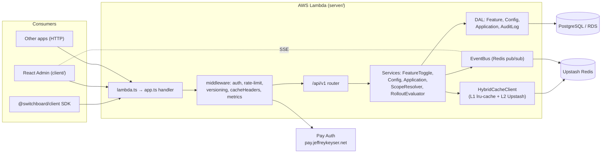

# Architecture

Switchboard is a three-surface repo: a serverless Express backend (`server/`), a React admin app (`client/`), and a publishable SDK (`client-sdk/`) ([README.md:155-188](https://github.com/Jeffrey-Keyser/Switchboard/blob/main/README.md#L155-L188)).

## Component map

## Role contracts

### Lambda entry
`server/lambda.ts` re-exports the async `handler` from `server/app.ts`, which builds the Express app once per cold start via `createServerlessApp` from `@jeffrey-keyser/express-server-factory` and caches the result ([server/lambda.ts:1](https://github.com/Jeffrey-Keyser/Switchboard/blob/main/server/lambda.ts#L1), [server/app.ts:223-237](https://github.com/Jeffrey-Keyser/Switchboard/blob/main/server/app.ts#L223-L237)).

### Versioned router
All product endpoints live under `/api/v1/*`. `server/routes/versions/v1/index.ts` mounts the eight sub-routers: `auth`, `diagnostics`, `cache`, `features`, `configs`, `applications`, `audit-logs`, `realtime` ([server/routes/versions/v1/index.ts:46-76](https://github.com/Jeffrey-Keyser/Switchboard/blob/main/server/routes/versions/v1/index.ts#L46-L76)). Version negotiation, legacy redirects, and validation are middleware applied before routing ([server/app.ts:191-202](https://github.com/Jeffrey-Keyser/Switchboard/blob/main/server/app.ts#L191-L202)).

### Domain services
- **FeatureToggleService** — CRUD + toggle of feature flags, publishes events on mutation ([server/services/FeatureToggleService.ts](https://github.com/Jeffrey-Keyser/Switchboard/blob/main/server/services/FeatureToggleService.ts), [CLAUDE.md:241-252](https://github.com/Jeffrey-Keyser/Switchboard/blob/main/CLAUDE.md#L241-L252)).
- **ConfigService** — typed config values (string/number/boolean/json) with scope resolution ([server/services/ConfigService.ts](https://github.com/Jeffrey-Keyser/Switchboard/blob/main/server/services/ConfigService.ts)).
- **ApplicationService** — applications + API key issuance/rotation (bcrypt-hashed) ([server/services/ApplicationService.ts](https://github.com/Jeffrey-Keyser/Switchboard/blob/main/server/services/ApplicationService.ts), [README.md:598-610](https://github.com/Jeffrey-Keyser/Switchboard/blob/main/README.md#L598-L610)).
- **ScopeResolver** — collapses user → application → global lookups into a single answer ([server/services/ScopeResolver.ts](https://github.com/Jeffrey-Keyser/Switchboard/blob/main/server/services/ScopeResolver.ts), [README.md:196-220](https://github.com/Jeffrey-Keyser/Switchboard/blob/main/README.md#L196-L220)).
- **RolloutEvaluator** — evaluates progressive-rollout rules per request ([server/services/RolloutEvaluator.ts](https://github.com/Jeffrey-Keyser/Switchboard/blob/main/server/services/RolloutEvaluator.ts)).
- **EventBus** — Redis pub/sub fan-out for SSE; buffers last 1000 events for replay ([server/services/EventBus.ts](https://github.com/Jeffrey-Keyser/Switchboard/blob/main/server/services/EventBus.ts), [CLAUDE.md:227-260](https://github.com/Jeffrey-Keyser/Switchboard/blob/main/CLAUDE.md#L227-L260)).

### Cache stack
`server/services/cache/` exposes `HybridCacheClient` that composes `InMemoryCacheClient` (L1, `lru-cache`) and `UpstashCacheClient` (L2, REST). Strategy selectable via `CACHE_STRATEGY` env var ([server/services/cache](https://github.com/Jeffrey-Keyser/Switchboard/blob/main/server/services/cache), [CLAUDE.md:343-372](https://github.com/Jeffrey-Keyser/Switchboard/blob/main/CLAUDE.md#L343-L372)).

### Data access layer
DALs extend `BaseDal` for parameterized SQL + transactions; `pg` is the only driver. One DAL per aggregate: `FeatureToggleDal`, `ConfigValueDal`, `ApplicationDal`, `AuditLogDal` ([server/dal](https://github.com/Jeffrey-Keyser/Switchboard/blob/main/server/dal), [CLAUDE.md:469-473](https://github.com/Jeffrey-Keyser/Switchboard/blob/main/CLAUDE.md#L469-L473)).

### Auth
`setupPayAuth` from `@jeffrey-keyser/pay-auth-integration` is wired in `server/app.ts:48-88`, proxying JWT/session validation to the external Pay service. Public routes (`/`, `/ping`, `/api-docs`, etc.) bypass auth via `publicRoutes` config ([server/app.ts:48-88](https://github.com/Jeffrey-Keyser/Switchboard/blob/main/server/app.ts#L48-L88)). API keys for consumer routes are validated by `middleware/apiKeyAuth.ts` ([server/middleware/apiKeyAuth.ts](https://github.com/Jeffrey-Keyser/Switchboard/blob/main/server/middleware/apiKeyAuth.ts)).

### Client
React + Redux Toolkit + RTK Query under `client/src/`, split into smart `containers/` and presentational `components/`; uses Vite ([client/](https://github.com/Jeffrey-Keyser/Switchboard/blob/main/client), [CLAUDE.md:436-448](https://github.com/Jeffrey-Keyser/Switchboard/blob/main/CLAUDE.md#L436-L448)).

### SDK
`client-sdk/src/SwitchboardClient.ts` is the public class; `client-sdk/src/react/` provides `SwitchboardProvider`, `useFeature`, `useConfig`; bundled with Rollup ([client-sdk/src](https://github.com/Jeffrey-Keyser/Switchboard/blob/main/client-sdk/src), [client-sdk/package.json:13-14](https://github.com/Jeffrey-Keyser/Switchboard/blob/main/client-sdk/package.json#L13-L14)).
