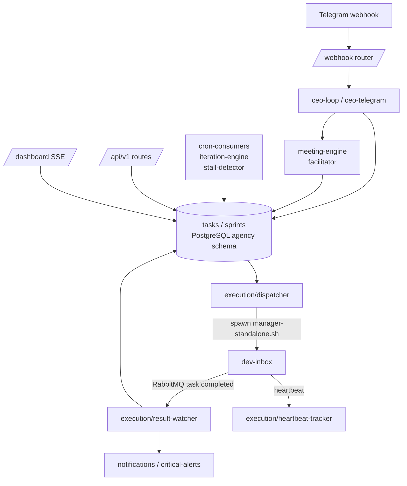

# Architecture

Agency HQ is a single Express service whose process owns several long-running internal subsystems: the HTTP API, a meeting engine, a dispatch/result watcher pair that bridges dev-inbox over RabbitMQ, and a set of cron-style background services ([src/app.ts:91-136](https://github.com/Jeffrey-Keyser/agency-hq/blob/main/src/app.ts#L91-L136)).

## Role contracts

- **HTTP app shell.** `src/app.ts` builds the Express application from `@jeffrey-keyser/express-server-factory`, mounts `/`, `/dashboard`, and `/api/v1` routers, registers the database and result-watcher health checks, and applies correlation-id + version-negotiation middleware ([src/app.ts:8-95](https://github.com/Jeffrey-Keyser/agency-hq/blob/main/src/app.ts#L8-L95)).
- **API surface.** Versioned routes live under `src/routes/versions/v1/` and are aggregated through `src/routes/versions/v1` index; the dashboard UI is served from `src/routes/dashboard-ui.ts` ([src/app.ts:8-10](https://github.com/Jeffrey-Keyser/agency-hq/blob/main/src/app.ts#L8-L10)).
- **Meeting engine.** `src/meeting-engine/facilitator.ts` runs the facilitator-driven discourse loop; `agent-invoker.ts`, `briefing-builder.ts`, `context-fetcher.ts`, and `artifact-extractor.ts` provide turn execution, prompt assembly, contextual lookup, and structured-output extraction ([src/meeting-engine/index.ts:1-6](https://github.com/Jeffrey-Keyser/agency-hq/blob/main/src/meeting-engine/index.ts#L1-L6)).
- **Execution / dispatch.** `src/execution/dispatcher.ts` packages a task into a prompt and `spawn`s `/home/jkeyser/dev-inbox/scripts/manager-standalone.sh`; concurrency is bounded by `dispatch_slots` rows ([src/execution/dispatcher.ts:28](https://github.com/Jeffrey-Keyser/agency-hq/blob/main/src/execution/dispatcher.ts#L28), [CLAUDE.md:50-51](https://github.com/Jeffrey-Keyser/agency-hq/blob/main/CLAUDE.md#L50-L51)).
- **Result + heartbeat.** `result-watcher.ts` consumes dev-inbox completion events and reconciles task status; `heartbeat-tracker.ts` watches the heartbeat queue and surfaces stalls; `retry-scheduler.ts` re-queues recoverable failures ([src/execution/index.ts:26-53](https://github.com/Jeffrey-Keyser/agency-hq/blob/main/src/execution/index.ts#L26-L53)).
- **Background services.** `services/iteration-engine.ts` ticks every 5 minutes (gated by an autonomy rule) to detect stalled slots; `services/ghost-detector.ts`, `services/stale-meeting-detector.ts`, `services/decision-auto-close.ts`, `services/critical-alerts.ts`, and `services/cron-consumers.ts` run additional housekeeping ([src/services/iteration-engine.ts:7-34](https://github.com/Jeffrey-Keyser/agency-hq/blob/main/src/services/iteration-engine.ts#L7-L34)).
- **Data access.** All persistence flows through `src/dal/*` modules on top of `pg` and the `agency` PostgreSQL schema, with the connection pool exported from `src/db/connection.ts` ([src/app.ts:14](https://github.com/Jeffrey-Keyser/agency-hq/blob/main/src/app.ts#L14), [CLAUDE.md:39-58](https://github.com/Jeffrey-Keyser/agency-hq/blob/main/CLAUDE.md#L39-L58)).
- **Realtime push.** `src/sse/` powers SSE channels for the dashboard, dispatch events, and meeting transcript streams ([src/app.ts:55-65](https://github.com/Jeffrey-Keyser/agency-hq/blob/main/src/app.ts#L55-L65)).
