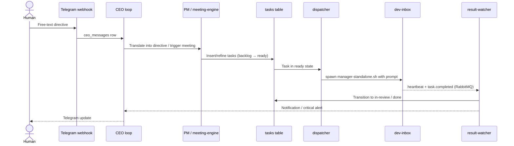

# Iteration Loop

The agency-hq iteration loop turns a free-text human directive into a tracked task, dispatches it to dev-inbox, and reconciles the result back into the scrum board.

## Step-by-step, cited

1. **Human directive lands.** The Telegram webhook router writes a `ceo_messages` row; the CEO loop service consumes it ([README.md:47](https://github.com/Jeffrey-Keyser/agency-hq/blob/main/README.md#L47), [src/services/ceo-loop.ts](https://github.com/Jeffrey-Keyser/agency-hq/blob/main/src/services/ceo-loop.ts)).
2. **Directive translation.** Strategic directives are stored in `ceo_directives` (build/pause/pursue/deprioritize/investigate/general) and the PM translates them into tasks or sprints ([CLAUDE.md:56-58](https://github.com/Jeffrey-Keyser/agency-hq/blob/main/CLAUDE.md#L56-L58)).
3. **Optional meeting.** A `brainstorm`, `implementation`, `backlog-grooming`, `standup`, or `retro` meeting can be triggered to refine work; the meeting engine emits structured output that the artifact extractor turns into task updates ([CLAUDE.md:103-121](https://github.com/Jeffrey-Keyser/agency-hq/blob/main/CLAUDE.md#L103-L121), [src/meeting-engine/index.ts:1-6](https://github.com/Jeffrey-Keyser/agency-hq/blob/main/src/meeting-engine/index.ts#L1-L6)).
4. **Scrum board transitions.** Tasks move through `backlog → ready → in-progress → in-review → done`; the `task_status_log` migration captures every transition ([CLAUDE.md:40](https://github.com/Jeffrey-Keyser/agency-hq/blob/main/CLAUDE.md#L40), [migrations/1710600052200_add-task-status-log.ts](https://github.com/Jeffrey-Keyser/agency-hq/blob/main/migrations/1710600052200_add-task-status-log.ts)).
5. **Dispatch.** The dispatcher pulls a `ready` task, builds a prompt, claims a `dispatch_slots` row, and spawns dev-inbox via `manager-standalone.sh` ([src/execution/dispatcher.ts:1-30](https://github.com/Jeffrey-Keyser/agency-hq/blob/main/src/execution/dispatcher.ts#L1-L30)).
6. **Heartbeat + completion.** dev-inbox emits heartbeats and a final `task.completed` event over RabbitMQ; the result-watcher acks the message and updates the task ([src/execution/index.ts:26-49](https://github.com/Jeffrey-Keyser/agency-hq/blob/main/src/execution/index.ts#L26-L49)).
7. **Retry / escalation.** Recoverable failures are re-enqueued by `retry-scheduler.ts`; unrecoverable ones fire a Telegram critical alert via `critical-alerts.ts` ([src/execution/index.ts:53](https://github.com/Jeffrey-Keyser/agency-hq/blob/main/src/execution/index.ts#L53), [src/execution/dispatcher.ts:9](https://github.com/Jeffrey-Keyser/agency-hq/blob/main/src/execution/dispatcher.ts#L9)).
8. **Iteration ticks.** Every 5 minutes the iteration engine, gated by the `iteration-engine-enabled` autonomy rule, sweeps for stalled slots and reports them ([src/services/iteration-engine.ts:7-34](https://github.com/Jeffrey-Keyser/agency-hq/blob/main/src/services/iteration-engine.ts#L7-L34)).
9. **Visibility.** Progress is exposed through the `/dashboard` SSE stream and the `/api/v1/dispatch-events` channel ([src/app.ts:55-64](https://github.com/Jeffrey-Keyser/agency-hq/blob/main/src/app.ts#L55-L64)).
