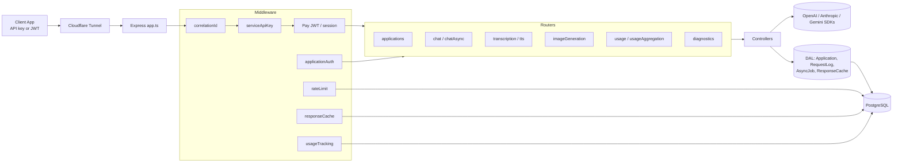

# Architecture

The server is a single Express 5 process composed by `@jeffrey-keyser/express-server-factory`. `app.ts` registers routers, middleware, auth, and Swagger; `bin/www.ts` (dev) and `dist/bin/www.js` (prod) boot it ([server/app.ts:1-30](https://github.com/Jeffrey-Keyser/ai-proxy/blob/main/server/app.ts#L1-L30), [server/package.json:6-9](https://github.com/Jeffrey-Keyser/ai-proxy/blob/main/server/package.json#L6-L9)).

## Role contracts

**Entry point / composition.** `app.ts` wires routes, middleware, Pay auth, health checks, Swagger, and error handlers into a `ServerConfig` consumed by `createExpressApp` ([server/app.ts:114-211](https://github.com/Jeffrey-Keyser/ai-proxy/blob/main/server/app.ts#L114-L211)). The app instance is cached and lazily resolved via `getExpressApp` ([server/app.ts:278-290](https://github.com/Jeffrey-Keyser/ai-proxy/blob/main/server/app.ts#L278-L290)).

**Routers (`server/routes/`).** Thin Express routers declare HTTP shape and JSDoc Swagger annotations, delegating logic to controllers. Mount points are declared in `app.ts` — `/v1/applications`, `/v1/chat`, `/v1/chat/async`, `/v1/transcription`, `/v1/tts`, `/v1/image`, `/v1/diagnostics`, `/v1` (usage), `/api/v1` (usage aggregation) ([server/app.ts:197-210](https://github.com/Jeffrey-Keyser/ai-proxy/blob/main/server/app.ts#L197-L210)).

**Controllers (`server/controllers/`).** Provider-call orchestration lives here: `ApplicationsController`, `ChatController`, `ImageGenerationController`, `UsageController`. Controllers translate validated input into provider SDK calls and DAL writes ([server/controllers/ChatController.ts](https://github.com/Jeffrey-Keyser/ai-proxy/blob/main/server/controllers/ChatController.ts)).

**Middleware (`server/middleware/`).**
- `correlationId` stamps each request with an ID for log tracing, mounted first ([server/app.ts:250-253](https://github.com/Jeffrey-Keyser/ai-proxy/blob/main/server/app.ts#L250-L253)).
- `serviceApiKey` enforces a coarse-grained gate via `AI_PROXY_API_KEY`, exempting public routes ([server/app.ts:254-256](https://github.com/Jeffrey-Keyser/ai-proxy/blob/main/server/app.ts#L254-L256)).
- `applicationAuth` resolves `Authorization: Bearer app_live_…` keys to an `Application` row ([server/middleware/applicationAuth.ts](https://github.com/Jeffrey-Keyser/ai-proxy/blob/main/server/middleware/applicationAuth.ts)).
- `rateLimit` and `responseCache` short-circuit before the provider call ([server/middleware/rateLimit.ts](https://github.com/Jeffrey-Keyser/ai-proxy/blob/main/server/middleware/rateLimit.ts), [server/middleware/responseCache.ts](https://github.com/Jeffrey-Keyser/ai-proxy/blob/main/server/middleware/responseCache.ts)).
- `usageTracking` runs after each request to write a `RequestLog` row ([server/middleware/usageTracking.ts](https://github.com/Jeffrey-Keyser/ai-proxy/blob/main/server/middleware/usageTracking.ts)).

**DAL (`server/dal/`).** `ApplicationDal`, `RequestLogDal`, `AsyncJobDal`, `ResponseCacheDal` extend a `BaseDal` from `@jeffrey-keyser/database-base-config` and execute parameterized SQL against the shared `pg.Pool` ([server/dal/ApplicationDal.ts](https://github.com/Jeffrey-Keyser/ai-proxy/blob/main/server/dal/ApplicationDal.ts), [server/dal/RequestLogDal.ts](https://github.com/Jeffrey-Keyser/ai-proxy/blob/main/server/dal/RequestLogDal.ts)).

**Domain (`server/domain/`).** Entities, value objects, and repository interfaces — the layer that keeps controllers free of raw SQL ([server/domain/README.md](https://github.com/Jeffrey-Keyser/ai-proxy/blob/main/server/domain/README.md)).

**Infrastructure (`server/infrastructure/`).** Provider clients and diagnostics adapters live here, isolating SDK surfaces from controllers ([server/infrastructure/providers](https://github.com/Jeffrey-Keyser/ai-proxy/blob/main/server/infrastructure/providers)).

**Async worker (`server/worker.ts`).** Long-running chat jobs are accepted by `/v1/chat/async` and processed by the worker reading `AsyncJobDal` ([server/routes/chatAsync.ts](https://github.com/Jeffrey-Keyser/ai-proxy/blob/main/server/routes/chatAsync.ts), [server/worker.ts](https://github.com/Jeffrey-Keyser/ai-proxy/blob/main/server/worker.ts)).

**Error mapping.** A custom handler block in `app.ts` maps cross-package `UnauthorizedError` / `ForbiddenError` (from `@jeffrey-keyser/api-errors`) to the right HTTP status, working around the `instanceof` boundary between `express-server-factory` and `api-errors` ([server/app.ts:224-247](https://github.com/Jeffrey-Keyser/ai-proxy/blob/main/server/app.ts#L224-L247)). After-stage `githubErrorMiddleware` posts uncaught errors as issues to this repo ([server/app.ts:272-274](https://github.com/Jeffrey-Keyser/ai-proxy/blob/main/server/app.ts#L272-L274)).
