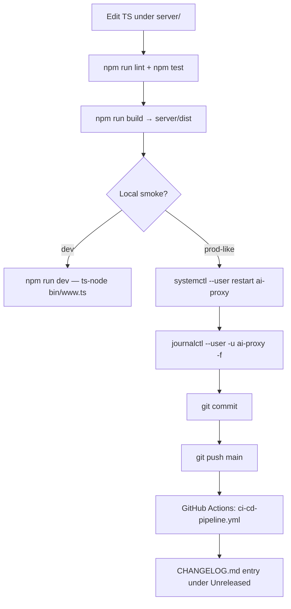

# Iteration Loop

This repo is a single-developer service with a tight loop: edit TypeScript, run tests, build, restart the systemd unit. CI runs on every push, but production is a homelab box rather than Lambda.

## Steps cited to source

1. **Edit + lint + test.** ESLint v9 flat config and Jest run from the `server/` workspace ([server/package.json:10-13](https://github.com/Jeffrey-Keyser/ai-proxy/blob/main/server/package.json#L10-L13), [CLAUDE.md:38-58](https://github.com/Jeffrey-Keyser/ai-proxy/blob/main/CLAUDE.md#L38-L58)). Tests live in `server/tests/__tests__/` with unit and integration subdirectories ([CLAUDE.md:330-336](https://github.com/Jeffrey-Keyser/ai-proxy/blob/main/CLAUDE.md#L330-L336)).
2. **Build.** `npm run build` invokes `tsc` and emits to `server/dist/` ([server/package.json:8](https://github.com/Jeffrey-Keyser/ai-proxy/blob/main/server/package.json#L8), [CLAUDE.md:181](https://github.com/Jeffrey-Keyser/ai-proxy/blob/main/CLAUDE.md#L181)).
3. **Local smoke.** Dev uses `ts-node ./bin/www.ts` on port 3001 ([server/package.json:7](https://github.com/Jeffrey-Keyser/ai-proxy/blob/main/server/package.json#L7), [README.md:111-113](https://github.com/Jeffrey-Keyser/ai-proxy/blob/main/README.md#L111-L113)). Swagger UI at `/api-docs` lets you exercise endpoints interactively ([README.md:22](https://github.com/Jeffrey-Keyser/ai-proxy/blob/main/README.md#L22)).
4. **Restart prod.** After build, `systemctl --user restart ai-proxy` reloads the running instance ([CLAUDE.md:168-170](https://github.com/Jeffrey-Keyser/ai-proxy/blob/main/CLAUDE.md#L168-L170)).
5. **Observe.** `journalctl --user -u ai-proxy -f` tails logs; the boot banner echoes service version and Pay-service URL ([CLAUDE.md:174-176](https://github.com/Jeffrey-Keyser/ai-proxy/blob/main/CLAUDE.md#L174-L176), [server/app.ts:35-42](https://github.com/Jeffrey-Keyser/ai-proxy/blob/main/server/app.ts#L35-L42)).
6. **Commit and push.** Recent commits show the cadence: focused fixes against `main` (e.g., `fix(auth): add /v1/tts to application-auth route prefixes`). Conventional Commit prefixes are the norm.
7. **CI.** `.github/workflows/ci-cd-pipeline.yml` runs on push; `terraform_deploy.yml` is `workflow_dispatch` only ([CLAUDE.md:342-348](https://github.com/Jeffrey-Keyser/ai-proxy/blob/main/CLAUDE.md#L342-L348)).
8. **Changelog.** Notable changes are added under `## [Unreleased]` in `CHANGELOG.md` and graduated when a version is cut ([CHANGELOG.md:1-15](https://github.com/Jeffrey-Keyser/ai-proxy/blob/main/CHANGELOG.md#L1-L15)).

## Failure-recovery side-loop

When a request raises an uncaught error in production, `githubErrorMiddleware` opens (or comments on) an issue in `Jeffrey-Keyser/ai-proxy`, which becomes the next item in the loop ([server/app.ts:272-274](https://github.com/Jeffrey-Keyser/ai-proxy/blob/main/server/app.ts#L272-L274)).
