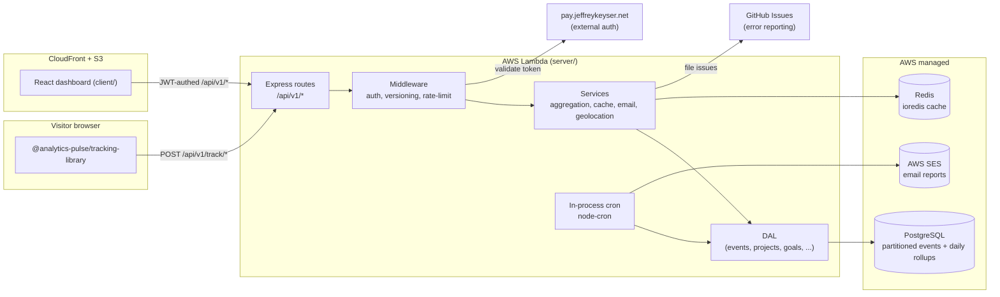

# Architecture

Analytics-Pulse is a three-surface system (tracker → API → dashboard) backed by Postgres and a handful of in-process cron jobs. The API is the only stateful actor; the tracker and dashboard are stateless clients.

## Component map

## Role contracts

### `server/app.ts` — composition root

The Express app is assembled by `createServerlessAppSync` from `@jeffrey-keyser/express-server-factory`, wiring CORS, sessions, Pay auth, Swagger, and the v1 router in one config block ([server/app.ts:1-5](https://github.com/Jeffrey-Keyser/analytics-pulse/blob/main/server/app.ts#L1-L5), [server/app.ts:99-247](https://github.com/Jeffrey-Keyser/analytics-pulse/blob/main/server/app.ts#L99-L247)). Cron jobs auto-start at import time ([server/app.ts:34-36](https://github.com/Jeffrey-Keyser/analytics-pulse/blob/main/server/app.ts#L34-L36)).

### `server/routes/versions/v1/index.ts` — API surface

All public traffic flows through `/api/v1/*`. The router splits routes into three tiers — public (API-key or no auth) for `/track`, `/errors`, `/unsubscribe`, `/diagnostics`; user-authed for projects/analytics/goals; admin-only for `/aggregation`, `/partitions`, `/performance` ([server/routes/versions/v1/index.ts:73-149](https://github.com/Jeffrey-Keyser/analytics-pulse/blob/main/server/routes/versions/v1/index.ts#L73-L149)).

### `server/middleware/versioning.ts` — version negotiation

Adds the `API-Version` response header, redirects legacy `/v1/*` to `/api/v1/*` (301), and rejects unsupported versions ([server/app.ts:217-223](https://github.com/Jeffrey-Keyser/analytics-pulse/blob/main/server/app.ts#L217-L223)).

### `server/services/*` — business logic

One file per domain capability: `aggregation.ts` rolls up daily metrics, `cache.ts` wraps `ioredis` with an in-memory fallback, `goalTracking.ts` evaluates goal completions, `emailReporting.ts` builds and dispatches scheduled reports via SES, `errorReporting.ts` opens GitHub Issues for runtime errors, `geolocation.ts` resolves IPs with `geoip-lite`, `userAgent.ts` parses UA strings, `apiKeys.ts` generates and validates bcrypt-hashed keys ([README.md:62-71](https://github.com/Jeffrey-Keyser/analytics-pulse/blob/main/README.md#L62-L71), [server/package.json:17-44](https://github.com/Jeffrey-Keyser/analytics-pulse/blob/main/server/package.json#L17-L44)).

### `server/dal/*` — data access

DAL classes extend a `BaseDal` from `@jeffrey-keyser/database-base-config`, exposing parameterised SQL and `withTransaction` helpers. Tables include `events` (partitioned monthly), `analytics_daily` (pre-computed rollups), `projects`, `api_keys`, `sessions`, `goals`, `campaigns`, `email_preferences`, `email_reports`, `error_reports`, `project_settings`, `diagnostics`, `system` ([CLAUDE.md](https://github.com/Jeffrey-Keyser/analytics-pulse/blob/main/CLAUDE.md), [README.md:67-71](https://github.com/Jeffrey-Keyser/analytics-pulse/blob/main/README.md#L67-L71)).

### `server/cron/*` — scheduled jobs

Three jobs auto-register on app import:
- `dailyAggregation.ts` — runs `0 1 * * *` UTC and rolls up the previous day's events ([server/cron/dailyAggregation.ts:32-36](https://github.com/Jeffrey-Keyser/analytics-pulse/blob/main/server/cron/dailyAggregation.ts#L32-L36)).
- `partitionMaintenance.ts` — creates next-month and drops stale partitions ([server/app.ts:35](https://github.com/Jeffrey-Keyser/analytics-pulse/blob/main/server/app.ts#L35)).
- `emailReporting.ts` — dispatches daily / weekly / monthly reports per project preferences ([server/app.ts:36](https://github.com/Jeffrey-Keyser/analytics-pulse/blob/main/server/app.ts#L36)).

### `client/src` — React dashboard

Smart `containers/` own state, dumb `components/` render UI; data fetching goes through RTK Query slices in `client/src/reducers/`. Auth state is managed by `@jeffrey-keyser/pay-auth-integration/client/react` ([README.md:632-641](https://github.com/Jeffrey-Keyser/analytics-pulse/blob/main/README.md#L632-L641), [client/package.json:7-25](https://github.com/Jeffrey-Keyser/analytics-pulse/blob/main/client/package.json#L7-L25)).

### `tracking-library/` — browser SDK

Rollup-built ESM / CJS / UMD bundles published as `@analytics-pulse/tracking-library`. Posts events to `/api/v1/track/event` or `/api/v1/track/batch`, authenticated by an `ap_*` API key ([tracking-library/package.json:1-10](https://github.com/Jeffrey-Keyser/analytics-pulse/blob/main/tracking-library/package.json#L1-L10), [README.md:108-135](https://github.com/Jeffrey-Keyser/analytics-pulse/blob/main/README.md#L108-L135)).

### `terraform/` — infrastructure

Modules under `terraform/modules/`, environment-specific config under `terraform/accounts/us-east-1/`. Provisions Lambda, ECR, S3, CloudFront, Route 53, ACM, CloudWatch, IAM, VPC ([README.md:1022-1043](https://github.com/Jeffrey-Keyser/analytics-pulse/blob/main/README.md#L1022-L1043)).
