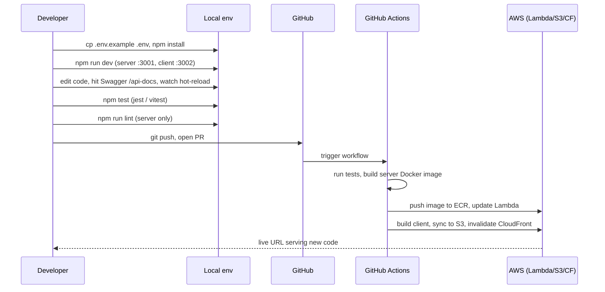

# Iteration Loop

The cycle differs slightly per surface (server / client / tracking SDK) but all three share the same gate: lint + tests locally, PR to GitHub, then a workflow-driven build that lands on AWS.

## Typical change cycle

## Step-by-step references

1. **Environment setup.** Copy `server/.env.example` → `server/.env`; the server's `config/env.ts` validates required vars at startup and throws if any are missing ([README.md:940-956](https://github.com/Jeffrey-Keyser/analytics-pulse/blob/main/README.md#L940-L956)).
2. **Run locally.** `cd server && npm run dev` for the API (port 3001) and `cd client && npm run dev` for the dashboard, or `./scripts/docker-dev.sh` to bring up server + client + PostgreSQL together with hot-reload ([README.md:813-846](https://github.com/Jeffrey-Keyser/analytics-pulse/blob/main/README.md#L813-L846)).
3. **Add API endpoint.** Drop a route in `server/routes/`, add JSDoc for Swagger, register it in `server/routes/versions/v1/index.ts`, then mirror types in `server/types/` and add an RTK Query slice in `client/src/reducers/` ([CLAUDE.md](https://github.com/Jeffrey-Keyser/analytics-pulse/blob/main/CLAUDE.md), [server/routes/versions/v1/index.ts:73-149](https://github.com/Jeffrey-Keyser/analytics-pulse/blob/main/server/routes/versions/v1/index.ts#L73-L149)).
4. **Database changes.** Generate a migration with `npx sequelize-cli migration:generate`, apply with `server/db/deploy.sh`; new DAL classes extend `BaseDal` with `withTransaction` for atomicity ([README.md:960-987](https://github.com/Jeffrey-Keyser/analytics-pulse/blob/main/README.md#L960-L987)).
5. **Test.** Server uses Jest + Supertest (`server/tests/__tests__/{unit,integration}`); client uses Vitest + Testing Library; the SDK uses Jest with `jest-environment-jsdom` ([README.md:997-1018](https://github.com/Jeffrey-Keyser/analytics-pulse/blob/main/README.md#L997-L1018), [tracking-library/package.json:46-51](https://github.com/Jeffrey-Keyser/analytics-pulse/blob/main/tracking-library/package.json#L46-L51)).
6. **Lint.** Server runs ESLint v9 flat config; client relies on react-app eslintConfig in `package.json` ([server/package.json:10](https://github.com/Jeffrey-Keyser/analytics-pulse/blob/main/server/package.json#L10), [client/package.json:40-45](https://github.com/Jeffrey-Keyser/analytics-pulse/blob/main/client/package.json#L40-L45)).
7. **Open PR.** Push to GitHub triggers CI/CD; the Docker image is built and pushed to ECR, Lambda is updated with the new image, the client is built and synced to S3, and CloudFront cache is invalidated ([README.md:1041-1042](https://github.com/Jeffrey-Keyser/analytics-pulse/blob/main/README.md#L1041-L1042)). Terraform changes are gated behind manual `workflow_dispatch` ([README.md:1042](https://github.com/Jeffrey-Keyser/analytics-pulse/blob/main/README.md#L1042)).
8. **Contribution standards.** See `CONTRIBUTING.md` for code-of-conduct and PR conventions ([CONTRIBUTING.md:1-17](https://github.com/Jeffrey-Keyser/analytics-pulse/blob/main/CONTRIBUTING.md#L1-L17)).

## Bootstrap loop (first-time deploy)

For a fresh clone targeting a new domain, the fast path is `./scripts/new-service-auto.sh <name> <domain>`, which validates prerequisites, runs project setup, applies Terraform, builds and pushes the ECR image, then commits and pushes to trigger CI/CD — target time under 10 minutes ([README.md:238-291](https://github.com/Jeffrey-Keyser/analytics-pulse/blob/main/README.md#L238-L291)).
