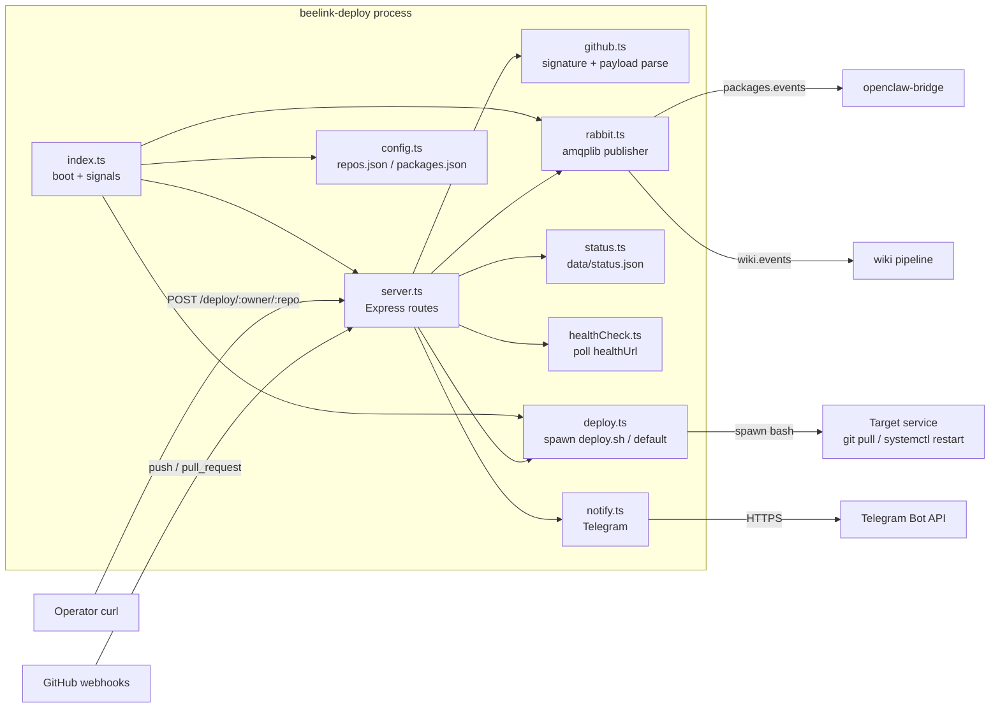

# Architecture

Single Node.js process. One Express app, one optional RabbitMQ channel, an on-disk status file, an in-memory deploy-log ring buffer. No database, no queue worker — this process is purely a producer of side effects.

## Component diagram

## Roles

**`src/index.ts` — boot + signals.** Loads config, optionally connects to RabbitMQ when at least one package is configured, mounts the Express app, wires `SIGHUP`/`SIGUSR2` to hot-reload repo config, and wires `SIGTERM`/`SIGINT` to drain in-flight deploys for up to 240 s before exit ([src/index.ts:6-55](https://github.com/Jeffrey-Keyser/beelink-deploy/blob/main/src/index.ts#L6-L55)).

**`src/server.ts` — Express routes.** Owns `/health`, `/api/status`, `/repos`, `/webhook`, `/deploy/:owner/:repo`, `/deploy/:owner/:repo/logs`. Uses a raw-body verify hook so HMAC can be checked against bytes, not parsed JSON ([src/server.ts:76-80](https://github.com/Jeffrey-Keyser/beelink-deploy/blob/main/src/server.ts#L76-L80)). Stores live config on `app.set('deployConfig', …)` so signal handlers and routes share a single mutable reference ([src/server.ts:72-73](https://github.com/Jeffrey-Keyser/beelink-deploy/blob/main/src/server.ts#L72-L73), [src/index.ts:21-31](https://github.com/Jeffrey-Keyser/beelink-deploy/blob/main/src/index.ts#L21-L31)).

**`src/config.ts` — config loader.** Reads three JSON files from `config/` (or `$CONFIG_DIR`): `config.json` for port/host, `repos.json` for service repos, `packages.json` for package repos. Requires `RABBITMQ_URL` env var or throws ([src/config.ts:31-65](https://github.com/Jeffrey-Keyser/beelink-deploy/blob/main/src/config.ts#L31-L65)). `reloadRepos()` re-reads on signal without restarting ([src/config.ts:70-84](https://github.com/Jeffrey-Keyser/beelink-deploy/blob/main/src/config.ts#L70-L84)).

**`src/github.ts` — payload + signature.** `validateSignature` uses `timingSafeEqual` against the `sha256=` hex digest ([src/github.ts:6-28](https://github.com/Jeffrey-Keyser/beelink-deploy/blob/main/src/github.ts#L6-L28)). `parsePushEvent` and `parsePullRequestEvent` narrow the unknown body to typed shapes; if narrowing fails the route returns 400 ([src/github.ts:60-127](https://github.com/Jeffrey-Keyser/beelink-deploy/blob/main/src/github.ts#L60-L127)).

**`src/deploy.ts` — deploy runner.** Spawns `bash deploy.sh` if the repo provides one; otherwise runs the default `git pull` / `npm ci --production` / `sudo systemctl restart <service>` sequence ([src/deploy.ts:141-160](https://github.com/Jeffrey-Keyser/beelink-deploy/blob/main/src/deploy.ts#L141-L160)). Tracks an `inflightDeploys` counter so shutdown can wait for them to drain ([src/deploy.ts:25-54](https://github.com/Jeffrey-Keyser/beelink-deploy/blob/main/src/deploy.ts#L25-L54)). Keeps the last 20 deploy log entries per repo in a `Map` for `/deploy/:owner/:repo/logs` ([src/deploy.ts:21-78](https://github.com/Jeffrey-Keyser/beelink-deploy/blob/main/src/deploy.ts#L21-L78)). Optional `DEPLOY_WEBHOOK_URL` posts truncated failure payloads ([src/deploy.ts:90-119](https://github.com/Jeffrey-Keyser/beelink-deploy/blob/main/src/deploy.ts#L90-L119)).

**`src/rabbit.ts` — publisher.** Asserts two durable topic exchanges: `packages.events` and `wiki.events` ([src/rabbit.ts:10-11](https://github.com/Jeffrey-Keyser/beelink-deploy/blob/main/src/rabbit.ts#L10-L11)). Publishes `package.push.<owner>.<repo>` routing keys for package repos. Publishes `wiki.update.<owner>.<repo>` routing keys for **all** merged PRs — not just package repos — using a `WikiUpdateEvent` payload; the wiki updater self-filters un-onboarded repos ([src/rabbit.ts:36-58](https://github.com/Jeffrey-Keyser/beelink-deploy/blob/main/src/rabbit.ts#L36-L58), [src/rabbit.ts:154-180](https://github.com/Jeffrey-Keyser/beelink-deploy/blob/main/src/rabbit.ts#L154-L180), [src/server.ts:147-173](https://github.com/Jeffrey-Keyser/beelink-deploy/blob/main/src/server.ts#L147-L173)). Auto-reconnects with exponential backoff capped at 60 s ([src/rabbit.ts:13-86](https://github.com/Jeffrey-Keyser/beelink-deploy/blob/main/src/rabbit.ts#L13-L86)).

**`src/status.ts` — persisted status.** Reads/writes `data/status.json`; one record per repo containing last attempt time, commit, branch, success flag, duration, and error string ([src/status.ts:6-95](https://github.com/Jeffrey-Keyser/beelink-deploy/blob/main/src/status.ts#L6-L95)). `getStatusSummary` derives an `ok`/`degraded`/`down` rollup for the public status page ([src/status.ts:100-124](https://github.com/Jeffrey-Keyser/beelink-deploy/blob/main/src/status.ts#L100-L124)).

**`src/healthCheck.ts` — post-deploy probe.** Polls the optional `healthUrl` every 2 s up to 15 s, with a 3 s per-request timeout ([src/healthCheck.ts:1-37](https://github.com/Jeffrey-Keyser/beelink-deploy/blob/main/src/healthCheck.ts#L1-L37)).

**`src/notify.ts` — Telegram.** Posts a Markdown message to `api.telegram.org/bot<token>/sendMessage`. No-ops if `TELEGRAM_BOT_TOKEN` or `TELEGRAM_CHAT_ID` is missing ([src/notify.ts:6-25](https://github.com/Jeffrey-Keyser/beelink-deploy/blob/main/src/notify.ts#L6-L25)).

## Storage surfaces

- `data/status.json` — last-known per-repo deploy state, JSON-pretty-printed and rewritten on every deploy ([src/status.ts:47-60](https://github.com/Jeffrey-Keyser/beelink-deploy/blob/main/src/status.ts#L47-L60)).
- In-memory `deployLogs` map, capped at 20 entries per repo, lost on restart ([src/deploy.ts:21-22](https://github.com/Jeffrey-Keyser/beelink-deploy/blob/main/src/deploy.ts#L21-L22)).
- `public/` — static status page served by Express ([src/server.ts:82-83](https://github.com/Jeffrey-Keyser/beelink-deploy/blob/main/src/server.ts#L82-L83)).
