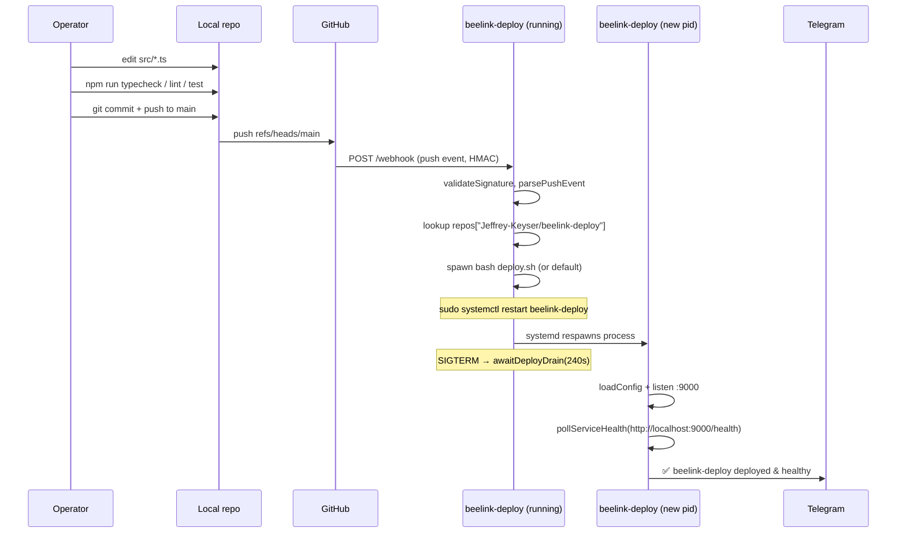

# Iteration Loop

This repo deploys itself. A push to `Jeffrey-Keyser/beelink-deploy` arrives at `/webhook` on the running instance, which then runs its own deploy script — so the loop has a unique "the bridge replaces its own planks while crossing" quality. Hence the 240 s drain on shutdown ([src/index.ts:6](https://github.com/Jeffrey-Keyser/beelink-deploy/blob/main/src/index.ts#L6)) and the post-deploy health check at `http://localhost:9000/health` ([config/repos.json:63-68](https://github.com/Jeffrey-Keyser/beelink-deploy/blob/main/config/repos.json#L63-L68)).

## Cycle

## Steps, cited

1. **Local checks.** `npm run typecheck`, `npm run lint`, `npm test` are the available verification scripts ([package.json:7-13](https://github.com/Jeffrey-Keyser/beelink-deploy/blob/main/package.json#L7-L13)). Tests run under `tsx --test` against `tests/*.test.ts`.
2. **Commit & push.** Standard `git push origin main`; the live remote is configured as a webhook source on GitHub ([README.md:71-78](https://github.com/Jeffrey-Keyser/beelink-deploy/blob/main/README.md#L71-L78)).
3. **Webhook receipt.** Express parses JSON while caching raw bytes for signature verification ([src/server.ts:75-80](https://github.com/Jeffrey-Keyser/beelink-deploy/blob/main/src/server.ts#L75-L80)). HMAC check is `timingSafeEqual` against the `GITHUB_WEBHOOK_SECRET` env ([src/github.ts:6-28](https://github.com/Jeffrey-Keyser/beelink-deploy/blob/main/src/github.ts#L6-L28)).
4. **Dispatch.** `event === 'push'` routes through `parsePushEvent`; `[skip deploy]` / `[no deploy]` in the head commit message short-circuits ([src/server.ts:231-235](https://github.com/Jeffrey-Keyser/beelink-deploy/blob/main/src/server.ts#L231-L235)).
5. **Deploy run.** `runDeploy` increments the in-flight counter, looks for `deploy.sh`, and otherwise runs the default `git pull / npm ci --production / sudo systemctl restart <service>` sequence ([src/deploy.ts:124-180](https://github.com/Jeffrey-Keyser/beelink-deploy/blob/main/src/deploy.ts#L124-L180)).
6. **Self-restart drain.** The `systemctl restart` delivers `SIGTERM`; the handler flips `shuttingDown`, calls `awaitDeployDrain(240_000)` and only then exits ([src/index.ts:36-55](https://github.com/Jeffrey-Keyser/beelink-deploy/blob/main/src/index.ts#L36-L55), [src/deploy.ts:32-45](https://github.com/Jeffrey-Keyser/beelink-deploy/blob/main/src/deploy.ts#L32-L45)).
7. **Post-deploy notification.** New pid starts, status is recorded to `data/status.json` ([src/status.ts:65-94](https://github.com/Jeffrey-Keyser/beelink-deploy/blob/main/src/status.ts#L65-L94)), the `healthUrl` is polled for up to 15 s ([src/healthCheck.ts:11-37](https://github.com/Jeffrey-Keyser/beelink-deploy/blob/main/src/healthCheck.ts#L11-L37)), and Telegram is paged with success or warning ([src/server.ts:19-58](https://github.com/Jeffrey-Keyser/beelink-deploy/blob/main/src/server.ts#L19-L58)).

## Config-only changes

Edits to `config/repos.json` or `config/packages.json` don't require a restart. Send `SIGHUP` or `SIGUSR2` to the process and `reloadRepos()` reads the files and swaps the in-memory map ([src/index.ts:19-34](https://github.com/Jeffrey-Keyser/beelink-deploy/blob/main/src/index.ts#L19-L34), [src/config.ts:70-84](https://github.com/Jeffrey-Keyser/beelink-deploy/blob/main/src/config.ts#L70-L84)).

## Manual override

`POST /deploy/:owner/:repo` with header `X-Deploy-Key: $DEPLOY_API_KEY` triggers the same `runDeploy` path without GitHub in the loop ([src/server.ts:273-308](https://github.com/Jeffrey-Keyser/beelink-deploy/blob/main/src/server.ts#L273-L308)). Use this when re-deploying after a failed run or when GitHub isn't reachable.
