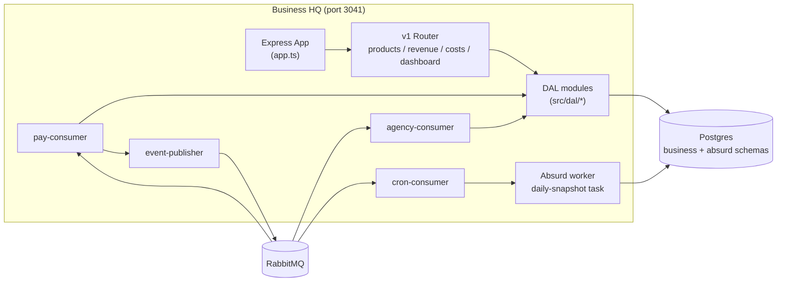

# Architecture

Single Node process. Hosts Express HTTP API, three RabbitMQ consumers, and an Absurd durable workflow worker bound to one shared `pg.Pool` ([src/bin/www.ts:11-35](https://github.com/Jeffrey-Keyser/business-hq/blob/main/src/bin/www.ts#L11-L35)).

## Component diagram

## Role contracts

**HTTP boundary.** `app.ts` builds the Express app via `@jeffrey-keyser/express-server-factory`, registers `versionNegotiation` + `validateVersion([1])` middleware, mounts `/` and `/api/v1`, and exposes a `/health` probe wired to a Postgres health check ([src/app.ts:21-67](https://github.com/Jeffrey-Keyser/business-hq/blob/main/src/app.ts#L21-L67)). The v1 router fans out to four resource routers ([src/routes/versions/v1/index.ts:10-13](https://github.com/Jeffrey-Keyser/business-hq/blob/main/src/routes/versions/v1/index.ts#L10-L13)).

**Process entrypoint.** `bin/www.ts` listens on `PORT`, then asynchronously starts the Absurd worker and connects RabbitMQ, registering all three consumers in parallel. SIGTERM/SIGINT trigger graceful shutdown of Absurd, RabbitMQ, then HTTP ([src/bin/www.ts:14-49](https://github.com/Jeffrey-Keyser/business-hq/blob/main/src/bin/www.ts#L14-L49)).

**Messaging layer.** `services/rabbit.ts` wraps `amqplib` with a reconnecting `RabbitMQService` singleton that asserts the `BusinessExchange` on connect and tracks subscriptions for replay on reconnect ([src/services/rabbit.ts:19-40](https://github.com/Jeffrey-Keyser/business-hq/blob/main/src/services/rabbit.ts#L19-L40)).

**Inbound consumers.**
- `pay-consumer` binds queues to the `pay.events` topic exchange for `payment.succeeded` and `subscription.created`, deduping on `stripe_payment_id` ([src/services/pay-consumer.ts:6-87](https://github.com/Jeffrey-Keyser/business-hq/blob/main/src/services/pay-consumer.ts#L6-L87)).
- `agency-consumer` binds to `AgencyExchange` for `sprint.completed`, resolving `product_id` by `repo` lookup ([src/services/agency-consumer.ts:11-45](https://github.com/Jeffrey-Keyser/business-hq/blob/main/src/services/agency-consumer.ts#L11-L45)).
- `cron-consumer` binds to `cron.jobs` for `business.daily-snapshot` and spawns the Absurd task ([src/services/cron-consumer.ts:4-34](https://github.com/Jeffrey-Keyser/business-hq/blob/main/src/services/cron-consumer.ts#L4-L34)).

**Durable workflow.** `services/absurd.ts` registers a single `daily-snapshot` task with two checkpointed `ctx.step` calls (`collect-metrics`, `save-snapshot`). Idempotency key `daily-snapshot:<date>:<hour>` prevents duplicate spawns; `ON CONFLICT (period, period_start) DO UPDATE` makes the upsert safe to retry ([src/services/absurd.ts:18-115](https://github.com/Jeffrey-Keyser/business-hq/blob/main/src/services/absurd.ts#L18-L115)). Worker concurrency=1, 5s poll ([src/services/absurd.ts:118-125](https://github.com/Jeffrey-Keyser/business-hq/blob/main/src/services/absurd.ts#L118-L125)).

**Outbound publisher.** `event-publisher.ts` emits three routing keys on `business.events` — `revenue_updated`, `product_launched`, `milestone_reached` ([src/services/event-publisher.ts:7-48](https://github.com/Jeffrey-Keyser/business-hq/blob/main/src/services/event-publisher.ts#L7-L48)).

**Data layer.** Each `business` table has a thin DAL module under `src/dal/` (products, revenue-events, cost-events, build-events, financial-snapshots, settings). All share the single `pg.Pool` from `src/db/connection.ts`.

**Legacy snapshot calculator.** `snapshot-calculator.ts` is the pre-Absurd, non-durable variant of the daily rollup, kept for reference / fallback ([src/services/snapshot-calculator.ts:8-77](https://github.com/Jeffrey-Keyser/business-hq/blob/main/src/services/snapshot-calculator.ts#L8-L77)).
