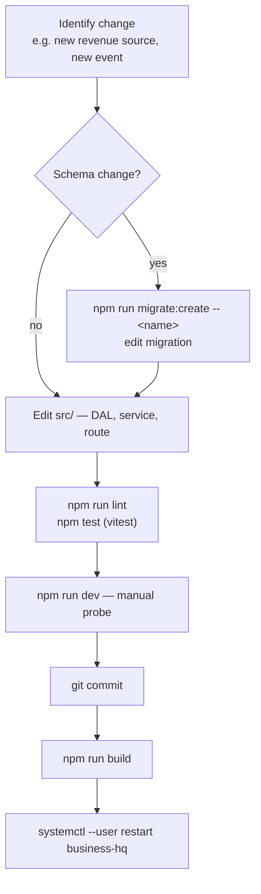

# Iteration Loop

Repo is a private TypeScript service; iteration is local-developer-driven, no CI gate documented in-repo. Changes typically follow this cycle:

## Step-by-step

1. **Schema first if needed.** New tables/columns start with `npm run migrate:create -- <name>` which generates a sequential timestamp filename to avoid ordering conflicts ([CLAUDE.md:32](https://github.com/Jeffrey-Keyser/business-hq/blob/main/CLAUDE.md#L32)). Migrations live under `migrations/` and run via `node-pg-migrate` ([package.json:12-14](https://github.com/Jeffrey-Keyser/business-hq/blob/main/package.json#L12-L14)).

2. **Add DAL function.** Each table has a module in `src/dal/`. New persistence logic goes here, not in the route.

3. **Wire a route or consumer.**
   - HTTP: register under `src/routes/versions/v1/<resource>.ts` and mount in `v1Router` ([src/routes/versions/v1/index.ts:10-13](https://github.com/Jeffrey-Keyser/business-hq/blob/main/src/routes/versions/v1/index.ts#L10-L13)).
   - Event: add a `rabbit.subscribe` block in the relevant consumer or create a new consumer module and register it from `bin/www.ts` ([src/bin/www.ts:26-31](https://github.com/Jeffrey-Keyser/business-hq/blob/main/src/bin/www.ts#L26-L31)).
   - Outbound event: add a publisher helper in `event-publisher.ts` ([src/services/event-publisher.ts:7-48](https://github.com/Jeffrey-Keyser/business-hq/blob/main/src/services/event-publisher.ts#L7-L48)).

4. **Verify.** `npm run lint`, `npm test` (vitest), `npm run dev` for a live probe ([package.json:7-11](https://github.com/Jeffrey-Keyser/business-hq/blob/main/package.json#L7-L11)).

5. **Ship.** `npm run build` produces `dist/`, then `systemctl --user restart business-hq` reloads the unit ([README.md:70-73](https://github.com/Jeffrey-Keyser/business-hq/blob/main/README.md#L70-L73)).

## Conventions enforced by the layout

- Versioned API: all new endpoints land under `/api/v1/`; `validateVersion([1])` rejects unsupported versions ([src/app.ts:83](https://github.com/Jeffrey-Keyser/business-hq/blob/main/src/app.ts#L83)).
- Idempotent consumers: pay-consumer dedupes on `stripe_payment_id` ([src/services/pay-consumer.ts:23-30](https://github.com/Jeffrey-Keyser/business-hq/blob/main/src/services/pay-consumer.ts#L23-L30)); Absurd task uses `ON CONFLICT` upserts and per-hour idempotency keys ([src/services/absurd.ts:76-83](https://github.com/Jeffrey-Keyser/business-hq/blob/main/src/services/absurd.ts#L76-L83)).
- Durable side-effects via Absurd: any new daily/hourly aggregation should be a new `registerTask` call, not a bare consumer handler.
