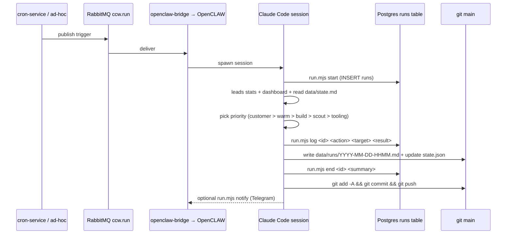

# Iteration Loop

The change cycle in this repo is a *run* — a single Claude Code session triggered hourly (9am–5pm CT, Mon–Fri) or ad-hoc ([CLAUDE.md:13-19](https://github.com/Jeffrey-Keyser/cream-city-web/blob/main/CLAUDE.md#L13-L19)). Each run produces a row in `runs`, a markdown log under `data/runs/`, and (usually) a git commit pushed to `main`.

## Run sequence

## Step detail

1. **Initialize.** `node scripts/run.mjs start` inserts a `runs` row and writes `current_run_id` into `data/state.json` ([scripts/run.mjs:48-60](https://github.com/Jeffrey-Keyser/cream-city-web/blob/main/scripts/run.mjs#L48-L60)). Operator then pulls pipeline state via `leads.mjs stats` and `run.mjs dashboard` ([CLAUDE.md:22-30](https://github.com/Jeffrey-Keyser/cream-city-web/blob/main/CLAUDE.md#L22-L30)).
2. **Decide.** Priority order: customer commitments → active follow-ups → in-flight builds → new scouting → tooling → automation → long-term refactors ([CLAUDE.md, Decision Framework](https://github.com/Jeffrey-Keyser/cream-city-web/blob/main/CLAUDE.md)). When primary work is blocked, run a productive alternative — test integrations, polish templates, draft proposals ([CLAUDE.md, "When Blocked" section](https://github.com/Jeffrey-Keyser/cream-city-web/blob/main/CLAUDE.md)).
3. **Execute & log.** Every action recorded via `run.mjs log <run_id> <action> <target> <result>` where action ∈ `{scout, outreach, build_site, follow_up, deploy, admin}` ([CLAUDE.md:40-45](https://github.com/Jeffrey-Keyser/cream-city-web/blob/main/CLAUDE.md#L40-L45)).
4. **Wrap up.** Write `data/runs/YYYY-MM-DD-HHMM.md` covering decision, actions, results, blockers, next steps ([CLAUDE.md:47-54](https://github.com/Jeffrey-Keyser/cream-city-web/blob/main/CLAUDE.md#L47-L54)). Finalize with `run.mjs end <id> "summary"` and update `data/state.json` ([CLAUDE.md:56-61](https://github.com/Jeffrey-Keyser/cream-city-web/blob/main/CLAUDE.md#L56-L61)).
5. **Commit & push.** Conventional pattern: `git add -A && git diff --cached --quiet || git commit -m "CCW run #<id>: 
" && git push` ([CLAUDE.md:63-69](https://github.com/Jeffrey-Keyser/cream-city-web/blob/main/CLAUDE.md#L63-L69)).
6. **Escalate.** Anything requiring Jeffrey — account setup, spend > $20, phone calls, in-person tasks — triggers `run.mjs notify` (NanoClaw IPC → Telegram) ([scripts/run.mjs:23-34](https://github.com/Jeffrey-Keyser/cream-city-web/blob/main/scripts/run.mjs#L23-L34), [CLAUDE.md:172-181](https://github.com/Jeffrey-Keyser/cream-city-web/blob/main/CLAUDE.md#L172-L181)).

## Human gate on outreach

Outbound prospect emails never auto-send. Drafts go via `scripts/send-email.mjs request-approval <lead_id> <template>`, NanoClaw delivers to Telegram, Jeffrey replies `APPROVE-{lead_id}`, only then send ([CLAUDE.md:162-170](https://github.com/Jeffrey-Keyser/cream-city-web/blob/main/CLAUDE.md#L162-L170)). Outreach is also globally blocked until P.O. Box activation, site polish, and a simulated end-to-end journey are signed off ([CLAUDE.md:104-128](https://github.com/Jeffrey-Keyser/cream-city-web/blob/main/CLAUDE.md#L104-L128)).

## Validation

`npm run lint` and `npm run build` both run `node --check` over `scripts/`, `api/`, `workers/` ([package.json:13-15](https://github.com/Jeffrey-Keyser/cream-city-web/blob/main/package.json#L13-L15)). Test suite is `node --test tests.db-parse-env.test.mjs` ([package.json:14](https://github.com/Jeffrey-Keyser/cream-city-web/blob/main/package.json#L14)).
