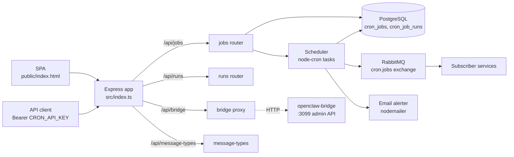

# Architecture

`cron-service` is a single Node process. `src/index.ts` bootstraps env validation, the DB pool, the RabbitMQ connection, the scheduler, and the Express app ([src/index.ts:1-162](https://github.com/Jeffrey-Keyser/cron-service/blob/main/src/index.ts#L1-L162)).

## Role contracts

**Bootstrap & HTTP host** — `src/index.ts` wires routers, mounts CORS, request logging, static SPA, error mapper, `/api/health`, and SIGTERM/SIGINT shutdown that stops the scheduler and closes RabbitMQ + DB ([src/index.ts:24-137](https://github.com/Jeffrey-Keyser/cron-service/blob/main/src/index.ts#L24-L137)).

**Env validation** — `validateEnv()` exits the process if `DATABASE_URL`, `RABBITMQ_URL`, or `CRON_API_KEY` is missing; called before any imports that touch them ([src/validate-env.ts:1-11](https://github.com/Jeffrey-Keyser/cron-service/blob/main/src/validate-env.ts#L1-L11), [src/index.ts:1-4](https://github.com/Jeffrey-Keyser/cron-service/blob/main/src/index.ts#L1-L4)).

**Auth middleware** — `requireApiKey` parses `Authorization: Bearer …`, compares against `CRON_API_KEY` with `timingSafeEqual`. Applied to POST/PUT/DELETE on `/api/jobs*` and `POST /api/jobs/:id/trigger` ([src/middleware/auth.ts:5-29](https://github.com/Jeffrey-Keyser/cron-service/blob/main/src/middleware/auth.ts#L5-L29), [src/routes/jobs.ts:67-221](https://github.com/Jeffrey-Keyser/cron-service/blob/main/src/routes/jobs.ts#L67-L221)).

**Jobs router** — full CRUD over `cron_jobs`. Creation uses `INSERT … ON CONFLICT (name, schedule) DO UPDATE SET name = cron_jobs.name RETURNING *, (xmax = 0) AS inserted` so retries return the existing row instead of erroring ([src/routes/jobs.ts:78-104](https://github.com/Jeffrey-Keyser/cron-service/blob/main/src/routes/jobs.ts#L78-L104)). Validates cron expressions through `node-cron` and decorates rows with `cronstrue` human text + `cron-parser` next-run ([src/routes/jobs.ts:240-255](https://github.com/Jeffrey-Keyser/cron-service/blob/main/src/routes/jobs.ts#L240-L255)).

**Runs router** — paginated read of `cron_job_runs` joined to `cron_jobs.name`, capped at 100 per request ([src/routes/runs.ts:6-30](https://github.com/Jeffrey-Keyser/cron-service/blob/main/src/routes/runs.ts#L6-L30)).

**Scheduler** — singleton in `src/services/scheduler.ts`. Holds a `Map<jobId, ScheduledTask>`; `loadJobs()` reads enabled rows on boot, `scheduleJob` / `unscheduleJob` / `refreshJob` keep the map in sync with DB writes ([src/services/scheduler.ts:12-46](https://github.com/Jeffrey-Keyser/cron-service/blob/main/src/services/scheduler.ts#L12-L46), [src/services/scheduler.ts:149-170](https://github.com/Jeffrey-Keyser/cron-service/blob/main/src/services/scheduler.ts#L149-L170)). `executeJob` inserts a `running` row, calls `attemptPublish` which retries with `retry_delay_ms * backoff_multiplier^retryCount`, then updates the run + job-health columns ([src/services/scheduler.ts:57-147](https://github.com/Jeffrey-Keyser/cron-service/blob/main/src/services/scheduler.ts#L57-L147)).

**RabbitMQ adapter** — single `Channel`, reconnects on `error` / `close` with exponential backoff up to 10 attempts. Asserts the shared `CronExchange` from `@jeffrey-keyser/message-contracts` at connect time ([src/services/rabbit.ts:24-75](https://github.com/Jeffrey-Keyser/cron-service/blob/main/src/services/rabbit.ts#L24-L75)). `publishCronEvent` sends a `CronJobTriggered` message; `publish` is a generic fallback for custom exchanges or direct queues ([src/services/rabbit.ts:80-109](https://github.com/Jeffrey-Keyser/cron-service/blob/main/src/services/rabbit.ts#L80-L109)).

**DB pool** — thin wrapper exporting `query` and `close` over a single `pg.Pool` bound to `DATABASE_URL` ([src/services/db.ts:1-14](https://github.com/Jeffrey-Keyser/cron-service/blob/main/src/services/db.ts#L1-L14)).

**Email alerter** — lazily constructs a nodemailer transport if `SMTP_HOST` is set; logs to stdout instead when SMTP isn't configured ([src/services/email.ts:1-35](https://github.com/Jeffrey-Keyser/cron-service/blob/main/src/services/email.ts#L1-L35)).

**Bridge proxy** — `/api/bridge/*` forwards to the `openclaw-bridge` admin API at `BRIDGE_HOST:BRIDGE_PORT` (default `localhost:3099`). Lets the SPA inspect/edit handler config without exposing the bridge directly ([src/routes/bridge.ts:1-64](https://github.com/Jeffrey-Keyser/cron-service/blob/main/src/routes/bridge.ts#L1-L64)).

**Message types route** — read-only `GET /api/message-types` returning `CronTargets` from `@jeffrey-keyser/message-contracts` so the UI can list known consumers ([src/routes/message-types.ts:1-10](https://github.com/Jeffrey-Keyser/cron-service/blob/main/src/routes/message-types.ts#L1-L10)).

**Domain types** — `CronJob`, `CronJobRun`, `CreateJobInput`, `UpdateJobInput` in `src/models/types.ts` mirror the SQL schema and shape route inputs ([src/models/types.ts:1-55](https://github.com/Jeffrey-Keyser/cron-service/blob/main/src/models/types.ts#L1-L55), [schema.sql:3-30](https://github.com/Jeffrey-Keyser/cron-service/blob/main/schema.sql#L3-L30)).

**Logging** — `pino`-backed `createLogger(scope)` from `src/lib/logger.ts` is the single log entry point; HTTP requests are logged with method/path/status/duration in `src/index.ts` ([src/index.ts:30-47](https://github.com/Jeffrey-Keyser/cron-service/blob/main/src/index.ts#L30-L47), [package.json:25](https://github.com/Jeffrey-Keyser/cron-service/blob/main/package.json#L25)).
