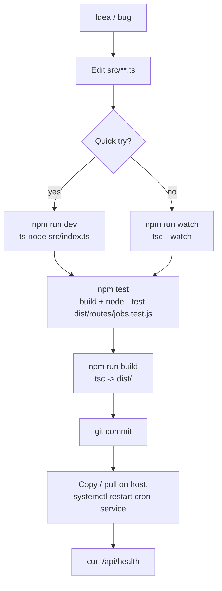

# Iteration Loop

The repo is a single-author TypeScript service with no CI manifest checked in. The iteration loop is the local build + test + systemd-restart cycle.

## Step citations

1. **Edit + build** — `npm run build` runs `tsc`; output goes to `dist/` referenced by `main` ([package.json:5-12](https://github.com/Jeffrey-Keyser/cron-service/blob/main/package.json#L5-L12)).
2. **Dev / watch** — `npm run dev` runs `ts-node src/index.ts` for a fast inner loop; `npm run watch` recompiles on save ([package.json:9-11](https://github.com/Jeffrey-Keyser/cron-service/blob/main/package.json#L9-L11), [README.md:132-140](https://github.com/Jeffrey-Keyser/cron-service/blob/main/README.md#L132-L140)).
3. **Tests** — `npm test` compiles first, then runs `node --test dist/routes/jobs.test.js`. Tests target the jobs router with injected `db` and `scheduler` mocks via `createJobsRouter(deps)` ([package.json:11](https://github.com/Jeffrey-Keyser/cron-service/blob/main/package.json#L11), [src/routes/jobs.ts:15-28](https://github.com/Jeffrey-Keyser/cron-service/blob/main/src/routes/jobs.ts#L15-L28)).
4. **Schema drift** — when `cron_jobs` / `cron_job_runs` need changes, edit `schema.sql` and re-apply via `psql -U jeff -d cron_service -f schema.sql`. Migrations are inline `IF NOT EXISTS` blocks at the bottom of the file, so re-running is safe ([schema.sql:36-49](https://github.com/Jeffrey-Keyser/cron-service/blob/main/schema.sql#L36-L49), [README.md:22-29](https://github.com/Jeffrey-Keyser/cron-service/blob/main/README.md#L22-L29)).
5. **Commit** — branch is `main`. Recent history shows merges from `dev-inbox/*` agent branches plus direct fixes (e.g. `9a86a62 Restore job creation idempotency`, `56733ed feat: require Bearer CRON_API_KEY on mutating /api/jobs routes`). No PR template or CONTRIBUTING file in the repo.
6. **Ship** — production runs from the same checkout under a systemd unit. Update is `git pull` (or push to host), `npm run build`, `sudo systemctl restart cron-service` ([cron-service.service:5-12](https://github.com/Jeffrey-Keyser/cron-service/blob/main/cron-service.service#L5-L12), [README.md:142-149](https://github.com/Jeffrey-Keyser/cron-service/blob/main/README.md#L142-L149)).
7. **Verify** — hit `GET /api/health`; response includes DB latency, RabbitMQ connection state, scheduled job count, and process uptime/memory ([src/index.ts:62-110](https://github.com/Jeffrey-Keyser/cron-service/blob/main/src/index.ts#L62-L110)).

## Notes on what *isn't* in the loop

- No GitHub Actions / CI config in-repo — checks are local.
- No linter or formatter scripts in `package.json` ([package.json:6-12](https://github.com/Jeffrey-Keyser/cron-service/blob/main/package.json#L6-L12)).
- The only test file shipped is `src/routes/jobs.test.ts`; scheduler and rabbit adapter changes are validated by running the service against a real DB + RabbitMQ.
