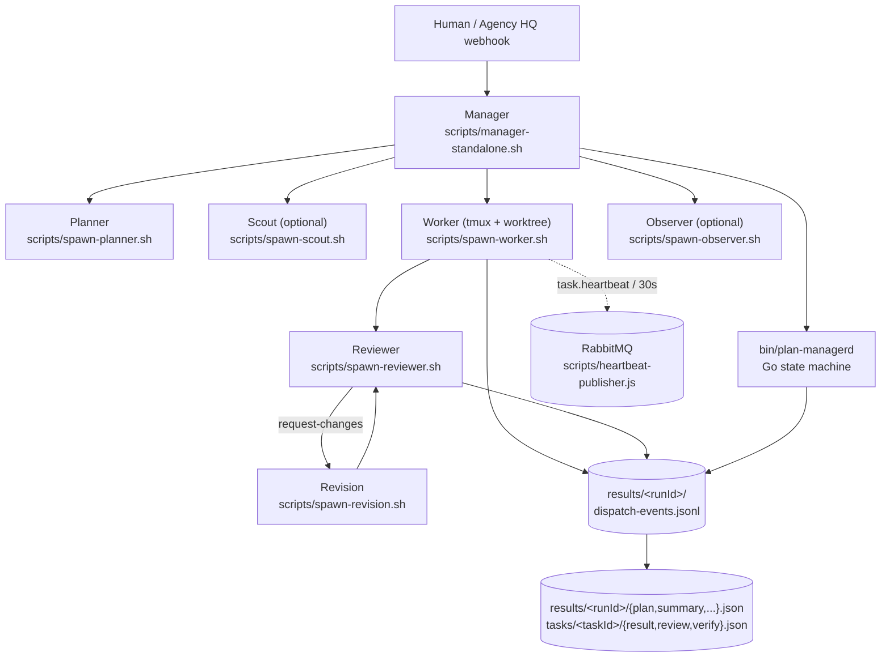

# Architecture

`dev-inbox` is a thin bash orchestration shell around a Go state-machine binary, with every agent role implemented as an Agent CLI session running in a tmux pane and (for workers/reviewers/revisions) a per-task git worktree ([README.md:51-66](https://github.com/Jeffrey-Keyser/dev-inbox/blob/main/README.md#L51-L66)).

## Component map

## Role contracts

- **Manager** — `scripts/manager-standalone.sh` is the standalone entry point. It writes the canonical `results/<runId>/startup.json` proof-of-life marker, registers an EXIT/ERR/INT/TERM failure trap, and then sequences planner → scouts → workers → reviewers → observer ([scripts/manager-standalone.sh:9-19](https://github.com/Jeffrey-Keyser/dev-inbox/blob/main/scripts/manager-standalone.sh#L9-L19), [scripts/manager-standalone.sh:71-81](https://github.com/Jeffrey-Keyser/dev-inbox/blob/main/scripts/manager-standalone.sh#L71-L81)). The manager is judgment-only — it spawns child agents and blocks on signals, no inline planning or source reads ([CLAUDE.md](https://github.com/Jeffrey-Keyser/dev-inbox/blob/main/CLAUDE.md) — `prompts/manager-system.md` row).
- **Planner** — `scripts/spawn-planner.sh` runs the planner agent single-shot (no worktree) and writes canonical `results/<runId>/plan.json`. On agent error it writes a failure plan with `status: "failed"` so downstream consumers always see a terminal state ([CLAUDE.md](https://github.com/Jeffrey-Keyser/dev-inbox/blob/main/CLAUDE.md) — `scripts/spawn-planner.sh` row, [README.md:24-27](https://github.com/Jeffrey-Keyser/dev-inbox/blob/main/README.md#L24-L27)).
- **Scout** — `scripts/spawn-scout.sh` runs read-only per-task recon and writes a hybrid YAML-frontmatter + markdown brief to `results/<runId>/tasks/<taskId>/scout.md`. Briefs are cached per `<repoSlug>@<sha>:<taskFingerprint>` under `results/scout-cache/` with a 30-day TTL ([CLAUDE.md](https://github.com/Jeffrey-Keyser/dev-inbox/blob/main/CLAUDE.md) — "Task Enrichment (Scout)" section).
- **Worker** — `scripts/spawn-worker.sh` creates a git worktree, opens a tmux pane, and launches the configured worker agent CLI; placeholders like `{{TASK_ID}}`, `{{BRANCH_NAME}}`, `{{ACCEPTANCE_CRITERIA}}` are filled in by `scripts/lib/prompter.sh` before the agent starts ([CLAUDE.md](https://github.com/Jeffrey-Keyser/dev-inbox/blob/main/CLAUDE.md) — `scripts/spawn-worker.sh` row and "Worker Prompt Placeholders" section).
- **Reviewer / Revision** — `scripts/spawn-reviewer.sh` reviews the worker's commits; on `request-changes`, `scripts/spawn-revision.sh` re-launches the worker agent in the same worktree to address feedback, up to `maxRevisions` (default 1). `reject` verdicts are never auto-revised ([CLAUDE.md](https://github.com/Jeffrey-Keyser/dev-inbox/blob/main/CLAUDE.md) — "Concurrency & Reliability" section).
- **Observer** — `scripts/spawn-observer.sh` runs an optional meta-analysis pass over the full run and produces `results/<runId>/observer.json` via `scripts/write-observer-report.sh` ([CLAUDE.md](https://github.com/Jeffrey-Keyser/dev-inbox/blob/main/CLAUDE.md) — observer rows).
- **Plan-manager Go runtime** — `bin/plan-managerd` is the state-machine implementation and the canonical event-log projector (`plan-managerd project <runId>`). The bash entrypoints default to it; `PLAN_MANAGER_BACKEND=bash` is the rollback escape hatch ([README.md:67](https://github.com/Jeffrey-Keyser/dev-inbox/blob/main/README.md#L67), [CLAUDE.md](https://github.com/Jeffrey-Keyser/dev-inbox/blob/main/CLAUDE.md) — "Plan-Manager Go Backend" section).

## State and IPC

- **Event log** — `results/<runId>/dispatch-events.jsonl` is the canonical record of run state. `scripts/lib/dispatch-events.sh` serializes appends through `flock` and `python3 os.fsync` so a crash mid-write cannot lose an event; `scripts/lib/event-types.sh` freezes the 15-event registry the projector replays ([CLAUDE.md](https://github.com/Jeffrey-Keyser/dev-inbox/blob/main/CLAUDE.md) — `dispatch-events.sh` and `event-types.sh` rows).
- **Projection** — `plan-managerd project <runId>` derives `startup.json`, `plan.json`, `summary.json`, the per-task `result.json` / `review.json` / `verify.json`, and the FD `meta.json` mirror by replaying the log. Replay is idempotent — timestamps come from event `ts`, never wall-clock ([CLAUDE.md](https://github.com/Jeffrey-Keyser/dev-inbox/blob/main/CLAUDE.md) — "Result file contract" section).
- **IPC** — agents signal completion via `tmux wait-for "<event>-<runId>"`; `scripts/lib/wait-for-event.sh` is the event-log-based equivalent that the manager dual-writes against tmux during the 14-day bake ([README.md:62-66](https://github.com/Jeffrey-Keyser/dev-inbox/blob/main/README.md#L62-L66), [CLAUDE.md](https://github.com/Jeffrey-Keyser/dev-inbox/blob/main/CLAUDE.md) — `wait-for-event.sh` row).
- **Concurrency** — `scripts/acquire-slot.sh` / `scripts/release-slot.sh` implement a filesystem semaphore in `results/.slots/`, capping the system at 12 concurrent agent CLI processes. Slots older than 30 minutes are reaped as stale ([CLAUDE.md](https://github.com/Jeffrey-Keyser/dev-inbox/blob/main/CLAUDE.md) — "Concurrency & Reliability" section).
