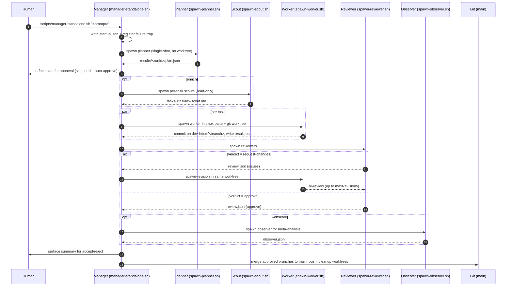

# Iteration Loop

A change to a target repo flows through dev-inbox in 12 steps, each backed by a spawn script and an event-log entry ([README.md:164-178](https://github.com/Jeffrey-Keyser/dev-inbox/blob/main/README.md#L164-L178)).

## Step-by-step

1. **Trigger** — The operator runs `/orchestrate <prompt>` or `scripts/manager-standalone.sh "<prompt>" [--flags]`. Webhook callers hit the same standalone script ([README.md:71-94](https://github.com/Jeffrey-Keyser/dev-inbox/blob/main/README.md#L71-L94)).
2. **Startup marker** — Manager writes `results/<runId>/startup.json` and registers an EXIT/ERR/INT/TERM trap before any other init that can fail, so a crash before the plan lands always produces `failed.json` ([scripts/manager-standalone.sh:25-30](https://github.com/Jeffrey-Keyser/dev-inbox/blob/main/scripts/manager-standalone.sh#L25-L30), [scripts/manager-standalone.sh:71-81](https://github.com/Jeffrey-Keyser/dev-inbox/blob/main/scripts/manager-standalone.sh#L71-L81)).
3. **Plan** — `scripts/spawn-planner.sh` runs the planner agent (default: Claude `opus`) and writes `results/<runId>/plan.json`. Planner failures emit a plan with `status: "failed"` and a `reason` instead of throwing ([CLAUDE.md](https://github.com/Jeffrey-Keyser/dev-inbox/blob/main/CLAUDE.md) — `spawn-planner.sh` and `planner-system.md` rows).
4. **Approval** — Manager surfaces the plan to the human unless `--auto-approve` is set ([README.md:81-87](https://github.com/Jeffrey-Keyser/dev-inbox/blob/main/README.md#L81-L87)).
5. **Optional enrichment** — When a task has `enrich: true`, a per-task scout reads the target repo and produces `results/<runId>/tasks/<taskId>/scout.md`. The brief body (frontmatter stripped) is prepended to the worker's `context` field inside `<scout>` tags ([CLAUDE.md](https://github.com/Jeffrey-Keyser/dev-inbox/blob/main/CLAUDE.md) — "Task Enrichment (Scout)" section).
6. **Worker fan-out** — `scripts/spawn-worker.sh` creates a worktree, opens a tmux pane, and launches the configured agent CLI per task in parallel, gated by `scripts/acquire-slot.sh` (max 12 concurrent CLIs) ([CLAUDE.md](https://github.com/Jeffrey-Keyser/dev-inbox/blob/main/CLAUDE.md) — `spawn-worker.sh` and "Concurrency & Reliability" sections).
7. **Worker completes** — On exit, the worker runs `scripts/write-result.sh`, which writes `results/<runId>/tasks/<taskId>/result.json` and signals `tmux wait-for task-<taskId>` ([CLAUDE.md](https://github.com/Jeffrey-Keyser/dev-inbox/blob/main/CLAUDE.md) — `write-result.sh` row).
8. **Verify gate** — `scripts/verify-task.sh` runs the ordered `verifyCommands` for the task and writes `tasks/<taskId>/verify.json` with exit codes, durations, and stdout/stderr tails before the reviewer is dispatched ([CLAUDE.md](https://github.com/Jeffrey-Keyser/dev-inbox/blob/main/CLAUDE.md) — `verify.json` row in the result-file contract).
9. **Review** — `scripts/spawn-reviewer.sh` runs the reviewer agent and writes `tasks/<taskId>/review.json`. Reviewers that produce <50 bytes are automatically retried once after 5 seconds ([CLAUDE.md](https://github.com/Jeffrey-Keyser/dev-inbox/blob/main/CLAUDE.md) — "Concurrency & Reliability" section).
10. **Revision loop** — On `request-changes`, `scripts/spawn-revision.sh` relaunches the worker agent in the same worktree with the reviewer's issues injected via `{{REVIEW_ISSUES}}` / `{{REVIEW_SUMMARY}}`. `reject` verdicts are never auto-revised ([CLAUDE.md](https://github.com/Jeffrey-Keyser/dev-inbox/blob/main/CLAUDE.md) — `spawn-revision.sh` row and "Concurrency & Reliability" section).
11. **Observer** — When `--observe` is on (default in many run configs), `scripts/spawn-observer.sh` produces a meta-analysis report at `results/<runId>/observer.json` via `scripts/write-observer-report.sh` ([CLAUDE.md](https://github.com/Jeffrey-Keyser/dev-inbox/blob/main/CLAUDE.md) — observer rows).
12. **Land** — Manager merges approved branches to `main`, pushes, and triggers `scripts/worktree-cleanup.sh` to remove finished worktrees. Branch sweep is handled separately by `scripts/branch-cleanup.sh` ([README.md:212-219](https://github.com/Jeffrey-Keyser/dev-inbox/blob/main/README.md#L212-L219)).

## Failure paths

- **Manager dies before plan** — EXIT trap writes `results/<runId>/failed.json` with stage `pre-plan` and the captured stderr tail ([CLAUDE.md](https://github.com/Jeffrey-Keyser/dev-inbox/blob/main/CLAUDE.md) — "Result file contract" failure schema).
- **Orphaned worker** — `scripts/recover-orphans.sh` detects completed workers with no review and spawns the missing reviewer; workers also self-heal by calling it 60s after completion ([CLAUDE.md](https://github.com/Jeffrey-Keyser/dev-inbox/blob/main/CLAUDE.md) — "Concurrency & Reliability" section).
- **Terminal status classification** — `scripts/classify-failure.sh` runs on any non-`complete` summary and writes `results/<runId>/failure-classification.json`, then emits a `failure_classified` event for the weekly leaderboard ([CLAUDE.md](https://github.com/Jeffrey-Keyser/dev-inbox/blob/main/CLAUDE.md) — "Failure Classification" section).
