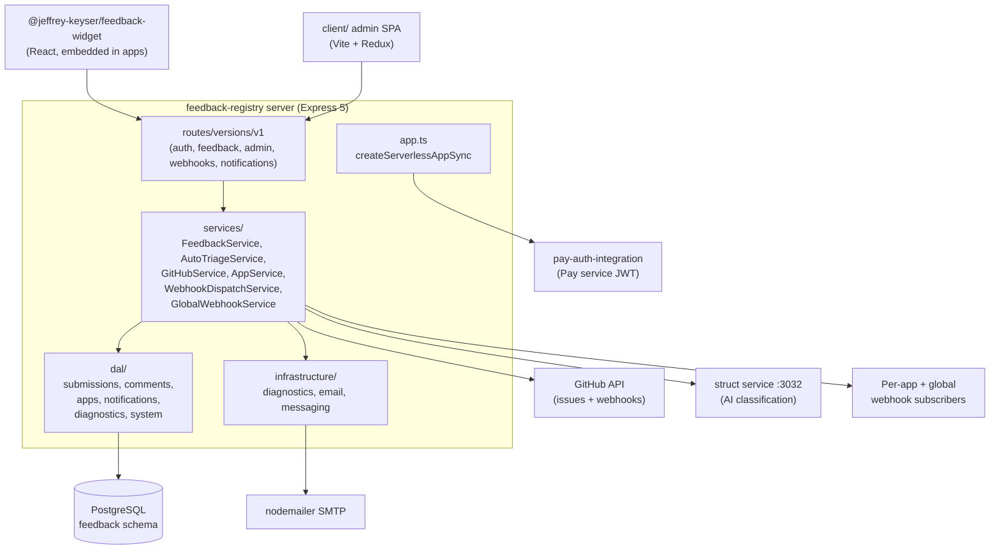

# Architecture

Express 5 / TypeScript service with layered separation: HTTP routes → domain services → DAL → Postgres. Async fan-out happens via webhook dispatchers and (optionally) AMQP message contracts. Auth and middleware come from shared `@jeffrey-keyser/*` packages so this repo owns business logic only ([server/app.ts:1-11](https://github.com/Jeffrey-Keyser/feedback-registry/blob/main/server/app.ts#L1-L11), [server/package.json:18-36](https://github.com/Jeffrey-Keyser/feedback-registry/blob/main/server/package.json#L18-L36)).

## Component map

## Role contracts

**`server/app.ts` — Express bootstrap.** Builds the app via `createServerlessAppSync` from `@jeffrey-keyser/express-server-factory`, wires correlation IDs, GitHub-error middleware, Pay auth, and mounts the v1 router ([server/app.ts:1-11](https://github.com/Jeffrey-Keyser/feedback-registry/blob/main/server/app.ts#L1-L11), [server/app.ts:32-34](https://github.com/Jeffrey-Keyser/feedback-registry/blob/main/server/app.ts#L32-L34)).

**`server/bin/www.ts` — HTTP startup.** Listens on `config.PORT` (default 3001), logs health + Swagger URLs, handles graceful shutdown on SIGTERM. Designed for systemd on the Beelink homelab ([server/bin/www.ts:1-23](https://github.com/Jeffrey-Keyser/feedback-registry/blob/main/server/bin/www.ts#L1-L23), [server/config/env.ts:71-74](https://github.com/Jeffrey-Keyser/feedback-registry/blob/main/server/config/env.ts#L71-L74)).

**`server/routes/versions/v1/index.ts` — versioned router.** Mounts `/auth`, `/diagnostics`, `/feedback`, `/admin`, `/webhooks`, `/notifications` under `/api/v1/*`. Legacy `/v1/*` paths redirect via `middleware/versioning.ts` ([server/routes/versions/v1/index.ts:45-65](https://github.com/Jeffrey-Keyser/feedback-registry/blob/main/server/routes/versions/v1/index.ts#L45-L65), [CLAUDE.md:78-82](https://github.com/Jeffrey-Keyser/feedback-registry/blob/main/CLAUDE.md#L78-L82)).

**`server/services/FeedbackService.ts` — core orchestrator.** Owns submission, triage, resolve, comment flows. On state transitions it dispatches per-app webhooks and a global webhook for cross-service consumers like `github-error-issues` ([server/services/FeedbackService.ts:463-520](https://github.com/Jeffrey-Keyser/feedback-registry/blob/main/server/services/FeedbackService.ts#L463-L520)).

**`server/services/AutoTriageService.ts` — AI classifier.** Calls the internal Struct service (`STRUCT_URL`, port 3032) for schema-conformant classification of bug/feature/question + severity. Falls back to keyword triage when Struct is unreachable ([CLAUDE.md:174-179](https://github.com/Jeffrey-Keyser/feedback-registry/blob/main/CLAUDE.md#L174-L179)).

**`server/services/GitHubService.ts` — GitHub bridge.** Creates issues in the repo recorded on `feedback.apps.github_repo`, attaches labels and assignee from triage payload, persists issue URL/number back to the submission row ([README.md:391-401](https://github.com/Jeffrey-Keyser/feedback-registry/blob/main/README.md#L391-L401)).

**`server/services/WebhookDispatchService.ts` + `GlobalWebhookService.ts` — outbound fan-out.** Per-app webhooks notify the source app on triage/resolve; the global dispatcher fires `feedback.created` / `feedback.resolved` for ecosystem-wide subscribers ([server/services/GlobalWebhookService.ts:19](https://github.com/Jeffrey-Keyser/feedback-registry/blob/main/server/services/GlobalWebhookService.ts#L19)).

**`server/dal/*` — data access.** Thin per-table modules (`submissions`, `comments`, `apps`, `notifications`, `diagnostics`, `system`, `feedback`) using parameterized SQL through the shared `pg` pool ([server/dal](https://github.com/Jeffrey-Keyser/feedback-registry/tree/main/server/dal)).

**`server/infrastructure/` — side-effect adapters.** Houses `diagnostics`, `email` (nodemailer SMTP), and `messaging` (AMQP via `amqplib` + `@jeffrey-keyser/message-contracts`) helpers ([server/package.json:18-30](https://github.com/Jeffrey-Keyser/feedback-registry/blob/main/server/package.json#L18-L30)).

**`packages/feedback-widget` — embeddable React widget.** Published as `@jeffrey-keyser/feedback-widget`, built with `tsup`, peer-depends React 18+, consumed by every ecosystem app ([packages/feedback-widget/package.json:1-30](https://github.com/Jeffrey-Keyser/feedback-registry/blob/main/packages/feedback-widget/package.json#L1-L30)).

**`client/` — admin SPA.** Vite + React 19 + Redux Toolkit dashboard for maintainers. Uses Pay-auth and personal-ui-kit; not customer-facing ([client/package.json:1-20](https://github.com/Jeffrey-Keyser/feedback-registry/blob/main/client/package.json#L1-L20)).
