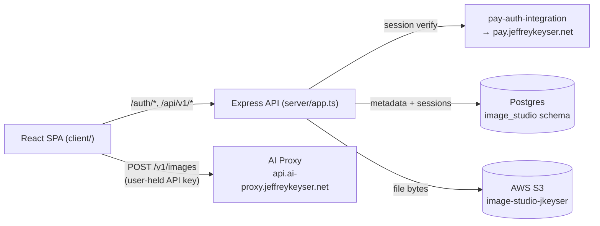

# Architecture

Two deployable surfaces in one repo: an Express API (`server/`) and a Vite-built React SPA (`client/`). Image generation itself is offloaded to the AI Proxy and runs in the browser ([CLAUDE.md:3-5](https://github.com/Jeffrey-Keyser/image-studio/blob/main/CLAUDE.md#L3-L5)).

## Roles

### Server entrypoint — `server/app.ts`

Builds a single Express app via `createServerlessAppSync` from `@jeffrey-keyser/express-server-factory`. Wires Pay auth middleware, Postgres session store, rate limiter, Swagger, and three top-level routers: `/`, `/api/v1`, `/auth` ([server/app.ts:171-265](https://github.com/Jeffrey-Keyser/image-studio/blob/main/server/app.ts#L171-L265)). Also bridges `@jeffrey-keyser/api-errors` `DomainError` to the ESF flavor so `instanceof` checks in the HTTP mapper succeed ([server/app.ts:147-168](https://github.com/Jeffrey-Keyser/image-studio/blob/main/server/app.ts#L147-L168)).

### v1 router — `server/routes/versions/v1/`

Mounts `images`, `generations`, `import`, `staging`, and `diagnostics` sub-routers. The `images` router owns CRUD + per-version streaming; `generations` owns prompt-history; `staging` exposes the batch review surface ([README.md:56-96](https://github.com/Jeffrey-Keyser/image-studio/blob/main/README.md#L56-L96)).

### Services layer — `server/services/`

- `imagesService.ts` and `generationService.ts` — domain orchestration over the DAL and S3.
- `s3.ts` — `@aws-sdk/client-s3` wrapper for upload/stream/delete keyed by bucket from `S3_BUCKET` ([README.md:99-108](https://github.com/Jeffrey-Keyser/image-studio/blob/main/README.md#L99-L108)).
- `userResolution.ts` — bridges Pay user identity into a local user row.
- `soloVault.ts` — per-user namespace helper.

### Auth bridge — `pay-auth-integration`

A single `setupPayAuth({ payUrl, publicRoutes, ... })` call provides the middleware injected as `auth.provider` and a router mounted at `/auth` ([server/app.ts:84-119](https://github.com/Jeffrey-Keyser/image-studio/blob/main/server/app.ts#L84-L119), [server/app.ts:221-265](https://github.com/Jeffrey-Keyser/image-studio/blob/main/server/app.ts#L221-L265)). AGENTS.md hard-pins to `^6.10.1` and forbids private subpath imports ([AGENTS.md:6-17](https://github.com/Jeffrey-Keyser/image-studio/blob/main/AGENTS.md#L6-L17)).

### Client shell — `client/src/App.tsx`

`BrowserRouter` with `AuthContainer` gating, `Layout` chrome, and routes for image list, studio, image detail, and staging-batch review. Uses `usePayAuth()` from `@jeffrey-keyser/pay-auth-integration/client/react` for session state ([client/src/App.tsx:1-46](https://github.com/Jeffrey-Keyser/image-studio/blob/main/client/src/App.tsx#L1-L46)).

### Client data layer — `client/src/reducers/`

RTK Query API slices: `images.api.ts`, `image.api.ts`, `generations.api.ts`, `diagnostics.api.ts`, `users.api.ts`, `feedback.api.ts`. AI Proxy is called from container code, not these slices — backend slices only see image metadata and history ([client/package.json:5-27](https://github.com/Jeffrey-Keyser/image-studio/blob/main/client/package.json#L5-L27)).

### Persistence — `server/db/` + `image_studio` schema

PostgreSQL is the single source of truth for sessions (`user_sessions`), image metadata, versions, and generation history. Connection pool lives in `server/db/connection.ts` and is shared with `connect-session-sequelize` and the health check ([server/app.ts:60-63](https://github.com/Jeffrey-Keyser/image-studio/blob/main/server/app.ts#L60-L63), [server/app.ts:198-217](https://github.com/Jeffrey-Keyser/image-studio/blob/main/server/app.ts#L198-L217)).

### Storage — AWS S3

Image bytes live in `S3_BUCKET` (default `image-studio-jkeyser`). The `:id/versions/:version/file` routes stream from S3 rather than caching local copies ([README.md:65-67](https://github.com/Jeffrey-Keyser/image-studio/blob/main/README.md#L65-L67), [README.md:99-108](https://github.com/Jeffrey-Keyser/image-studio/blob/main/README.md#L99-L108)).
