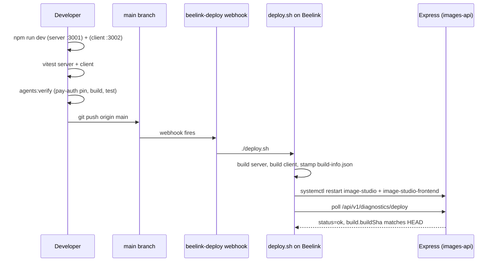

# Iteration Loop

Single-repo loop: edit, run Vitest on both halves, push to `main`, let the homelab webhook do the rest.

## Steps

1. **Local dev.** `cd server && npm run dev` boots Express on port 3001; `cd client && npm run dev` boots Vite on port 3002. AWS credentials and a `.env` are required for full functionality ([README.md:20-43](https://github.com/Jeffrey-Keyser/image-studio/blob/main/README.md#L20-L43)).
2. **Test.** `npm test` in each workspace runs Vitest. Server adds `test:integration` and `test:docker` variants for containerized integration runs ([server/package.json:11-16](https://github.com/Jeffrey-Keyser/image-studio/blob/main/server/package.json#L11-L16)).
3. **agents:verify gate.** Workers run the four checks between the `<!-- agents:verify -->` markers — pay-auth pin, no private subpath imports, ≤1 `new PayAuth(`, build+test green ([AGENTS.md:30-53](https://github.com/Jeffrey-Keyser/image-studio/blob/main/AGENTS.md#L30-L53)).
4. **Push to `main`.** Direct push triggers the `beelink-deploy` webhook on the Beelink host ([README.md:124-127](https://github.com/Jeffrey-Keyser/image-studio/blob/main/README.md#L124-L127), [CLAUDE.md:62-64](https://github.com/Jeffrey-Keyser/image-studio/blob/main/CLAUDE.md#L62-L64)).
5. **`deploy.sh`.** `git pull`, `npm install`, `npm run build` for both server and client, then write `dist/build-info.json` with `buildSha` + `builtAt` so the deploy ID does not dirty the worktree ([deploy.sh:1-32](https://github.com/Jeffrey-Keyser/image-studio/blob/main/deploy.sh#L1-L32)).
6. **systemd restart.** `systemctl restart image-studio` and `image-studio-frontend` ([deploy.sh:34-39](https://github.com/Jeffrey-Keyser/image-studio/blob/main/deploy.sh#L34-L39)).
7. **Deploy verification.** Polls `GET /api/v1/diagnostics/deploy` (default `http://localhost:3030/...`) up to 15× and only passes when `status === "ok"` and `build.buildSha` matches `HEAD`. Missing `PAY_SERVICE_TOKEN` surfaces as a warning, not a failure ([deploy.sh:42-65](https://github.com/Jeffrey-Keyser/image-studio/blob/main/deploy.sh#L42-L65), [README.md:142-153](https://github.com/Jeffrey-Keyser/image-studio/blob/main/README.md#L142-L153)).

Manual rerun is identical: `./deploy.sh` from the Beelink host ([README.md:136-140](https://github.com/Jeffrey-Keyser/image-studio/blob/main/README.md#L136-L140)).
