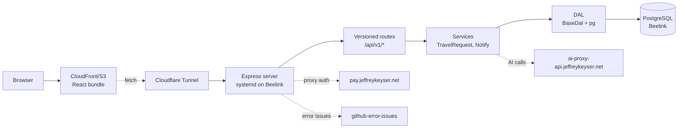

# Architecture

Two top-level workspaces: `client/` (React + Vite) and `server/` (Express + TypeScript). Server initialization is async — Solo Vault secrets load before config validation and DB pool creation ([server/app.ts:17-58](https://github.com/Jeffrey-Keyser/insta-travel-map/blob/main/server/app.ts#L17-L58)).

## Role contracts

### Server bootstrap
`server/bin/www.ts` is the dev entrypoint. Loads dotenv → Solo Vault secrets → `initConfig()` → `initializeApp()` → `expressApp.listen(PORT)` ([server/bin/www.ts:19-53](https://github.com/Jeffrey-Keyser/insta-travel-map/blob/main/server/bin/www.ts#L19-L53)). Production runs `dist/bin/www.js` under the `insta-travel-map` systemd unit ([README.md:55-72](https://github.com/Jeffrey-Keyser/insta-travel-map/blob/main/README.md#L55-L72)).

### App factory
`server/app.ts` builds a `ServerConfigV2` and hands it to `createServerlessApp` from `@jeffrey-keyser/express-server-factory` ([server/app.ts:1-4](https://github.com/Jeffrey-Keyser/insta-travel-map/blob/main/server/app.ts#L1-L4), [server/app.ts:139-402](https://github.com/Jeffrey-Keyser/insta-travel-map/blob/main/server/app.ts#L139-L402)). Factory wires CORS, session, rate-limiting, structured logging, Swagger, health checks, and the error handler that fires GitHub issues ([server/app.ts:155-344](https://github.com/Jeffrey-Keyser/insta-travel-map/blob/main/server/app.ts#L155-L344)).

### Routing
Top-level routers: `/` (index), `/api/v1` (versioned v1 router), `/auth` (Pay-auth routes) ([server/app.ts:288-292](https://github.com/Jeffrey-Keyser/insta-travel-map/blob/main/server/app.ts#L288-L292)). Versioning middleware negotiates header, redirects legacy `/v1/*` → `/api/v1/*`, and validates supported versions ([server/app.ts:346-355](https://github.com/Jeffrey-Keyser/insta-travel-map/blob/main/server/app.ts#L346-L355)). Domain route files live in `server/routes/` — `travel-requests.ts`, `access-requests.ts`, `acl.ts`, `flights.ts`, `payment.ts`, `auth.ts` ([server/routes](https://github.com/Jeffrey-Keyser/insta-travel-map/blob/main/server/routes)).

### Auth
`setupPayAuth` from `@jeffrey-keyser/pay-auth-integration/server` returns `{ middleware, routes }`; absence of either is a fatal startup error ([server/app.ts:90-136](https://github.com/Jeffrey-Keyser/insta-travel-map/blob/main/server/app.ts#L90-L136)). Public-route list combines `DEFAULT_PUBLIC_ROUTES` with app-specific bypasses for access-requests, swagger, ping ([server/app.ts:98-112](https://github.com/Jeffrey-Keyser/insta-travel-map/blob/main/server/app.ts#L98-L112)).

### DAL + DB
`server/dal/` holds the BaseDal pattern (extend, use `withTransaction`, parameterized queries) ([CLAUDE.md:175-180](https://github.com/Jeffrey-Keyser/insta-travel-map/blob/main/CLAUDE.md#L175-L180)). Connection pool comes from `@jeffrey-keyser/database-base-config` via `server/db/connection.ts`, loaded lazily after vault secrets resolve ([server/app.ts:55-58](https://github.com/Jeffrey-Keyser/insta-travel-map/blob/main/server/app.ts#L55-L58)). Health probe in `server/dal/diagnostics.ts` is wired into the `/health` check ([server/app.ts:244-252](https://github.com/Jeffrey-Keyser/insta-travel-map/blob/main/server/app.ts#L244-L252)).

### Services
`server/services/TravelRequestService.ts` and `NotifyService.ts` encapsulate domain operations called by routes ([server/services](https://github.com/Jeffrey-Keyser/insta-travel-map/blob/main/server/services)).

### Client
Vite-based React 19 SPA with Redux Toolkit + RTK Query, react-leaflet for maps, react-i18next for translations, Stripe Elements for payments ([client/package.json:5-42](https://github.com/Jeffrey-Keyser/insta-travel-map/blob/main/client/package.json#L5-L42)). Container/presentational split: smart containers in `client/src/containers/`, dumb components in `client/src/components/`; Redux API slices in `client/src/reducers/` ([CLAUDE.md:35-43](https://github.com/Jeffrey-Keyser/insta-travel-map/blob/main/CLAUDE.md#L35-L43), [CLAUDE.md:189-194](https://github.com/Jeffrey-Keyser/insta-travel-map/blob/main/CLAUDE.md#L189-L194)).
