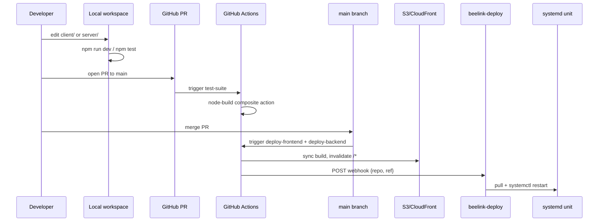

# Iteration Loop

## Steps cited to source

1. **Local dev**: client runs via `vite` (`npm run dev` in `client/`), server runs via `ts-node ./bin/www.ts` (`npm run dev` in `server/`) ([client/package.json:45](https://github.com/Jeffrey-Keyser/insta-travel-map/blob/main/client/package.json#L45), [server/package.json:7](https://github.com/Jeffrey-Keyser/insta-travel-map/blob/main/server/package.json#L7)).
2. **Tests**: client uses Vitest, server uses Jest + Supertest ([client/package.json:48](https://github.com/Jeffrey-Keyser/insta-travel-map/blob/main/client/package.json#L48), [server/package.json:11-13](https://github.com/Jeffrey-Keyser/insta-travel-map/blob/main/server/package.json#L11-L13)).
3. **Pre-commit guardrails**: any agent-touched PR must pass the verify block — pay-auth version pin, no forbidden subpath imports, single `new PayAuth(...)` site, green build + tests ([AGENTS.md:32-52](https://github.com/Jeffrey-Keyser/insta-travel-map/blob/main/AGENTS.md#L32-L52)).
4. **PR CI**: `test-suite` job runs only on PRs, checks out the private `jeffrey-keyser/github-actions` repo for composite actions, then invokes `node-build` ([.github/workflows/ci-cd-pipeline.yml:11-41](https://github.com/Jeffrey-Keyser/insta-travel-map/blob/main/.github/workflows/ci-cd-pipeline.yml#L11-L41)).
5. **Merge to main**: gates the deploy jobs via `if: github.ref == 'refs/heads/main' && github.event_name == 'push'` ([.github/workflows/ci-cd-pipeline.yml:45](https://github.com/Jeffrey-Keyser/insta-travel-map/blob/main/.github/workflows/ci-cd-pipeline.yml#L45), [.github/workflows/ci-cd-pipeline.yml:100](https://github.com/Jeffrey-Keyser/insta-travel-map/blob/main/.github/workflows/ci-cd-pipeline.yml#L100)).
6. **Frontend deploy**: rebuilds with `npm install --force` + `npm run build`, then runs the `s3-deploy` composite action that syncs `client/dist` and invalidates `/*` on CloudFront ([.github/workflows/ci-cd-pipeline.yml:63-96](https://github.com/Jeffrey-Keyser/insta-travel-map/blob/main/.github/workflows/ci-cd-pipeline.yml#L63-L96)).
7. **Backend deploy**: `curl -X POST` to the beelink-deploy webhook with `{repository, ref}`; the webhook pulls the latest code and restarts the systemd service ([.github/workflows/ci-cd-pipeline.yml:104-113](https://github.com/Jeffrey-Keyser/insta-travel-map/blob/main/.github/workflows/ci-cd-pipeline.yml#L104-L113), [CLAUDE.md:103-106](https://github.com/Jeffrey-Keyser/insta-travel-map/blob/main/CLAUDE.md#L103-L106)).
8. **Error feedback loop**: production errors fire to `GitHubErrorIssueService` which auto-files issues with stack and request metadata — closing the loop back to step 1 ([server/app.ts:7-8](https://github.com/Jeffrey-Keyser/insta-travel-map/blob/main/server/app.ts#L7-L8), [server/app.ts:312-327](https://github.com/Jeffrey-Keyser/insta-travel-map/blob/main/server/app.ts#L312-L327)).
