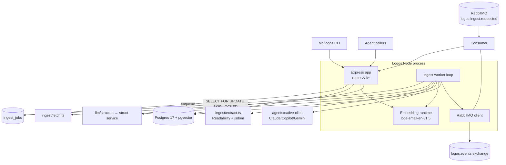

# Architecture

Logos is a single Node process: Express HTTP server, an in-process worker polling `ingest_job`, a RabbitMQ consumer/publisher, an ONNX embedding runtime, and Postgres ([src/bin/www.ts:10-44](https://github.com/Jeffrey-Keyser/logos/blob/main/src/bin/www.ts#L10-L44)).

## Role contracts

### HTTP surface (`src/routes/v1/*`)
The single Express app mounts a versioned `/v1` router that aggregates one file per resource — status, ingest, proposals, pages, query, feeds, themes ([src/routes/v1/index.ts:1-20](https://github.com/Jeffrey-Keyser/logos/blob/main/src/routes/v1/index.ts#L1-L20)). Bearer auth is applied at mount time; framework auth and framework healthcheck are disabled in favor of the custom `/health` ([src/app.ts:42-53](https://github.com/Jeffrey-Keyser/logos/blob/main/src/app.ts#L42-L53)).

### Ingest worker (`src/worker/ingest.ts`, `src/ingest/service.ts`)
Started after the HTTP listener is up, concurrency 2, retry with exponential backoff up to 5 attempts ([README.md:220-223](https://github.com/Jeffrey-Keyser/logos/blob/main/README.md#L220-L223), [src/bin/www.ts:42](https://github.com/Jeffrey-Keyser/logos/blob/main/src/bin/www.ts#L42)). It owns the fetch → extract → chunk → embed → propose pipeline assembled from `src/ingest/*` and `src/embed/*`.

### Extraction (`src/ingest/extract.ts`, `src/ingest/extract-pdf.ts`)
Primary path is `@mozilla/readability` + `jsdom`; PDF is `pdf-parse`; on short/failed extraction the worker falls back to a native CLI agent invocation using the `logos/extract-fallback` prompt body ([README.md:171-179](https://github.com/Jeffrey-Keyser/logos/blob/main/README.md#L171-L179), [package.json:23-33](https://github.com/Jeffrey-Keyser/logos/blob/main/package.json#L23-L33)).

### Native CLI agent dispatcher (`src/agents/native-cli.ts`)
Multi-provider ladder over Claude CLI, GitHub Copilot CLI, and Gemini CLI with concurrency-slot lockfiles. Used wherever a schema-free LLM hop is acceptable, primarily extraction fallback ([README.md:88-89](https://github.com/Jeffrey-Keyser/logos/blob/main/README.md#L88-L89), [README.md:449-451](https://github.com/Jeffrey-Keyser/logos/blob/main/README.md#L449-L451)).

### Structured LLM ops (`src/llm/struct.ts`, `src/llm/schemas/*`)
Thin client for `Jeffrey-Keyser/struct` at `http://localhost:3032/api/v1/run`. Every JSON-shaped op — page proposal, proposal revision, answer synthesis — passes a JSON Schema and gets back a validated object ([README.md:88](https://github.com/Jeffrey-Keyser/logos/blob/main/README.md#L88), [README.md:226-248](https://github.com/Jeffrey-Keyser/logos/blob/main/README.md#L226-L248)).

### Embedding runtime (`src/embed/index.ts`, `src/embed/chunk.ts`)
`@xenova/transformers` loads `bge-small-en-v1.5` ONNX once at boot; `warmup()` is called before listening so `/health` reflects readiness ([src/bin/www.ts:12-14](https://github.com/Jeffrey-Keyser/logos/blob/main/src/bin/www.ts#L12-L14), [README.md:90](https://github.com/Jeffrey-Keyser/logos/blob/main/README.md#L90)). Vector column is `vector(384)` ([README.md:107](https://github.com/Jeffrey-Keyser/logos/blob/main/README.md#L107)).

### Proposal engine (`src/proposals/*`)
`service.ts` writes pending proposals, `diff.ts` renders before/after diffs, `revise.ts` triggers Struct-driven re-generation on `commented`, `apply.ts` mutates `page` + `page_section` and re-embeds `page_chunk` on approve ([README.md:251-280](https://github.com/Jeffrey-Keyser/logos/blob/main/README.md#L251-L280)).

### Query pipeline (`src/query/*`)
`retrieve.ts` runs hybrid HNSW + tsvector with RRF fusion, `expand.ts` pulls full sections + cited source chunks, `synthesize.ts` calls Struct with `logos/answer-synthesize` and the constrained-IDs schema, `run.ts` is the top-level orchestrator ([README.md:327-336](https://github.com/Jeffrey-Keyser/logos/blob/main/README.md#L327-L336)).

### Bus (`src/bus/*`)
`rabbit.ts` is the connection client with reconnect; `consumer.ts` is the `LogosConsumer` that translates `logos.ingest.requested` into in-process ingest. Publishing failures never crash the process — HTTP stays up with the bus down ([src/bin/www.ts:26-40](https://github.com/Jeffrey-Keyser/logos/blob/main/src/bin/www.ts#L26-L40)).

### Database (`src/db/`, `migrations/`)
Pool from `@jeffrey-keyser/database-base-config`; migrations via `node-pg-migrate`. Schema `logos`; tables `source`, `source_chunk`, `theme`, `page`, `page_section`, `page_chunk`, `proposal`, `ingest_job` ([README.md:86](https://github.com/Jeffrey-Keyser/logos/blob/main/README.md#L86), [README.md:135-147](https://github.com/Jeffrey-Keyser/logos/blob/main/README.md#L135-L147)).
