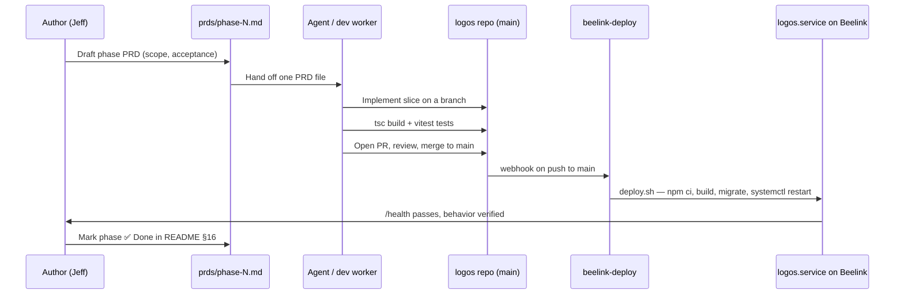

# Iteration Loop

Logos uses a **PRD-per-phase** model: each rollout phase has a self-contained, agent-executable PRD under `prds/`, and a worker (human or agent) is handed one file at a time ([README.md:469-470](https://github.com/Jeffrey-Keyser/logos/blob/main/README.md#L469-L470)).

## Phase ledger

Phases 0 and 1 are complete (✅ Done 2026-04-30); phase 2 (proposal review), phase 3 (query API), and phase 4+ backlog tracks (RabbitMQ wiring, HTML review, cron, RSS, empty-hub tuning) are checked into `prds/` as discrete files ([README.md:472-499](https://github.com/Jeffrey-Keyser/logos/blob/main/README.md#L472-L499), [prds/](https://github.com/Jeffrey-Keyser/logos/blob/main/prds)).

## Build + test loop

- `npm run dev` — `ts-node src/bin/www.ts` for local iteration ([package.json:7](https://github.com/Jeffrey-Keyser/logos/blob/main/package.json#L7)).
- `npm run build` — TypeScript compile to `dist/` ([package.json:8](https://github.com/Jeffrey-Keyser/logos/blob/main/package.json#L8)).
- `npm test` — Vitest suite under `tests/` ([package.json:10](https://github.com/Jeffrey-Keyser/logos/blob/main/package.json#L10)).
- `npm run migrate` — `node-pg-migrate` driver in `scripts/run-migrate.js`, run against the `logos` schema ([package.json:11](https://github.com/Jeffrey-Keyser/logos/blob/main/package.json#L11)).
- `npm run prepare:models` — downloads `bge-small-en-v1.5` ONNX into `~/logos/models/` on first deploy ([package.json:16](https://github.com/Jeffrey-Keyser/logos/blob/main/package.json#L16), [README.md:454-455](https://github.com/Jeffrey-Keyser/logos/blob/main/README.md#L454-L455)).
- `npm run seed:prompts` — pushes the four `logos/*` prompt bodies to prompt-registry as part of bringing up a fresh environment ([package.json:17](https://github.com/Jeffrey-Keyser/logos/blob/main/package.json#L17)).

## Merge → deploy

Auto-deploy is wired through `Jeffrey-Keyser/beelink-deploy`. On push to `main`, the deploy hook fires `deploy.sh` which runs `npm ci`, `npm run build`, `npm run migrate`, and `systemctl --user restart logos` ([README.md:430](https://github.com/Jeffrey-Keyser/logos/blob/main/README.md#L430), [deploy.sh:1-14](https://github.com/Jeffrey-Keyser/logos/blob/main/deploy.sh#L1-L14)). The user-systemd path requires `XDG_RUNTIME_DIR` and `DBUS_SESSION_BUS_ADDRESS` to be exported so `systemctl --user` works under the deploy daemon ([deploy.sh:4-7](https://github.com/Jeffrey-Keyser/logos/blob/main/deploy.sh#L4-L7)).

## What "done" looks like for a slice

A phase is "done" when its acceptance bullets in the PRD pass, the README's §16 phase ledger flips to ✅ with a date, and the live `/health` shows the new build's embedding warmup + DB probe passing ([README.md:472-499](https://github.com/Jeffrey-Keyser/logos/blob/main/README.md#L472-L499)).
