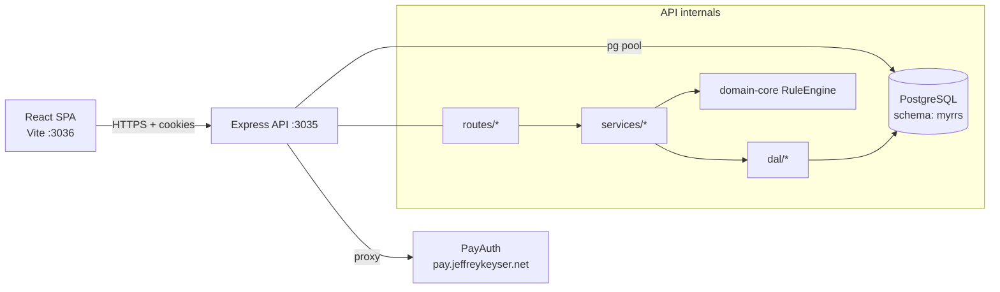

# Architecture

Two-workspace monorepo: a React/Vite SPA talks to an Express API that owns a PostgreSQL schema ([CLAUDE.md:54-60](https://github.com/Jeffrey-Keyser/myrrs/blob/main/CLAUDE.md#L54-L60)).

## Role contracts

**SPA entry.** `src/client/src/main.tsx` mounts `<App/>`; routing, layout, and Redux store live under `src/client/src/app` and `src/client/src/reducers` ([src/client/src/main.tsx](https://github.com/Jeffrey-Keyser/myrrs/blob/main/src/client/src/main.tsx#L1), [src/client/src/reducers](https://github.com/Jeffrey-Keyser/myrrs/blob/main/src/client/src/reducers)).

**API composition root.** `src/server/app.ts` builds the Express app via `@jeffrey-keyser/express-server-factory`, registers PayAuth, CORS, security headers, sessions on `connect-pg-simple`, and mounts routers ([src/server/app.ts:64-133](https://github.com/Jeffrey-Keyser/myrrs/blob/main/src/server/app.ts#L64-L133)).

**Routers.** Feature routers live in `src/server/routes/`: `routines`, `schedule`, `rules`, `ruleConfigurations`, `analytics`, `profile`, plus `auth` mounted from PayAuth ([src/server/app.ts:14-20](https://github.com/Jeffrey-Keyser/myrrs/blob/main/src/server/app.ts#L14-L20), [src/server/app.ts:123-132](https://github.com/Jeffrey-Keyser/myrrs/blob/main/src/server/app.ts#L123-L132)).

**Services.** Domain-core services are called directly from route handlers; the local `services/routines/index.ts` is intentionally empty after refactor ([src/server/services/routines/index.ts:1-3](https://github.com/Jeffrey-Keyser/myrrs/blob/main/src/server/services/routines/index.ts#L1-L3)). Local services that remain: `UserResolutionService` (auto-provision on first request) and `users/preferences` ([src/server/services/UserResolutionService.ts](https://github.com/Jeffrey-Keyser/myrrs/blob/main/src/server/services/UserResolutionService.ts), [src/server/services/users/preferences.ts](https://github.com/Jeffrey-Keyser/myrrs/blob/main/src/server/services/users/preferences.ts)).

**Repositories (DAL).** Repository pattern wraps the `pg` pool. Concrete repos: `RoutineRepository`, `TaskRepository`, `PreferencesRepository`, `RuleConfigurationRepository`, `UserSchedulingPreferencesRepository`, `UsersDal`, all extending `BaseRepository` ([src/server/dal](https://github.com/Jeffrey-Keyser/myrrs/blob/main/src/server/dal), [src/server/dal/BaseRepository.ts](https://github.com/Jeffrey-Keyser/myrrs/blob/main/src/server/dal/BaseRepository.ts)).

**Rule engine.** Sourced from `@jeffrey-keyser/myrrs-domain-core` — extensible `Rule` interface with `RuleEngine` orchestrating hard/soft constraints; route handlers call into it directly ([src/server/package.json:18](https://github.com/Jeffrey-Keyser/myrrs/blob/main/src/server/package.json#L18), [CLAUDE.md:96-103](https://github.com/Jeffrey-Keyser/myrrs/blob/main/CLAUDE.md#L96-L103)).

**Auth middleware.** `setupPayAuth` from `@jeffrey-keyser/pay-auth-integration` registers `/auth/*` routes and a middleware that runs ahead of business routes; `resolveUserData` then hydrates `req` with local user record ([src/server/app.ts:38-51](https://github.com/Jeffrey-Keyser/myrrs/blob/main/src/server/app.ts#L38-L51), [src/server/app.ts:119-121](https://github.com/Jeffrey-Keyser/myrrs/blob/main/src/server/app.ts#L119-L121)).

**Database bootstrap.** `db/init.ts` is invoked on app load via `app.ts`; deployable schema and migrations live in `src/server/db/` ([src/server/app.ts:23-31](https://github.com/Jeffrey-Keyser/myrrs/blob/main/src/server/app.ts#L23-L31), [src/server/db](https://github.com/Jeffrey-Keyser/myrrs/blob/main/src/server/db)).

**Client state.** RTK Query slices map 1:1 onto API surfaces: `routinesApi`, `scheduleApi`, `rulesApi`, `analyticsApi`, `preferencesApi`, `profileApi`, plus a `uiSlice` for ephemeral UI state ([src/client/src/reducers](https://github.com/Jeffrey-Keyser/myrrs/blob/main/src/client/src/reducers)).
