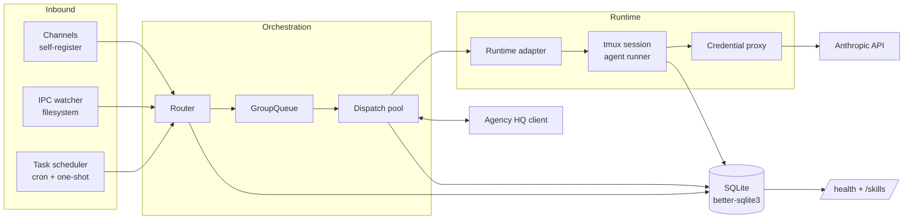

# Architecture

NanoClaw is a single Node.js process composed of small, well-named modules. The entry point `src/index.ts` bootstraps the app, the dispatcher, and the message loop, then keeps the process alive ([src/index.ts:13-21](https://github.com/Jeffrey-Keyser/nanoclaw/blob/main/src/index.ts#L13-L21)).

## Component diagram

## Role contracts

### Lifecycle and orchestration
- `src/lifecycle.ts` owns startup: it imports the channel registry side-effects, initializes secrets, the credential proxy, the SQLite DB, the IPC watcher, message API, skill registry, and the Agency HQ subsystems ([src/lifecycle.ts:1-67](https://github.com/Jeffrey-Keyser/nanoclaw/blob/main/src/lifecycle.ts#L1-L67)).
- `src/index.ts` is intentionally tiny: it calls `initApp`, `initDispatcher`, recovers pending messages, then starts the message loop ([src/index.ts:13-21](https://github.com/Jeffrey-Keyser/nanoclaw/blob/main/src/index.ts#L13-L21)).
- Shared mutable state (sessions, registered groups, last timestamps) lives in a single `state` object in `lifecycle.ts` ([src/lifecycle.ts:72-77](https://github.com/Jeffrey-Keyser/nanoclaw/blob/main/src/lifecycle.ts#L72-L77)).

### Channels
- Channels self-register through `src/channels/registry.ts` at startup; Telegram is the in-repo example ([CLAUDE.md:16](https://github.com/Jeffrey-Keyser/nanoclaw/blob/main/CLAUDE.md#L16), [README.md:72-73](https://github.com/Jeffrey-Keyser/nanoclaw/blob/main/README.md#L72-L73)).
- Additional channels (WhatsApp, Slack, Discord, Gmail, X) are explicitly out of core and arrive via skills or forks ([README.md:81-86](https://github.com/Jeffrey-Keyser/nanoclaw/blob/main/README.md#L81-L86)).

### Router, queue, dispatch
- `src/router.ts` handles message formatting and outbound routing ([CLAUDE.md:19](https://github.com/Jeffrey-Keyser/nanoclaw/blob/main/CLAUDE.md#L19)).
- `src/group-queue.ts` (`GroupQueue`) holds per-group work, instantiated once in `lifecycle.ts` ([src/lifecycle.ts:80](https://github.com/Jeffrey-Keyser/nanoclaw/blob/main/src/lifecycle.ts#L80)).
- `src/dispatch-pool.ts` runs the slot lifecycle, startup recovery, and drain behavior ([CLAUDE.md:23](https://github.com/Jeffrey-Keyser/nanoclaw/blob/main/CLAUDE.md#L23)); `src/dispatch-loop.ts` enforces the 3-strike `dispatch_blocked_until` rule against Agency HQ ([CLAUDE.md:115-117](https://github.com/Jeffrey-Keyser/nanoclaw/blob/main/CLAUDE.md#L115-L117)).

### Runtime layer
- `src/runtime-adapter.ts` defines the runtime contract; the only shipping implementation is `TmuxRuntimeAdapter`, with `kind: 'tmux-host'` and `preferredTarget: 'micro-vm'` for the next step ([src/runtime-adapter.ts:5-40](https://github.com/Jeffrey-Keyser/nanoclaw/blob/main/src/runtime-adapter.ts#L5-L40)).
- `src/container-runner.ts` spawns tmux-backed agent sessions and wires output ([CLAUDE.md:22](https://github.com/Jeffrey-Keyser/nanoclaw/blob/main/CLAUDE.md#L22), [README.md:182](https://github.com/Jeffrey-Keyser/nanoclaw/blob/main/README.md#L182)).
- `src/session-settings.ts` builds the per-group Claude config and runtime env bootstrap ([README.md:183](https://github.com/Jeffrey-Keyser/nanoclaw/blob/main/README.md#L183)).
- `src/credential-proxy.ts` keeps the real Anthropic credentials on the host and exposes a local proxy on `CREDENTIAL_PROXY_PORT` (default 3001) ([README.md:79](https://github.com/Jeffrey-Keyser/nanoclaw/blob/main/README.md#L79), [src/config.ts:47-50](https://github.com/Jeffrey-Keyser/nanoclaw/blob/main/src/config.ts#L47-L50)).
- `src/mount-security.ts` is paired with a host-side allowlist stored *outside* the project root and never mounted into agents ([src/config.ts:22-28](https://github.com/Jeffrey-Keyser/nanoclaw/blob/main/src/config.ts#L22-L28)).

### Persistence
- SQLite via `better-sqlite3`, accessed through `src/db/` (groups, sessions, tasks, messages, outbound messages, dispatch slots, migrations) ([package.json:40](https://github.com/Jeffrey-Keyser/nanoclaw/blob/main/package.json#L40), [CLAUDE.md:23](https://github.com/Jeffrey-Keyser/nanoclaw/blob/main/CLAUDE.md#L23)).

### Cross-cutting subsystems
- `src/ipc.ts` is the filesystem IPC watcher and handler dispatch ([CLAUDE.md:18](https://github.com/Jeffrey-Keyser/nanoclaw/blob/main/CLAUDE.md#L18), [README.md:186](https://github.com/Jeffrey-Keyser/nanoclaw/blob/main/README.md#L186)).
- `src/task-scheduler.ts` runs recurring + one-shot tasks against group context ([CLAUDE.md:20](https://github.com/Jeffrey-Keyser/nanoclaw/blob/main/CLAUDE.md#L20), [README.md:75](https://github.com/Jeffrey-Keyser/nanoclaw/blob/main/README.md#L75)).
- `src/agency-hq-dispatcher.ts` + `src/agency-hq-client.ts` integrate Agency HQ dispatch, stall detection, ops watchdog, sprint retro watcher ([src/lifecycle.ts:50-56](https://github.com/Jeffrey-Keyser/nanoclaw/blob/main/src/lifecycle.ts#L50-L56)).
- `src/service-health.ts` builds the `/health` snapshot served alongside `/skills` ([CLAUDE.md:13](https://github.com/Jeffrey-Keyser/nanoclaw/blob/main/CLAUDE.md#L13), [README.md:78](https://github.com/Jeffrey-Keyser/nanoclaw/blob/main/README.md#L78)).
- `src/notification-batcher.ts`, `src/uptime-monitor.ts`, `src/systemd-crash-monitor.ts`, `src/circuit-breaker.ts` — observability + resilience helpers wired in lifecycle ([src/lifecycle.ts:58-67](https://github.com/Jeffrey-Keyser/nanoclaw/blob/main/src/lifecycle.ts#L58-L67)).
