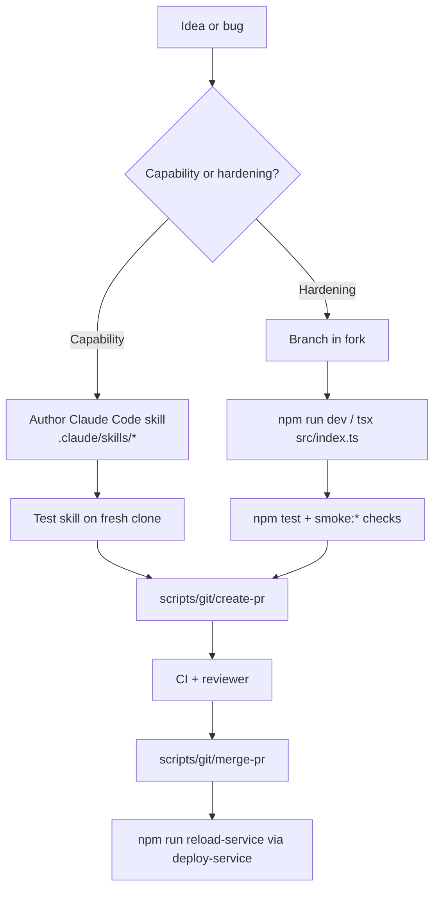

# Iteration Loop

NanoClaw's iteration loop is opinionated: **most new behavior should be a skill, not a core change**, and core changes are scoped to correctness, security, deploy safety, observability, and simplification ([CONTRIBUTING.md:5-7](https://github.com/Jeffrey-Keyser/nanoclaw/blob/main/CONTRIBUTING.md#L5-L7), [README.md:191-195](https://github.com/Jeffrey-Keyser/nanoclaw/blob/main/README.md#L191-L195)).

## Cycle diagram

## Steps, cited

1. **Decide capability vs hardening.** A skill PR must not modify any source files; core PRs should focus on correctness, security, deploy safety, scheduler reliability, observability, session lifecycle ([CONTRIBUTING.md:11-15](https://github.com/Jeffrey-Keyser/nanoclaw/blob/main/CONTRIBUTING.md#L11-L15), [CONTRIBUTING.md:26-36](https://github.com/Jeffrey-Keyser/nanoclaw/blob/main/CONTRIBUTING.md#L26-L36)).
2. **Develop locally.** `npm run dev` runs the orchestrator with hot reload via `tsx` ([package.json:14](https://github.com/Jeffrey-Keyser/nanoclaw/blob/main/package.json#L14), [CLAUDE.md:48](https://github.com/Jeffrey-Keyser/nanoclaw/blob/main/CLAUDE.md#L48)).
3. **Build artifacts when needed.** `npm run build:core` compiles the main service; `npm run build:agent-runner` compiles the in-container agent runner ([package.json:12-13](https://github.com/Jeffrey-Keyser/nanoclaw/blob/main/package.json#L12-L13), [CLAUDE.md:49-50](https://github.com/Jeffrey-Keyser/nanoclaw/blob/main/CLAUDE.md#L49-L50)).
4. **Run the test gate.** `npm test` runs Vitest once; `npm run test:watch` for iteration; `npm run test:coverage` for coverage ([package.json:26-28](https://github.com/Jeffrey-Keyser/nanoclaw/blob/main/package.json#L26-L28), [CLAUDE.md:61-63](https://github.com/Jeffrey-Keyser/nanoclaw/blob/main/CLAUDE.md#L61-L63)). Test files live alongside source under `src/**/*.test.ts` and in `setup/**/*.test.ts`, configured by `vitest.config.ts` and `vitest.skills.config.ts` ([CLAUDE.md:64](https://github.com/Jeffrey-Keyser/nanoclaw/blob/main/CLAUDE.md#L64)).
5. **Smoke the live paths.** `npm run smoke:runtime`, `npm run smoke:health`, and `npm run smoke:db-container` cover runtime, the health endpoint, and the v2 DB-backed container spawn path ([CLAUDE.md:51-53](https://github.com/Jeffrey-Keyser/nanoclaw/blob/main/CLAUDE.md#L51-L53), [README.md:150-162](https://github.com/Jeffrey-Keyser/nanoclaw/blob/main/README.md#L150-L162)).
6. **Open the PR.** Use the bundled dev-inbox helpers: `scripts/git/create-pr <branch> [--auto-merge]` handles worktree conflicts, missing commits, gh API retries, CI wait, and branch cleanup ([CLAUDE.md:34-40](https://github.com/Jeffrey-Keyser/nanoclaw/blob/main/CLAUDE.md#L34-L40), [README.md:138-146](https://github.com/Jeffrey-Keyser/nanoclaw/blob/main/README.md#L138-L146)).
7. **Merge.** `scripts/git/merge-pr <pr-number> [--squash|--merge|--rebase]` or the combined `create-and-merge` ([CLAUDE.md:37-38](https://github.com/Jeffrey-Keyser/nanoclaw/blob/main/CLAUDE.md#L37-L38)).
8. **Deploy.** `./deploy-service <service> [--with-tests]` is the deploy path; use `--with-tests` when touching dispatch / routing / IPC / config / notifications, omit for config-only or hotfixes ([CLAUDE.md:68-72](https://github.com/Jeffrey-Keyser/nanoclaw/blob/main/CLAUDE.md#L68-L72)). `npm run build` reloads the service via `scripts/reload-service.mjs` ([package.json:11-14](https://github.com/Jeffrey-Keyser/nanoclaw/blob/main/package.json#L11-L14)).
9. **Per-group instruction edits.** Durable group memory and persona live in `groups/{name}/CLAUDE.local.md`; the runtime `groups/{name}/CLAUDE.md` may be rewritten at spawn and should be treated as generated state ([CLAUDE.md:55-58](https://github.com/Jeffrey-Keyser/nanoclaw/blob/main/CLAUDE.md#L55-L58)).

## What core will reject

Feature growth, channels, broad compatibility shims, product enhancements — these should be skills or downstream forks ([CONTRIBUTING.md:7](https://github.com/Jeffrey-Keyser/nanoclaw/blob/main/CONTRIBUTING.md#L7), [CONTRIBUTING.md:36](https://github.com/Jeffrey-Keyser/nanoclaw/blob/main/CONTRIBUTING.md#L36)).
