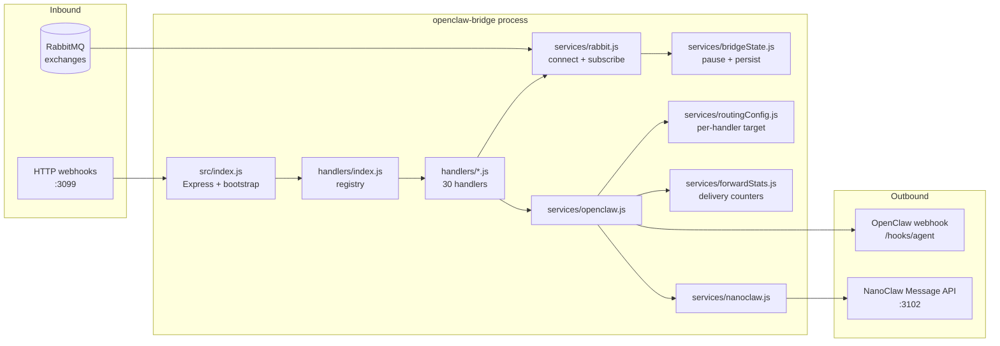

# Architecture

OpenClaw Bridge is a single-process Node.js app. `src/index.js` boots an Express server and a RabbitMQ channel, then `src/handlers/index.js` initializes every registered handler. Each handler subscribes to its own queue (and/or registers HTTP routes), and forwards events out through the routing layer to OpenClaw and/or NanoClaw ([src/index.js:596-626](https://github.com/Jeffrey-Keyser/openclaw-bridge/blob/main/src/index.js#L596-L626), [src/handlers/index.js:76-102](https://github.com/Jeffrey-Keyser/openclaw-bridge/blob/main/src/handlers/index.js#L76-L102)).

## Component diagram

## Role contracts

### Entry / HTTP layer — `src/index.js`

Boots Express on `HTTP_PORT` (default 3099), mounts the admin API (`/admin/handlers`, `/admin/targets`, `/admin/bridge`), Twilio routes, CCW email + contact form, pantry receipt upload, dev-inbox, plan-manager mount, decisions notify, spanish review, and a himalaya-backed email/calendar proxy. After RabbitMQ connects, calls `initializeHandlers()` and then `app.listen` ([src/index.js:23-44](https://github.com/Jeffrey-Keyser/openclaw-bridge/blob/main/src/index.js#L23-L44), [src/index.js:596-620](https://github.com/Jeffrey-Keyser/openclaw-bridge/blob/main/src/index.js#L596-L620)).

### Handler registry — `src/handlers/index.js`

Single flat array of `{ name, module, enabled }` entries, currently 30 handlers covering ping, cron, qa-patrol, spanish (3 modules), briefing, news, summary, package, backup, twilio, reminder, spanish-session (2), ccw (3), thrash, pantry-receipt, flights (2), workout, drive, agency, decisions, cron-health, logos, plan-manager-style helpers. Each handler exposes an `init()` that subscribes to its exchange and an internal forwarder ([src/handlers/index.js:41-102](https://github.com/Jeffrey-Keyser/openclaw-bridge/blob/main/src/handlers/index.js#L41-L102)).

### RabbitMQ service — `src/services/rabbit.js`

Owns the single AMQP connection and channel. Prefetch is `1` to keep one in-flight message at a time. Exposes `subscribeToExchange` (fanout) and `subscribeToQueue` (topic with a routing pattern). Both wrap consumer logic that respects `isHandlerEnabled` from bridgeState; on handler failure, requeues once, then drops to avoid poison-message loops that historically generated ~5,720 log lines/min ([src/services/rabbit.js:42-100](https://github.com/Jeffrey-Keyser/openclaw-bridge/blob/main/src/services/rabbit.js#L42-L100)).

### Bridge state — `src/services/bridgeState.js`

In-memory `{ globalPause, handlers }` persisted to `data/bridge-state.json`. `isHandlerEnabled(name)` returns false on global pause or a per-handler override. Used by both rabbit consumers (to ack-skip) and the admin API ([src/services/bridgeState.js:21-95](https://github.com/Jeffrey-Keyser/openclaw-bridge/blob/main/src/services/bridgeState.js#L21-L95)).

### Routing — `src/services/routingConfig.js`

Per-handler target of `openclaw | nanoclaw | both`. Default is `nanoclaw` for all handlers — i.e. the bridge's normal output path is the Telegram-shaped Message API, not the old OpenClaw webhook ([src/services/routingConfig.js:9-22](https://github.com/Jeffrey-Keyser/openclaw-bridge/blob/main/src/services/routingConfig.js#L9-L22)).

### OpenClaw client — `src/services/openclaw.js`

`sendToOpenClaw(message, { name, channel, deliver })` reads the target for the source name, POSTs `{message, name, deliver, channel, wakeMode:'now'}` to `OPENCLAW_WEBHOOK_URL` with a bearer token, and/or calls NanoClaw. Records every attempt to forward-stats ([src/services/openclaw.js:24-80](https://github.com/Jeffrey-Keyser/openclaw-bridge/blob/main/src/services/openclaw.js#L24-L80)).

### NanoClaw client — `src/services/nanoclaw.js`

Gated by `NANOCLAW_ENABLED=true`. Sends `{recipient, content, template:'custom'}` to the local Message API (default `http://127.0.0.1:3102/api/v1/messages`) at chat JID `NANOCLAW_CHAT_JID`. Delivery errors are deduped to one log line per minute per error key to avoid journalctl floods ([src/services/nanoclaw.js:7-69](https://github.com/Jeffrey-Keyser/openclaw-bridge/blob/main/src/services/nanoclaw.js#L7-L69)).
