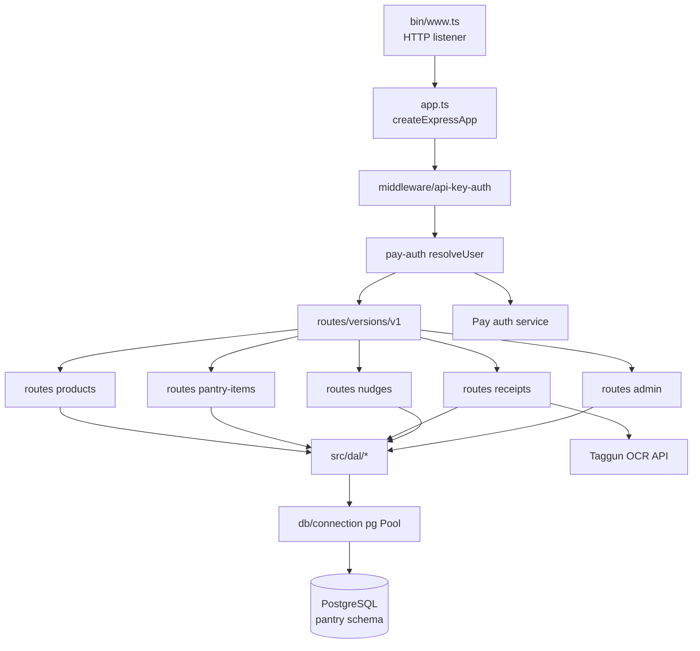

# Architecture

Classic three-layer Express service: HTTP routers delegate to a Data Access Layer (DAL), which talks to a shared `pg` pool. Composition is delegated to `@jeffrey-keyser/express-server-factory` so middleware, health checks, CORS, and routes are declared as config ([src/app.ts:55-116](https://github.com/Jeffrey-Keyser/pantry-manager/blob/main/src/app.ts#L55-L116)).

## Role contracts

**Entrypoint** — `src/bin/www.ts` boots the cached app, calls `listen`, wires `SIGTERM` graceful shutdown ([src/bin/www.ts:6-46](https://github.com/Jeffrey-Keyser/pantry-manager/blob/main/src/bin/www.ts#L6-L46)).

**Composition root** — `src/app.ts` builds a `ServerConfig` object (env, cors, json, auth, custom middleware, health, routes, error handling) and hands it to `createExpressApp` from `express-server-factory` ([src/app.ts:55-122](https://github.com/Jeffrey-Keyser/pantry-manager/blob/main/src/app.ts#L55-L122)).

**Config / env validation** — `src/config/env.ts` loads `.env`, validates `NODE_ENV`, `PORT`, `PANTRY_MANAGER_API_KEY` (hard required), and a `DatabaseConfig` via `validateDatabaseConfig` from `database-base-config` ([src/config/env.ts:18-65](https://github.com/Jeffrey-Keyser/pantry-manager/blob/main/src/config/env.ts#L18-L65)).

**Auth layer** — `apiKeyAuth` middleware checks `X-API-Key` / `Authorization: Bearer` against `PANTRY_MANAGER_API_KEY`, with `/health` and `/` whitelisted ([src/middleware/api-key-auth.ts:4-20](https://github.com/Jeffrey-Keyser/pantry-manager/blob/main/src/middleware/api-key-auth.ts#L4-L20)). User identity layer = `createUserResolutionMiddleware` from pay-auth-integration; upserts `pantry.users` by `pay_uuid` ([src/app.ts:27-48](https://github.com/Jeffrey-Keyser/pantry-manager/blob/main/src/app.ts#L27-L48)).

**Routing** — versioned mount at `/api/v1`, sub-routers per resource: products, pantry-items, receipts, nudges, admin ([src/routes/versions/v1/index.ts:11-15](https://github.com/Jeffrey-Keyser/pantry-manager/blob/main/src/routes/versions/v1/index.ts#L11-L15)). Root `/` returns a service descriptor ([src/routes/index.ts:5-13](https://github.com/Jeffrey-Keyser/pantry-manager/blob/main/src/routes/index.ts#L5-L13)).

**DAL** — `src/dal/products.ts`, `pantry-items.ts`, `receipts.ts`, `nudges.ts`, `seed-from-ping.ts`. Each module exports typed input/output interfaces and async functions that call `pool.query` directly — no ORM ([src/dal/products.ts:27-40](https://github.com/Jeffrey-Keyser/pantry-manager/blob/main/src/dal/products.ts#L27-L40)).

**Database** — single shared `pg.Pool` via `createPool` from `database-base-config` ([src/db/connection.ts:1-6](https://github.com/Jeffrey-Keyser/pantry-manager/blob/main/src/db/connection.ts#L1-L6)). Schema owned by `migrations/` using `node-pg-migrate`; initial schema creates `pantry.products`, `pantry.pantry_items`, `pantry.purchase_history` ([migrations/1710600000000_initial-pantry-schema.ts:3-50](https://github.com/Jeffrey-Keyser/pantry-manager/blob/main/migrations/1710600000000_initial-pantry-schema.ts#L3-L50)).

**Client** — separate React 19 SPA in `client/` (Vite build, Redux Toolkit, react-router-dom, pay-auth integration), not coupled to server build ([client/package.json:5-25](https://github.com/Jeffrey-Keyser/pantry-manager/blob/main/client/package.json#L5-L25)).
