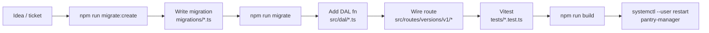

# Iteration Loop

Schema-first cycle. New behavior usually starts at the database (migration), surfaces through the DAL, gets exposed in a versioned router, gets covered by vitest, then ships via `tsc` + systemd restart.

## Steps

1. **Scaffold migration** — `npm run migrate:create -- <name>` invokes `scripts/create-migration.js`, producing a timestamped TS file in `migrations/` ([package.json:13](https://github.com/Jeffrey-Keyser/pantry-manager/blob/main/package.json#L13), [README.md:46](https://github.com/Jeffrey-Keyser/pantry-manager/blob/main/README.md#L46)).
2. **Define schema** — write `up`/`down` using `MigrationBuilder` SQL; follow the pattern of `1710600000000_initial-pantry-schema.ts` (raw SQL in `pgm.sql(...)`, indexes alongside table) ([migrations/1710600000000_initial-pantry-schema.ts:3-41](https://github.com/Jeffrey-Keyser/pantry-manager/blob/main/migrations/1710600000000_initial-pantry-schema.ts#L3-L41)).
3. **Apply** — `npm run migrate` runs `scripts/run-migrate.js` against the configured `pantry_manager` DB ([package.json:11](https://github.com/Jeffrey-Keyser/pantry-manager/blob/main/package.json#L11)).
4. **DAL function** — add a typed function in the matching `src/dal/*.ts`. Convention: export `interface XxxInput`, `interface Xxx`, then async `createXxx`/`getXxx` calling `pool.query` ([src/dal/products.ts:13-40](https://github.com/Jeffrey-Keyser/pantry-manager/blob/main/src/dal/products.ts#L13-L40)).
5. **Route** — mount the handler in `src/routes/versions/v1/<resource>.ts`; the v1 index aggregates sub-routers under `/api/v1` ([src/routes/versions/v1/index.ts:9-15](https://github.com/Jeffrey-Keyser/pantry-manager/blob/main/src/routes/versions/v1/index.ts#L9-L15)).
6. **Test** — write a vitest spec in `tests/` using supertest; existing examples cover api-key auth, nudges, and receipt parse ([package.json:10](https://github.com/Jeffrey-Keyser/pantry-manager/blob/main/package.json#L10)). Run with `npm test`.
7. **Build + deploy** — `npm run build` compiles to `dist/`, then `systemctl --user restart pantry-manager` flips the running service ([README.md:51-56](https://github.com/Jeffrey-Keyser/pantry-manager/blob/main/README.md#L51-L56)).

## Notes

- No PR templates / CI workflow committed; merge gate is local `npm test` + `npm run build`.
- API key (`PANTRY_MANAGER_API_KEY`) must be set in `.env` before boot or `validateAndLoadConfig` throws ([src/config/env.ts:52-55](https://github.com/Jeffrey-Keyser/pantry-manager/blob/main/src/config/env.ts#L52-L55)).
- Public paths bypass auth: `/health` and `/` only — every new route inherits API-key requirement automatically ([src/middleware/api-key-auth.ts:4-7](https://github.com/Jeffrey-Keyser/pantry-manager/blob/main/src/middleware/api-key-auth.ts#L4-L7)).
