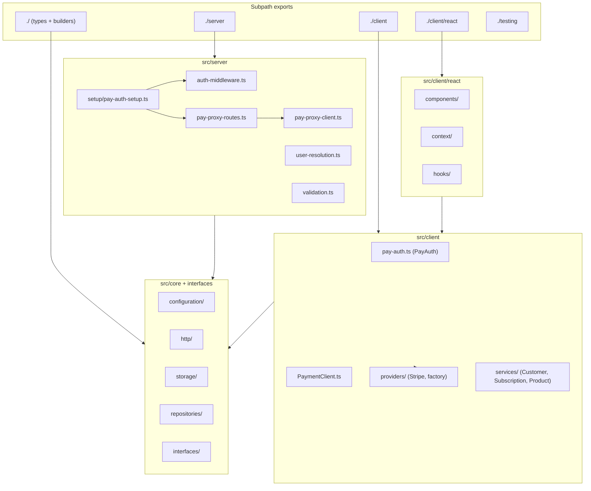

# Architecture

Package splits into five subpath-export surfaces backed by a shared `core/` ([package.json:9-34](https://github.com/Jeffrey-Keyser/pay-auth-integration/blob/main/package.json#L9-L34)).

## Role contracts

### Server entry

`setupPayAuth(config)` — one-call wiring. Merges defaults, validates config, builds middleware + proxy router, mounts on Express app ([src/server/index.ts:37-126](https://github.com/Jeffrey-Keyser/pay-auth-integration/blob/main/src/server/index.ts#L37-L126)). Backed by `PayAuthSetup` class ([src/server/index.ts:24-24](https://github.com/Jeffrey-Keyser/pay-auth-integration/blob/main/src/server/index.ts#L24)).

`authMiddleware` — token validation, attaches `req.user`, caches token results, exposes `requireAuth`/`requireRole`/`requirePermission` guards ([src/server/index.ts:128-144](https://github.com/Jeffrey-Keyser/pay-auth-integration/blob/main/src/server/index.ts#L128-L144)).

`createPayProxyRoutes` / `PayProxyClient` — Express router that forwards `/auth/*` and payment endpoints to Pay ([src/server/index.ts:27-29](https://github.com/Jeffrey-Keyser/pay-auth-integration/blob/main/src/server/index.ts#L27-L29)).

User resolution pipeline — `createUserResolutionMiddleware`, `createAuthPipeline` for layered auth flows ([src/server/index.ts:146-155](https://github.com/Jeffrey-Keyser/pay-auth-integration/blob/main/src/server/index.ts#L146-L155)).

### Client SDK

`PayAuth` — auth client: login, register, logout, getUser, token getters, event listeners ([README.md:294-311](https://github.com/Jeffrey-Keyser/pay-auth-integration/blob/main/README.md#L294-L311), [src/client/index.ts:7](https://github.com/Jeffrey-Keyser/pay-auth-integration/blob/main/src/client/index.ts#L7)).

`PaymentClient` — provider-agnostic payment ops, loads provider SDK dynamically ([src/client/index.ts:11-12](https://github.com/Jeffrey-Keyser/pay-auth-integration/blob/main/src/client/index.ts#L11-L12)).

`PaymentProviderAdapter` — interface for plug-in providers; ships `StripeProviderAdapter`, registered via `PaymentProviderAdapterFactory` ([src/client/index.ts:25-29](https://github.com/Jeffrey-Keyser/pay-auth-integration/blob/main/src/client/index.ts#L25-L29), [README.md:427-444](https://github.com/Jeffrey-Keyser/pay-auth-integration/blob/main/README.md#L427-L444)).

`CustomerService`, `SubscriptionService`, `ProductService` — higher-level payment management services on top of proxy routes ([src/client/index.ts:31-34](https://github.com/Jeffrey-Keyser/pay-auth-integration/blob/main/src/client/index.ts#L31-L34)).

### React surface

`PayAuthProvider` context wraps the app, `useAuthModal` / `useSubscriptions` / `usePayment` hooks expose state; `AuthModal` and `PaymentModal` are the rendered surfaces ([README.md:336-391](https://github.com/Jeffrey-Keyser/pay-auth-integration/blob/main/README.md#L336-L391)).

### Core shared

`core/configuration` — `PayAuthConfigBuilder`, `ConfigurationFactory`, `AuthModalThemeBuilder` plus theme presets ([src/index.ts:38-49](https://github.com/Jeffrey-Keyser/pay-auth-integration/blob/main/src/index.ts#L38-L49)).

`core/http`, `core/storage`, `core/repositories`, `core/validation` and `interfaces/` — HTTP client, token storage, cache manager, event emitter abstractions consumed by both server and client surfaces ([src tree](https://github.com/Jeffrey-Keyser/pay-auth-integration/blob/main/src/interfaces/http-client.interface.ts), [src/interfaces/token-storage.interface.ts](https://github.com/Jeffrey-Keyser/pay-auth-integration/blob/main/src/interfaces/token-storage.interface.ts)).

### Testing surface

`MockHttpClient`, `ResponseBuilder`, `createMockAuthMiddleware` published from `./testing` for downstream test suites ([README.md:469-477](https://github.com/Jeffrey-Keyser/pay-auth-integration/blob/main/README.md#L469-L477)).
