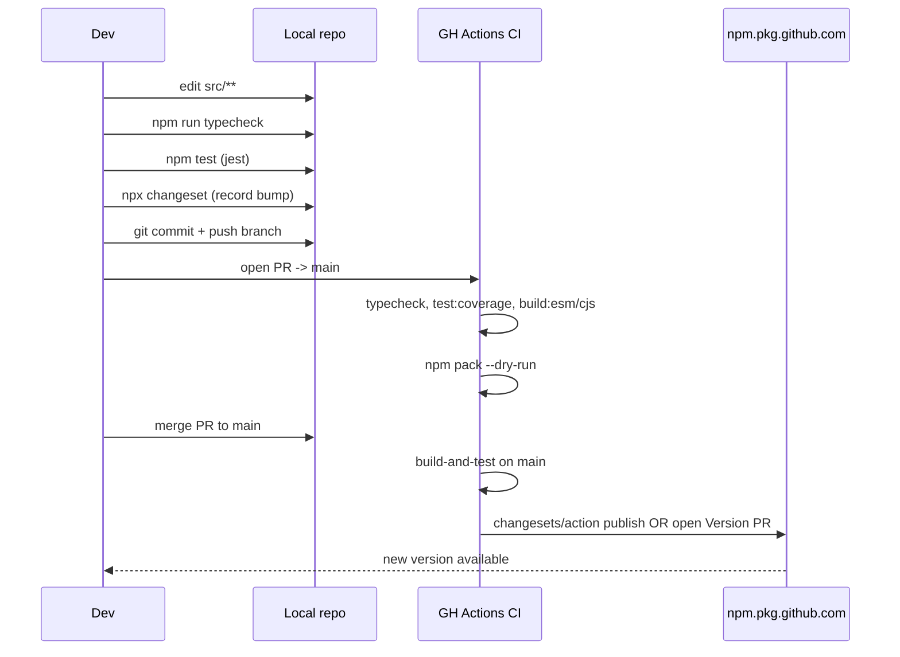

# Iteration Loop

Library repo — change cycle ends in an npm publish, not a deploy. Tooling: `tsc`, `jest`, `changesets`, GitHub Actions.

## Steps cited

1. **Edit** under `src/` — package source root ([package.json:52-58](https://github.com/Jeffrey-Keyser/pay-auth-integration/blob/main/package.json#L52-L58)).
2. **Typecheck** via `npm run typecheck` → `tsc --noEmit` ([package.json:120](https://github.com/Jeffrey-Keyser/pay-auth-integration/blob/main/package.json#L120)).
3. **Test** via `npm test` → `jest`; coverage via `npm run test:coverage` ([package.json:112-114](https://github.com/Jeffrey-Keyser/pay-auth-integration/blob/main/package.json#L112-L114)). Jest config at [jest.config.js](https://github.com/Jeffrey-Keyser/pay-auth-integration/blob/main/jest.config.js).
4. **Record bump** — changesets CLI: `.changeset/` directory holds pending bump notes ([package.json:128-130](https://github.com/Jeffrey-Keyser/pay-auth-integration/blob/main/package.json#L128-L130)).
5. **Build (local sanity)** — `npm run build` runs ESM, CJS, ESM-import fixer, and asset copies ([package.json:99-109](https://github.com/Jeffrey-Keyser/pay-auth-integration/blob/main/package.json#L99-L109)).
6. **CI** — pushes and PRs trigger `build-and-test` job on Node 20 + 22 matrix ([.github/workflows/ci.yml:1-66](https://github.com/Jeffrey-Keyser/pay-auth-integration/blob/main/.github/workflows/ci.yml#L1-L66)).
7. **Publish** — on merge to `main`, `publish` job runs `changesets/action@v1` to either open a Version PR or publish to GitHub Package Registry ([.github/workflows/ci.yml:68-100](https://github.com/Jeffrey-Keyser/pay-auth-integration/blob/main/.github/workflows/ci.yml#L68-L100), [package.json:128-130](https://github.com/Jeffrey-Keyser/pay-auth-integration/blob/main/package.json#L128-L130)).
8. **prepublishOnly guard** — `clean && build && typecheck` runs before any `npm publish` ([package.json:118](https://github.com/Jeffrey-Keyser/pay-auth-integration/blob/main/package.json#L118)).
9. **CHANGELOG** auto-updated by changesets; manual entries also kept ([CHANGELOG.md:1-7](https://github.com/Jeffrey-Keyser/pay-auth-integration/blob/main/CHANGELOG.md#L1-L7)).

Default branch is `main`; CI also runs on pushes to `develop` ([.github/workflows/ci.yml:3-6](https://github.com/Jeffrey-Keyser/pay-auth-integration/blob/main/.github/workflows/ci.yml#L3-L6)).

Storybook is available for component dev (`npm run storybook`) but not required to ship ([package.json:135-136](https://github.com/Jeffrey-Keyser/pay-auth-integration/blob/main/package.json#L135-L136)).
