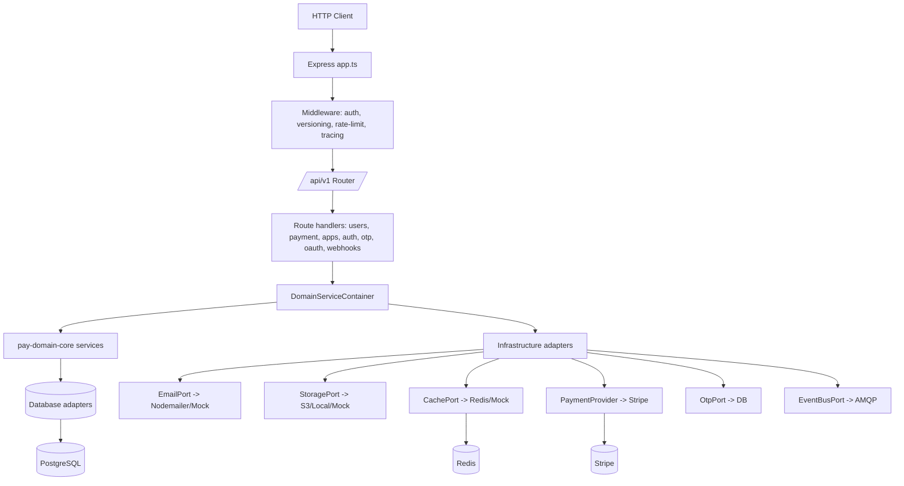

# Architecture

Pay is layered: HTTP (Express routes + middleware) → application services → domain services from `pay-domain-core` → infrastructure adapters → external systems. Singleton `DomainServiceContainer` wires the graph ([server/services/DomainServiceContainer.ts:49-60](https://github.com/Jeffrey-Keyser/pay/blob/main/server/services/DomainServiceContainer.ts#L49-L60)).

## Role contracts

- **Entry point** — `bin/www.ts` boots tracing first, then constructs the HTTP server and reads `PORT` ([server/bin/www.ts:10-33](https://github.com/Jeffrey-Keyser/pay/blob/main/server/bin/www.ts#L10-L33)).
- **Express app** — `app.ts` wires logger, CORS, session store, Swagger, route routers, and the global error mapper ([server/app.ts:1-52](https://github.com/Jeffrey-Keyser/pay/blob/main/server/app.ts#L1-L52)).
- **Versioning** — `/api/v1` is primary, legacy paths 308-redirect via `apiVersioning` middleware ([CLAUDE.md:53-75](https://github.com/Jeffrey-Keyser/pay/blob/main/CLAUDE.md#L53-L75), [server/app.ts:31-37](https://github.com/Jeffrey-Keyser/pay/blob/main/server/app.ts#L31-L37)).
- **Routes** — domain-grouped under `server/routes/` (users, payment, apps, auth, otp, oauth, webhooks, v1) ([server/routes](https://github.com/Jeffrey-Keyser/pay/blob/main/server/routes)).
- **Application services** — orchestrate domain services and adapters: `AuthService`, `UserService`, `PaymentProviderFactory`, `OtpVerificationService`, `GuestCleanupService`, etc. ([server/services](https://github.com/Jeffrey-Keyser/pay/blob/main/server/services)).
- **Domain services** — `AuthenticationService`, `UserRegistrationService`, `PaymentProcessingService`, `AppManagementService`, `GuestMigrationService` imported from `pay-domain-core` ([server/services/DomainServiceContainer.ts:1-8](https://github.com/Jeffrey-Keyser/pay/blob/main/server/services/DomainServiceContainer.ts#L1-L8)).
- **Ports (hexagonal interfaces)** — `EmailPort`, `StoragePort`, `CachePort`, `OtpPort`, `EventBusPort`, `RevocationPort` ([server/ports](https://github.com/Jeffrey-Keyser/pay/blob/main/server/ports)).
- **Adapters** — concrete implementations: `cache/`, `database/`, `email/`, `eventbus/`, `otp/`, `revocation/`, `storage/` ([server/adapters](https://github.com/Jeffrey-Keyser/pay/blob/main/server/adapters)).
- **Infrastructure services** — Stripe, JWT, password hashing, S3, OAuth providers ([server/infrastructure](https://github.com/Jeffrey-Keyser/pay/blob/main/server/infrastructure)).
- **Factories** — `EmailProviderFactory`, `StorageProviderFactory`, `CacheProviderFactory`, `EventBusProviderFactory`, `PaymentProviderFactory` select adapter by env var ([CLAUDE.md:230-258](https://github.com/Jeffrey-Keyser/pay/blob/main/CLAUDE.md#L230-L258), [server/services/factories](https://github.com/Jeffrey-Keyser/pay/blob/main/server/services/factories)).
- **Database** — PostgreSQL via `pg`, two schemas `contact` and `billing`, migrations from shared package `@jeffrey-keyser/database-base-config` ([CLAUDE.md:386-413](https://github.com/Jeffrey-Keyser/pay/blob/main/CLAUDE.md#L386-L413)).
- **Errors** — typed errors from `@jeffrey-keyser/api-errors`, mapped by `HttpErrorMapper` with correlation IDs ([server/app.ts:2-52](https://github.com/Jeffrey-Keyser/pay/blob/main/server/app.ts#L2-L52)).
- **Tracing** — OpenTelemetry SDK loaded before any instrumented module ([server/bin/www.ts:3-10](https://github.com/Jeffrey-Keyser/pay/blob/main/server/bin/www.ts#L3-L10)).

## Module-resolution constraint

ESM `"type": "module"` — TypeScript imports of local files must use `.js` extensions ([server/package.json:5](https://github.com/Jeffrey-Keyser/pay/blob/main/server/package.json#L5), [CONTRIBUTING.md:231-236](https://github.com/Jeffrey-Keyser/pay/blob/main/CONTRIBUTING.md#L231-L236)).
