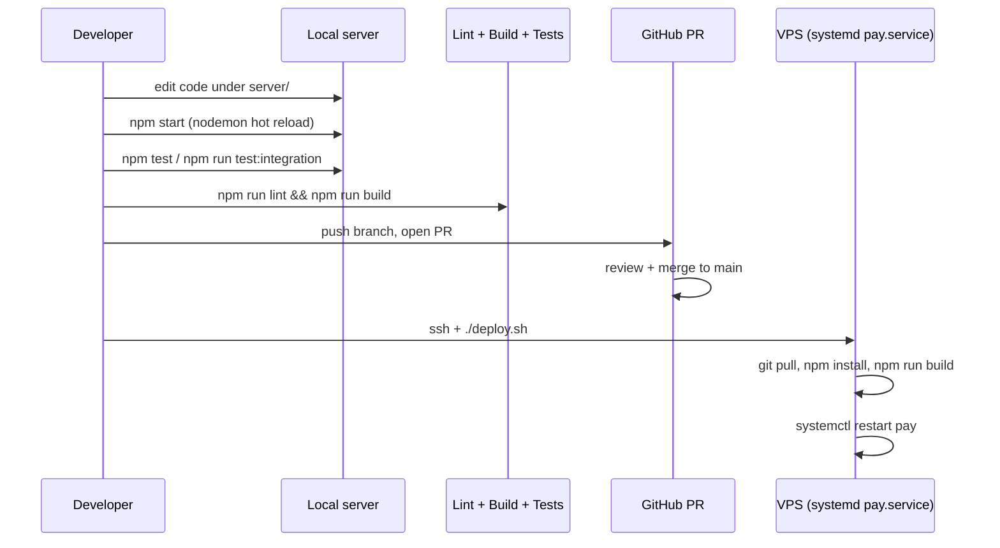

# Iteration Loop

## Steps

1. **Set up locally** — install Node 20, PostgreSQL, Redis; populate `server/.env`; `npm install` and `npm run migrate` ([CONTRIBUTING.md:38-112](https://github.com/Jeffrey-Keyser/pay/blob/main/CONTRIBUTING.md#L38-L112)).
2. **Hot-reload dev** — `npm start` runs nodemon over `ts-node ./bin/www.ts` ([server/package.json:9](https://github.com/Jeffrey-Keyser/pay/blob/main/server/package.json#L9), [CONTRIBUTING.md:129-136](https://github.com/Jeffrey-Keyser/pay/blob/main/CONTRIBUTING.md#L129-L136)).
3. **Add route or service** — define DTOs in `pay-api-types`, add route under `/server/routes/`, wire via `DomainServiceContainer`, document with Swagger JSDoc ([CLAUDE.md:514-521](https://github.com/Jeffrey-Keyser/pay/blob/main/CLAUDE.md#L514-L521)).
4. **Schema change** — author migration in shared `database-base-config` repo, publish, bump version here, run `npm run migrate` ([CLAUDE.md:425-465](https://github.com/Jeffrey-Keyser/pay/blob/main/CLAUDE.md#L425-L465)).
5. **Test** — unit tests via Jest (`npm test`), integration via Vitest + Testcontainers (`npm run test:integration` or `npm run test:docker`) ([server/package.json:11-14](https://github.com/Jeffrey-Keyser/pay/blob/main/server/package.json#L11-L14), [CLAUDE.md:355-378](https://github.com/Jeffrey-Keyser/pay/blob/main/CLAUDE.md#L355-L378)).
6. **Pre-commit gate** — `npm run lint` then `npm run build` always before commit ([CLAUDE.md:163-166](https://github.com/Jeffrey-Keyser/pay/blob/main/CLAUDE.md#L163-L166), [CONTRIBUTING.md:187-197](https://github.com/Jeffrey-Keyser/pay/blob/main/CONTRIBUTING.md#L187-L197)).
7. **Open PR + merge** — review against main on GitHub.
8. **Deploy** — `ssh <server> "cd /home/jkeyser/pay && ./deploy.sh"` performs `git pull`, build, kill port 3017, `systemctl restart pay` ([deploy.sh:1-17](https://github.com/Jeffrey-Keyser/pay/blob/main/deploy.sh#L1-L17), [CLAUDE.md:602-610](https://github.com/Jeffrey-Keyser/pay/blob/main/CLAUDE.md#L602-L610)).

## Auxiliary loops

- **Type changes** propagate from `pay-api-types` package, never duplicated in this repo ([README.md:15-33](https://github.com/Jeffrey-Keyser/pay/blob/main/README.md#L15-L33)).
- **Adapter swap** is driven by env var (`EMAIL_PROVIDER`, `STORAGE_PROVIDER`, `CACHE_PROVIDER`, `PAYMENT_PROVIDER`) — no code change needed ([CLAUDE.md:284-303](https://github.com/Jeffrey-Keyser/pay/blob/main/CLAUDE.md#L284-L303)).
- **Legacy fallback** — AWS Lambda workflows (`lambda-push.yml`, `terraform_deploy.yml`) still exist and could be re-enabled, but the VPS path is live ([CLAUDE.md:619-630](https://github.com/Jeffrey-Keyser/pay/blob/main/CLAUDE.md#L619-L630)).
