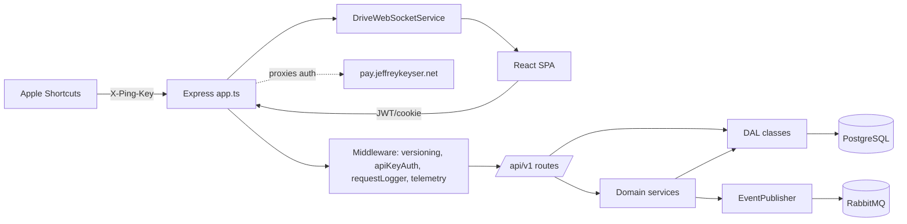

# Architecture

Ping monorepo two deployable artifacts: Express API (`server/`) and Vite-built SPA (`client/`). Both ship to single Beelink host ([README.md:34-37](https://github.com/Jeffrey-Keyser/ping/blob/main/README.md#L34-L37), [deploy.sh:24-27](https://github.com/Jeffrey-Keyser/ping/blob/main/deploy.sh#L24-L27)).

## Role contracts

- **Server entrypoint (`server/app.ts`)** — builds `ServerConfig` for `createServerlessAppSync` from `@jeffrey-keyser/express-server-factory`, mounts `indexRouter`, `v1Router` at `/api/v1`, and `payAuthSetup.routes` at `/auth` ([server/app.ts:1-5](https://github.com/Jeffrey-Keyser/ping/blob/main/server/app.ts#L1-L5), [server/app.ts:244-248](https://github.com/Jeffrey-Keyser/ping/blob/main/server/app.ts#L244-L248)).
- **Middleware pipeline** — correlation ID, telemetry (Analytics Pulse), request logger (Pino), version negotiation, legacy `/v1/*` redirect, version validation, conditional API-key auth, user resolution ([server/app.ts:278-299](https://github.com/Jeffrey-Keyser/ping/blob/main/server/app.ts#L278-L299)).
- **Routes (`server/routes/`)** — one file per domain: `location-pings`, `drives`, `zones`, `visits`, `moods`, `weights`, `expenses`, `workouts/*`, `bluetooth`, `health-sync`, `shortcuts`, `daily-summary`, `weekly-summary`, etc. ([server/routes](https://github.com/Jeffrey-Keyser/ping/blob/main/server/routes)).
- **Domain services (`server/domain/services/`)** — `PingService`, `DriveService`, `ZoneResolutionService`, `DiagnosticsService`, `TimeSeriesBuilder`, health checks ([server/domain/services](https://github.com/Jeffrey-Keyser/ping/blob/main/server/domain/services)).
- **DAL (`server/dal/`)** — one DAL per table family extending shared base; e.g. `PingDal`, `DriveDal`, `DriveWaypointDal`, `ZoneDal`, `VisitDal`, `MoodDal`, `WeightDal`, `WorkoutSessionDal`, `ExpenseDal` ([server/dal](https://github.com/Jeffrey-Keyser/ping/blob/main/server/dal)).
- **Application services (`server/services/`)** — orchestration helpers: `apiKeyService`, `MoodApplicationService`, `WeightApplicationService`, `WorkoutDashboardService`, `ActivityHeatmapService`, `DigestService`, `CronSubscriber`, `EventPublisher`, `DriveWebSocketService`, `telemetry` ([server/services](https://github.com/Jeffrey-Keyser/ping/blob/main/server/services)).
- **EventPublisher** — connects to RabbitMQ via `amqplib`, publishes only for Jeff's user ID; routing keys from `@jeffrey-keyser/message-contracts` ([server/services/EventPublisher.ts:1-32](https://github.com/Jeffrey-Keyser/ping/blob/main/server/services/EventPublisher.ts#L1-L32)).
- **Auth** — `setupPayAuth` from `@jeffrey-keyser/pay-auth-integration/server`; public routes include health, swagger, location-pings, health-sync, shortcuts/links, connectivity ([server/app.ts:70](https://github.com/Jeffrey-Keyser/ping/blob/main/server/app.ts#L70), [server/app.ts:86-122](https://github.com/Jeffrey-Keyser/ping/blob/main/server/app.ts#L86-L122)).
- **Sessions** — `express-session` backed by `user_sessions` table in `ping` schema, 24h TTL ([server/app.ts:174-193](https://github.com/Jeffrey-Keyser/ping/blob/main/server/app.ts#L174-L193)).
- **API versioning** — `versionNegotiation`/`legacyRedirect`/`validateVersion([1])` middleware; `/v1/*` 301s to `/api/v1/*` ([server/middleware/versioning.ts](https://github.com/Jeffrey-Keyser/ping/blob/main/server/middleware/versioning.ts), [CLAUDE.md:96-118](https://github.com/Jeffrey-Keyser/ping/blob/main/CLAUDE.md#L96-L118)).
- **Client (`client/src/`)** — React 19 SPA; Redux Toolkit + RTK Query slices under `reducers/`, containers/components split, Leaflet for maps via `react-leaflet`, Recharts for charts ([client/package.json:6-34](https://github.com/Jeffrey-Keyser/ping/blob/main/client/package.json#L6-L34)).
- **Lambda fallback** — `server/lambda.ts` wraps Express with `serverless-http`; Terraform infra retained but currently unused (Beelink is live) ([server/package.json:49](https://github.com/Jeffrey-Keyser/ping/blob/main/server/package.json#L49), [README.md:113-116](https://github.com/Jeffrey-Keyser/ping/blob/main/README.md#L113-L116)).
