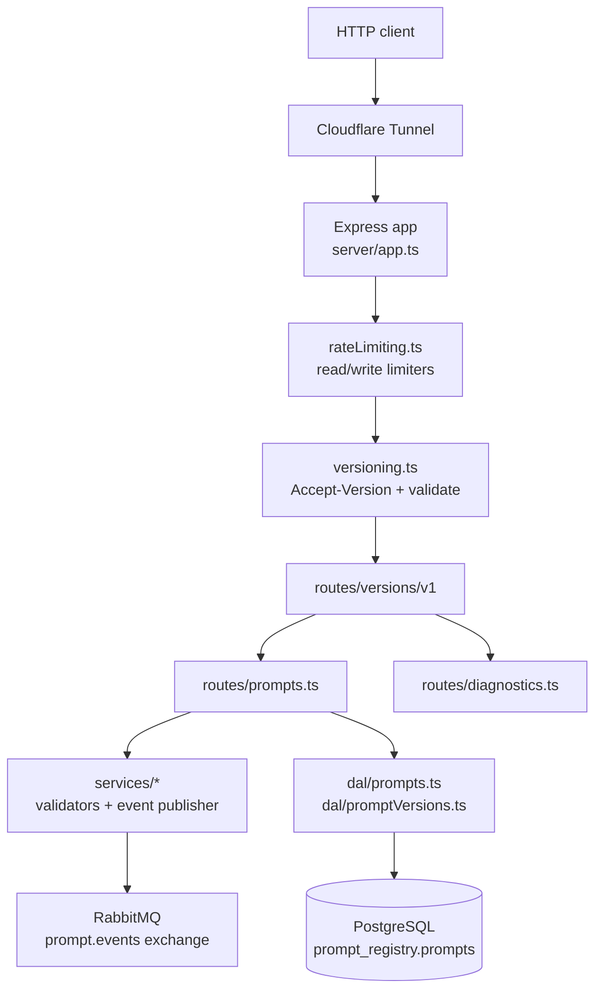

# Architecture

Single Node process. Express 5 application composed by `@jeffrey-keyser/express-server-factory`, with custom rate-limiting, version-negotiation, and routing layered in via `customMiddleware.before` ([server/app.ts:40-138](https://github.com/Jeffrey-Keyser/prompt-registry/blob/main/server/app.ts#L40-L138)).

## Component map

## Role contracts

### Bootstrap

`server/bin/www.ts` is the entrypoint invoked by `npm start`. It initializes the RabbitMQ channel and then `app.listen` on `config.PORT` ([server/bin/www.ts:13-24](https://github.com/Jeffrey-Keyser/prompt-registry/blob/main/server/bin/www.ts#L13-L24)).

### App composition

`server/app.ts` builds a `ServerConfig` and hands it to `createExpressApp`. Auth is explicitly disabled, CORS is allow-listed, Swagger UI is wired to `./routes/**/*.ts`, and a custom rate-limit + version-negotiation chain runs before routes ([server/app.ts:40-138](https://github.com/Jeffrey-Keyser/prompt-registry/blob/main/server/app.ts#L40-L138)).

### Middleware

- `middleware/rateLimiting.ts` — per-IP limiters using `CF-Connecting-IP`, 100 rpm reads / 20 rpm writes, JSON 429 envelope ([server/middleware/rateLimiting.ts:8-46](https://github.com/Jeffrey-Keyser/prompt-registry/blob/main/server/middleware/rateLimiting.ts#L8-L46)).
- `middleware/versioning.ts` — reads `Accept-Version`, writes `API-Version` response header, defaults to v1 ([server/middleware/versioning.ts:23-30](https://github.com/Jeffrey-Keyser/prompt-registry/blob/main/server/middleware/versioning.ts#L23-L30)).

### Routes

- `routes/index.ts` exposes `/` and `/ping` ([server/routes/index.ts:6-16](https://github.com/Jeffrey-Keyser/prompt-registry/blob/main/server/routes/index.ts#L6-L16)).
- `routes/versions/v1/index.ts` mounts `/diagnostics` and `/prompts` under `/api/v1` ([server/routes/versions/v1/index.ts:29-34](https://github.com/Jeffrey-Keyser/prompt-registry/blob/main/server/routes/versions/v1/index.ts#L29-L34)).
- `routes/prompts.ts` and `routes/promptVersions.ts` carry the CRUD + history handlers (`server/routes/` listing shows both).

### Data access layer

DAL modules in `server/dal/` wrap parameterized SQL. `dal/prompts.ts` is the primary CRUD surface and shapes rows into the `Prompt` type with a tags-default ([server/dal/prompts.ts:1-29](https://github.com/Jeffrey-Keyser/prompt-registry/blob/main/server/dal/prompts.ts#L1-L29)). Schema lives in `server/db/schema/001_prompts_table.sql` and is applied by `server/db/deploy.sh` ([CLAUDE.md:36-47](https://github.com/Jeffrey-Keyser/prompt-registry/blob/main/CLAUDE.md#L36-L47)).

### Services

`server/services/` holds cross-cutting helpers: input validators (`descriptionValidator`, `parameterValidator`, `tagValidator`), telemetry, and the RabbitMQ publisher. `promptEventPublisher.ts` asserts a durable topic exchange `prompt.events` and is a no-op when `AMQP_URL` is unset ([server/services/promptEventPublisher.ts:15-29](https://github.com/Jeffrey-Keyser/prompt-registry/blob/main/server/services/promptEventPublisher.ts#L15-L29)).

### Types and domain

Shared TypeScript contracts live in `server/types/` — `models.ts` for entities, `events.ts` for the published event union ([server/types/events.ts:1-10](https://github.com/Jeffrey-Keyser/prompt-registry/blob/main/server/types/events.ts#L1-L10)). `server/domain/` carries the entity/value-object/repository scaffolding referenced from DAL and services.
