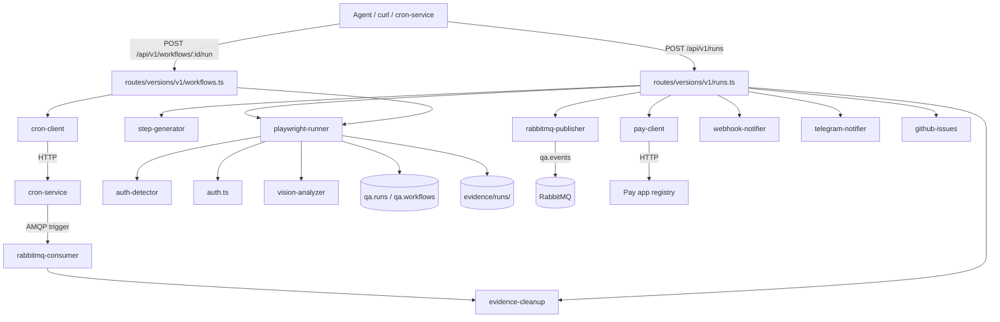

# Architecture

QA Patrol is a single Express 5 process. `src/app.ts` wires the server via `express-server-factory`, mounts routers under `/api/v1`, `/dashboard`, `/evidence`, and boots singletons for the RabbitMQ publisher and consumer ([app.ts:34-99](https://github.com/Jeffrey-Keyser/qa-patrol/blob/main/src/app.ts#L34-L99)).

## Component diagram

## Role contracts

- **HTTP entrypoint** — `src/app.ts` composes middleware, health checks (DB + RabbitMQ), and version negotiation ([app.ts:52-118](https://github.com/Jeffrey-Keyser/qa-patrol/blob/main/src/app.ts#L52-L118)). Routes are mounted under `/api/v1` via the v1 router index ([src/routes/versions/v1/index.ts](https://github.com/Jeffrey-Keyser/qa-patrol/blob/main/src/routes/versions/v1/index.ts)).
- **Runs router** — `runs.ts` owns run CRUD, synchronous execution, and the post-completion hook fan-out ([CLAUDE.md:26](https://github.com/Jeffrey-Keyser/qa-patrol/blob/main/CLAUDE.md#L26)).
- **Workflows router** — `workflows.ts` owns workflow CRUD + cron-service sync; running a workflow creates a `qa.runs` row that links back via `workflow_id` ([CLAUDE.md:27](https://github.com/Jeffrey-Keyser/qa-patrol/blob/main/CLAUDE.md#L27), [migrations/1000000003000_add-workflow-id-to-runs.ts](https://github.com/Jeffrey-Keyser/qa-patrol/blob/main/migrations/1000000003000_add-workflow-id-to-runs.ts)).
- **Playwright runner** — `services/playwright-runner.ts` (~274 lines) launches system Chrome, runs steps sequentially, captures console + 4xx/5xx network errors, screenshots per step ([README.md:164-169](https://github.com/Jeffrey-Keyser/qa-patrol/blob/main/README.md#L164-L169)).
- **Auth pipeline** — `auth-detector.ts` sniffs HTML for pay-auth markers; `auth.ts` runs the 3-tier login (`window.__PAY_AUTH__` → `data-testid` → React onChange hack) ([CLAUDE.md:29-30](https://github.com/Jeffrey-Keyser/qa-patrol/blob/main/CLAUDE.md#L29-L30), [README.md:243-246](https://github.com/Jeffrey-Keyser/qa-patrol/blob/main/README.md#L243-L246)).
- **Step generator** — `step-generator.ts` decomposes free-text `instructions` into structured steps via AI Proxy / gpt-4o ([README.md:215-216](https://github.com/Jeffrey-Keyser/qa-patrol/blob/main/README.md#L215-L216)).
- **Vision analyzer** — `vision-analyzer.ts` posts screenshots to a vision model when `options.enableVisionAnalysis` is set ([README.md:217](https://github.com/Jeffrey-Keyser/qa-patrol/blob/main/README.md#L217)).
- **Probes** — `probe-runner.ts` (~1174 lines) plus probe routes/registry/event publisher implement the smoke-probe subsystem seeded by migrations `1000000005000`…`1000000009000` ([migrations/](https://github.com/Jeffrey-Keyser/qa-patrol/blob/main/migrations/)).
- **Eventing** — `rabbitmq-publisher.ts` emits to the `qa.events` exchange; `rabbitmq-consumer.ts` ingests cron triggers (e.g. evidence cleanup) ([CLAUDE.md:34-35](https://github.com/Jeffrey-Keyser/qa-patrol/blob/main/CLAUDE.md#L34-L35)).
- **DAL** — `src/dal/` centralizes Postgres reads/writes; pool from `src/db/connection.ts` ([CLAUDE.md:41](https://github.com/Jeffrey-Keyser/qa-patrol/blob/main/CLAUDE.md#L41)).
- **Dashboard** — `routes/dashboard-ui` renders SSR pages; `routes/versions/v1/dashboard.ts` powers the SSE stream with polling fallback ([README.md:264](https://github.com/Jeffrey-Keyser/qa-patrol/blob/main/README.md#L264)).

## Data model

Two tables in schema `qa`:

- `qa.runs` — steps, summary, evidence paths, status, optional `workflow_id` ([CLAUDE.md:47](https://github.com/Jeffrey-Keyser/qa-patrol/blob/main/CLAUDE.md#L47)).
- `qa.workflows` — reusable definitions with optional cron schedule ([CLAUDE.md:48](https://github.com/Jeffrey-Keyser/qa-patrol/blob/main/CLAUDE.md#L48)).

Probe tables added by `1000000005000_create-probe-tables.ts` extend the schema for the smoke-probe subsystem ([migrations/1000000005000_create-probe-tables.ts](https://github.com/Jeffrey-Keyser/qa-patrol/blob/main/migrations/1000000005000_create-probe-tables.ts)).
