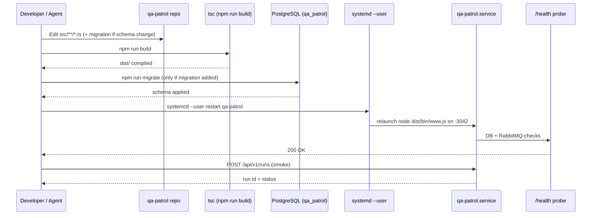

# Iteration Loop

QA Patrol is a small TypeScript service with a Postgres-backed schema and a systemd unit. The change cycle is short: edit → `npm run build` → migrate (if needed) → restart the user-mode service → verify via `/health` and a probe run.

## Cycle diagram

## Steps in detail

1. **Edit** — primary surfaces are `src/routes/versions/v1/*.ts` and `src/services/*.ts` ([CLAUDE.md:26-40](https://github.com/Jeffrey-Keyser/qa-patrol/blob/main/CLAUDE.md#L26-L40)).
2. **Build** — `npm run build` runs `tsc` against the strict TS config; output lands in `dist/` ([package.json:7](https://github.com/Jeffrey-Keyser/qa-patrol/blob/main/package.json#L7)).
3. **Migrate** — schema changes use `node-pg-migrate`. Generators: `npm run migrate:create <name>`; apply: `npm run migrate`; revert: `npm run migrate:down` ([package.json:10-12](https://github.com/Jeffrey-Keyser/qa-patrol/blob/main/package.json#L10-L12)). Migrations are numbered timestamps under `migrations/` ([migrations/](https://github.com/Jeffrey-Keyser/qa-patrol/blob/main/migrations/)).
4. **Restart** — `systemctl --user restart qa-patrol` re-execs the unit ([CLAUDE.md:20](https://github.com/Jeffrey-Keyser/qa-patrol/blob/main/CLAUDE.md#L20)).
5. **Verify health** — `GET /health` calls the DB + RabbitMQ checks wired in `app.ts` ([app.ts:83-92](https://github.com/Jeffrey-Keyser/qa-patrol/blob/main/src/app.ts#L83-L92)).
6. **Smoke a real run** — `POST /api/v1/runs` with a tiny step array exercises Playwright + auth + evidence path end-to-end ([README.md:19-30](https://github.com/Jeffrey-Keyser/qa-patrol/blob/main/README.md#L19-L30)).
7. **Deploy** — production rollout goes through the beelink-deploy webhook ([README.md:59](https://github.com/Jeffrey-Keyser/qa-patrol/blob/main/README.md#L59)).
8. **Post-merge auto-QA** — `scripts/post-merge-qa.sh` is wired into the ecosystem orchestrate flow (Step 11) so merged repos trigger a probe automatically ([README.md:231](https://github.com/Jeffrey-Keyser/qa-patrol/blob/main/README.md#L231)).

## Local dev shortcut

`npm run dev` runs `ts-node src/bin/www.ts` for fast iteration without a `tsc` step ([package.json:6](https://github.com/Jeffrey-Keyser/qa-patrol/blob/main/package.json#L6)). Tests use the node built-in runner: `npm test` → `node --test test/*.test.js` ([package.json:9](https://github.com/Jeffrey-Keyser/qa-patrol/blob/main/package.json#L9)).
