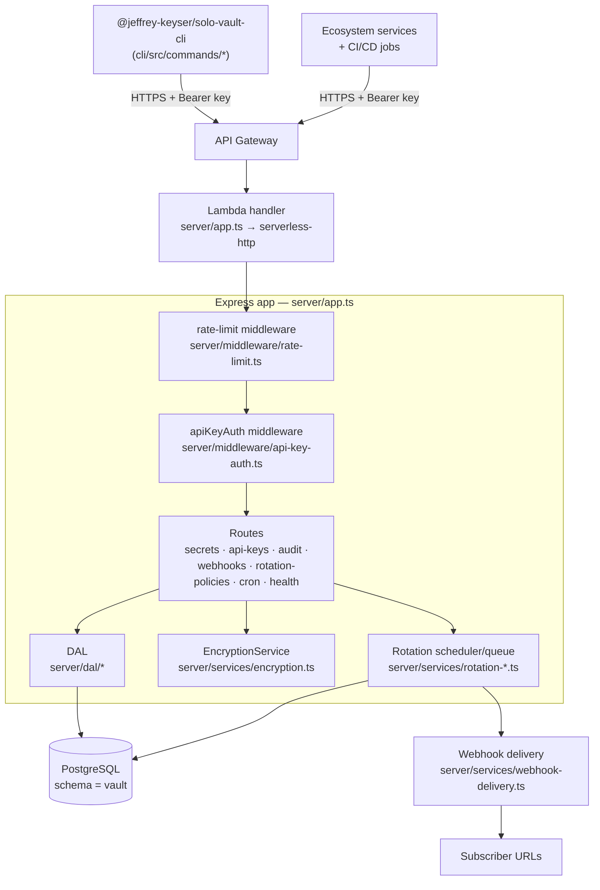

# Architecture

Solo Vault is a two-package monorepo: an Express API server packaged for AWS Lambda, and a Commander-based CLI that talks to the deployed API ([package.json:6-11](https://github.com/Jeffrey-Keyser/solo-vault/blob/main/package.json#L6-L11), [cli/package.json:5-8](https://github.com/Jeffrey-Keyser/solo-vault/blob/main/cli/package.json#L5-L8)). Persistence lives in PostgreSQL under the `vault` schema ([CLAUDE.md:46-50](https://github.com/Jeffrey-Keyser/solo-vault/blob/main/CLAUDE.md#L46-L50)).

## Role contracts

### App composition (`server/app.ts`)
Wires routes, middleware, CORS, swagger, and the database health check via `@jeffrey-keyser/express-server-factory`, then exports both a Lambda `handler` (through `serverless-http`) and an Express app for local dev ([server/app.ts:1-156](https://github.com/Jeffrey-Keyser/solo-vault/blob/main/server/app.ts#L1-L156)). A `schemaReady` promise gates startup on `assertSchemaReady` to fail fast on cold starts with a stale DB ([server/app.ts:28-38](https://github.com/Jeffrey-Keyser/solo-vault/blob/main/server/app.ts#L28-L38)).

### Authentication (`server/middleware/api-key-auth.ts`)
Extracts the API key from `Authorization: Bearer …`, allows a small `PUBLIC_PATHS` set (`/`, `/health`, `/ping`, `/api-docs`), and otherwise resolves the key against `apiKeysDAL` to populate `req.apiKey` with scopes (project, environment, permissions) ([server/middleware/api-key-auth.ts:1-60](https://github.com/Jeffrey-Keyser/solo-vault/blob/main/server/middleware/api-key-auth.ts#L1-L60)). A bootstrap shortcut accepts `BOOTSTRAP_ADMIN_KEY` for first-time setup ([server/middleware/api-key-auth.ts:55-60](https://github.com/Jeffrey-Keyser/solo-vault/blob/main/server/middleware/api-key-auth.ts#L55-L60)).

### Rate limiting (`server/middleware/rate-limit.ts`)
Two `express-rate-limit` instances — `authRateLimiter` runs before auth (per-IP), `writeRateLimiter` runs after auth (per-key) — mounted via `customMiddleware.before` ([server/app.ts:140-143](https://github.com/Jeffrey-Keyser/solo-vault/blob/main/server/app.ts#L140-L143)).

### Routes (`server/routes/*`)
Mounted under `/v1/*`: `secrets`, `api-keys`, `audit`, `webhooks`, `rotation-policies`, `cron`, `health` ([server/app.ts:118-127](https://github.com/Jeffrey-Keyser/solo-vault/blob/main/server/app.ts#L118-L127)). Each route file owns request validation (`express-validator`) and delegates persistence to a DAL module.

### Data Access Layer (`server/dal/*`)
One module per table family — `secrets.ts`, `api-keys.ts`, `audit.ts`, `rotation.ts`, `rotation-policies.ts`, `expiry-alerts.ts`, `webhooks.ts`, `secrets-health.ts` ([server/dal](https://github.com/Jeffrey-Keyser/solo-vault/tree/main/server/dal)). DAL functions accept and return plain objects; the `secrets` DAL pairs with `EncryptionService` for encrypt-on-write / decrypt-on-read.

### Encryption (`server/services/encryption.ts`)
AES-256-GCM with random 16-byte IV per secret; key derived via `crypto.scryptSync(VAULT_ENCRYPTION_KEY, "solo-vault-salt", 32)` ([server/services/encryption.ts:1-39](https://github.com/Jeffrey-Keyser/solo-vault/blob/main/server/services/encryption.ts#L1-L39)). Ciphertext, IV, and auth tag are stored together in the `secrets` row.

### Rotation pipeline (`server/services/rotation-*.ts`)
`rotation-scheduler.ts` walks `rotation_policies` and enqueues due rotations into `rotation-queue.ts`, which executes them and records history. `webhook-delivery.ts` posts rotation/expiry events to subscriber URLs ([server/services](https://github.com/Jeffrey-Keyser/solo-vault/tree/main/server/services)). Cron triggers reach these via the `/v1/cron` route ([server/app.ts:123](https://github.com/Jeffrey-Keyser/solo-vault/blob/main/server/app.ts#L123)).

### CLI (`cli/src/`)
`index.ts` registers each Commander subcommand from `cli/src/commands/*` ([cli/src/index.ts:1-34](https://github.com/Jeffrey-Keyser/solo-vault/blob/main/cli/src/index.ts#L1-L34)). `lib/api-client.ts` centralizes HTTP calls; `lib/config.ts` resolves API URL/key from env (`SOLO_VAULT_URL`, `SOLO_VAULT_API_KEY`), `~/.solo-vault/config.json`, and per-project `.solo-vault.json` ([README.md:249-275](https://github.com/Jeffrey-Keyser/solo-vault/blob/main/README.md#L249-L275)).
