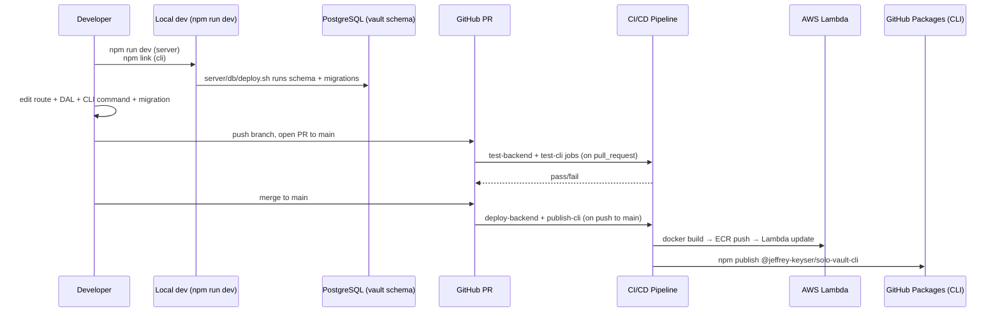

# Iteration Loop

Solo Vault has a single trunk (`main`) and a CI/CD pipeline that gates merges with tests and ships both the server and CLI on push ([.github/workflows/ci-cd-pipeline.yml:1-151](https://github.com/Jeffrey-Keyser/solo-vault/blob/main/.github/workflows/ci-cd-pipeline.yml#L1-L151)).

## Step-by-step

1. **Local environment.** Copy `server/.env.example` to `.env`, run `server/db/deploy.sh` to apply schema + migrations, then `npm run dev` from the repo root (which delegates to `server`) ([package.json:7](https://github.com/Jeffrey-Keyser/solo-vault/blob/main/package.json#L7), [CLAUDE.md:25-49](https://github.com/Jeffrey-Keyser/solo-vault/blob/main/CLAUDE.md#L25-L49)). On startup, `assertSchemaReady` validates the schema matches expectations before listening ([server/app.ts:28-38](https://github.com/Jeffrey-Keyser/solo-vault/blob/main/server/app.ts#L28-L38)).
2. **Make the change.** A new feature typically lands in three places: a route (`server/routes/*`), its DAL (`server/dal/*`), and the corresponding CLI command (`cli/src/commands/*`). Schema changes get a new numbered SQL file under `server/db/migrations/` (next number after `009_…`) ([server/db/migrations](https://github.com/Jeffrey-Keyser/solo-vault/tree/main/server/db/migrations)).
3. **Tests.** Co-located `*.test.ts` files cover each route, DAL, middleware, and service module — run with `npm test` from `server/` (Jest) ([server/package.json:13-15](https://github.com/Jeffrey-Keyser/solo-vault/blob/main/server/package.json#L13-L15)). CLI has its own Jest suite in `cli/tests/` ([cli/package.json:11-12](https://github.com/Jeffrey-Keyser/solo-vault/blob/main/cli/package.json#L11-L12)).
4. **Open PR.** CI runs `test-backend` and `test-cli` jobs (PR-only). Both use the shared `jeffrey-keyser/github-actions` composite action `node-build` with `npm ci` ([.github/workflows/ci-cd-pipeline.yml:10-71](https://github.com/Jeffrey-Keyser/solo-vault/blob/main/.github/workflows/ci-cd-pipeline.yml#L10-L71)).
5. **Merge to `main`.** Two deploy jobs fire on push: `deploy-backend` builds `Dockerfile_Server`, pushes to ECR, updates the Lambda; `publish-cli` runs `npm publish` to GitHub Packages ([.github/workflows/ci-cd-pipeline.yml:73-153](https://github.com/Jeffrey-Keyser/solo-vault/blob/main/.github/workflows/ci-cd-pipeline.yml#L73-L153)).
6. **Verify deploy.** Hit `https://vault.jeffreykeyser.net/health` (returns the configured `healthCheck` with the DB probe) ([server/app.ts:82-90](https://github.com/Jeffrey-Keyser/solo-vault/blob/main/server/app.ts#L82-L90)).

## Conventions worth knowing

- **Migrations are forward-only**, numbered sequentially, applied by `server/db/deploy.sh`; the file `server/db/schema-check.ts` enforces the resulting shape at cold start ([server/db/schema-check.ts](https://github.com/Jeffrey-Keyser/solo-vault/blob/main/server/db/schema-check.ts), [server/app.ts:28-38](https://github.com/Jeffrey-Keyser/solo-vault/blob/main/server/app.ts#L28-L38)).
- **No staging environment** — `main` deploys straight to production Lambda. Treat PR review + tests as the gate.
- **CLI version bumps** must be committed in `cli/package.json` before merge; `publish-cli` will fail if the version already exists in the registry ([cli/package.json:3](https://github.com/Jeffrey-Keyser/solo-vault/blob/main/cli/package.json#L3)).
