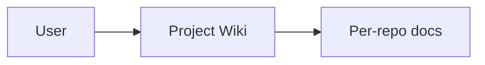

This page exercises Mermaid rendering at build time. If the diagram below appears as
inline SVG in the static HTML output, the scaffold's Mermaid integration is wired up
correctly.

```mermaid
flowchart LR
  user[User]
  wiki[Project Wiki]
  repos[Per-repo docs]
  user --> wiki
  wiki --> repos
```
