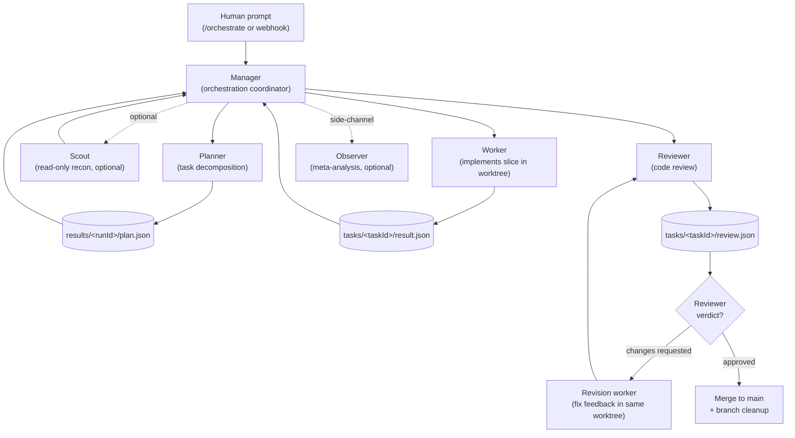

> The diagram below is a **high-level model** of how a `dev-inbox` run
> moves through its agent roles. The real implementation includes
> revision loops, optional enrichment, observer side-channels, and
> per-task slot/worktree management that this overview deliberately
> elides — for the exact contract, see the cited source files.

## Roles in one breath

A human kicks off the run with `/orchestrate` (or the standalone
script); the Manager is judgment-only and never reads source itself —
instead it spawns the role agents in this order: Planner → (optional)
Scout → Worker → Reviewer → (optional) Revision worker → merge
([CLAUDE.md:6-12](https://github.com/Jeffrey-Keyser/dev-inbox/blob/main/CLAUDE.md#L6-L12),
[CLAUDE.md:20](https://github.com/Jeffrey-Keyser/dev-inbox/blob/main/CLAUDE.md#L20)).

## Diagram — manager → planner → scout → worker → reviewer → revision → merge

## Role contracts

### Manager — `prompts/manager-system.md`

The Manager is the orchestration coordinator. It is **judgment-only**:
it spawns Planner / Scouts / Workers / Reviewers, blocks on tmux
signals, and surfaces decisions to the human. It does not author
prompts or read source itself
([CLAUDE.md:20](https://github.com/Jeffrey-Keyser/dev-inbox/blob/main/CLAUDE.md#L20)).
The slash-command spec that defines its lifecycle lives at
[`.claude/commands/orchestrate.md`](https://github.com/Jeffrey-Keyser/dev-inbox/blob/main/.claude/commands/orchestrate.md)
([CLAUDE.md:17](https://github.com/Jeffrey-Keyser/dev-inbox/blob/main/CLAUDE.md#L17)).

### Planner — `prompts/planner-system.md` + `scripts/spawn-planner.sh`

The Planner owns task decomposition, persona / skill / followup / ADR
injection, and `enrich` + `maxRevisions` decisions. Its output is the
canonical `results/<runId>/plan.json`; it runs as a single-shot agent
with no worktree, signalled via `tmux wait-for "planner-<runId>"`
([CLAUDE.md:21-22](https://github.com/Jeffrey-Keyser/dev-inbox/blob/main/CLAUDE.md#L21-L22)).

### Scout — `prompts/scout-system.md` + `scripts/spawn-scout.sh`

Scouts are **read-only** recon agents that produce per-task enrichment
when the plan flags it. They run in the repo (no worktree) and emit
`tasks/<taskId>/scout.md`
([CLAUDE.md:10](https://github.com/Jeffrey-Keyser/dev-inbox/blob/main/CLAUDE.md#L10),
[CLAUDE.md:24](https://github.com/Jeffrey-Keyser/dev-inbox/blob/main/CLAUDE.md#L24)).

### Worker — `prompts/worker-system.md` + `scripts/spawn-worker.sh`

Each Worker is an Agent CLI session in a tmux pane, scoped to a fresh
git worktree
([CLAUDE.md:8](https://github.com/Jeffrey-Keyser/dev-inbox/blob/main/CLAUDE.md#L8),
[CLAUDE.md:25-26](https://github.com/Jeffrey-Keyser/dev-inbox/blob/main/CLAUDE.md#L25-L26)).
The worktree is created on a branch derived from the task id
([spawn-worker.sh:122](https://github.com/Jeffrey-Keyser/dev-inbox/blob/main/scripts/spawn-worker.sh#L122)).
On exit, `scripts/write-result.sh` records the result JSON
([CLAUDE.md:27](https://github.com/Jeffrey-Keyser/dev-inbox/blob/main/CLAUDE.md#L27)).

### Reviewer — `prompts/reviewer-system.md` + `scripts/spawn-reviewer.sh`

Reviewers are Agent CLI sessions that re-enter the worker's worktree
and write a structured verdict at `tasks/<taskId>/review.json` via
`scripts/write-review.sh`
([CLAUDE.md:9](https://github.com/Jeffrey-Keyser/dev-inbox/blob/main/CLAUDE.md#L9),
[CLAUDE.md:29](https://github.com/Jeffrey-Keyser/dev-inbox/blob/main/CLAUDE.md#L29),
[CLAUDE.md:33](https://github.com/Jeffrey-Keyser/dev-inbox/blob/main/CLAUDE.md#L33)).

### Revision worker — `prompts/worker-revision-system.md` + `scripts/spawn-revision.sh`

When a Reviewer requests changes, the Manager re-launches the Worker
agent in the **same** worktree using the revision prompt template; the
contract is "fix reviewer feedback" rather than "implement the slice
from scratch"
([CLAUDE.md:30-31](https://github.com/Jeffrey-Keyser/dev-inbox/blob/main/CLAUDE.md#L30-L31)).

### Observer (optional) — `prompts/observer-system.md`

A meta-analysis agent that watches the full run end-to-end and writes
`results/<runId>/observer.json`. It is enabled by default and can be
suppressed with `--no-observe` on the Manager
([CLAUDE.md:11](https://github.com/Jeffrey-Keyser/dev-inbox/blob/main/CLAUDE.md#L11)).

## How signals travel

The Manager does not poll worker processes directly — instead, every
lifecycle transition is appended to
`results/<runId>/dispatch-events.jsonl`, which the Manager tails as
the source of truth
([CLAUDE.md:11-13](https://github.com/Jeffrey-Keyser/dev-inbox/blob/main/CLAUDE.md#L11-L13)).
The frozen event-type registry —
`run_start`, `plan_complete`, `worker_spawn`, `worker_complete`,
`reviewer_complete`, `revision_complete`, `run_complete`, etc. — is
defined in
[`scripts/lib/event-types.sh`](https://github.com/Jeffrey-Keyser/dev-inbox/blob/main/scripts/lib/event-types.sh)
([CLAUDE.md:48](https://github.com/Jeffrey-Keyser/dev-inbox/blob/main/CLAUDE.md#L48)).

> Nuance worth surfacing: the system is in a **14-day bake period**
> migrating projection from bash to the Go `plan-managerd` binary.
> Until the bake closes, both lanes dual-write and a regression in
> either is visible
> ([CLAUDE.md:11](https://github.com/Jeffrey-Keyser/dev-inbox/blob/main/CLAUDE.md#L11)).
