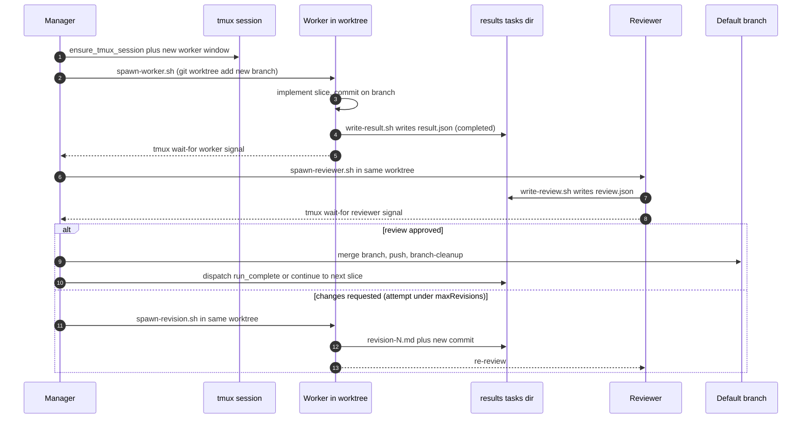

This page traces a single slice from the moment a plan exists through
merge. The flow is the same whether the run was started by
`/orchestrate` or by `scripts/manager-standalone.sh` — only the entry
point differs (see [Operations](../operations/)).

## Diagram — one slice end to end



## Stage notes

### 1. Plan exists, slice is queued

The Planner has already written `results/<runId>/plan.json`. That file
is the canonical task list and is consumed by the Manager to dispatch
slices
([CLAUDE.md:21](https://github.com/Jeffrey-Keyser/dev-inbox/blob/main/CLAUDE.md#L21)).
Manager dispatch obeys a global concurrency budget — at most **12**
agent CLI processes at once — enforced by
[`scripts/acquire-slot.sh:22`](https://github.com/Jeffrey-Keyser/dev-inbox/blob/main/scripts/acquire-slot.sh#L22)
(`MAX_SLOTS="${1:-${DEV_INBOX_MAX_SLOTS:-12}}"`).

### 2. tmux session + worker pane

The Manager ensures one tmux session per run, named
`dev-inbox-<run-token>` via
[`tmux_session_name_for_run`](https://github.com/Jeffrey-Keyser/dev-inbox/blob/main/scripts/lib/spawn-common.sh#L293-L296)
and creates / reuses windows through
[`ensure_tmux_session`](https://github.com/Jeffrey-Keyser/dev-inbox/blob/main/scripts/lib/spawn-common.sh#L311-L350).
Each Worker runs in its own window inside that session.

### 3. Worker executes in a fresh worktree

`scripts/spawn-worker.sh` creates an isolated branch and worktree for
the slice:

```bash
git worktree add -b "$BRANCH_NAME" "$WORKTREE_DIR" "$WORKTREE_BASE_REF"
```

([spawn-worker.sh:122](https://github.com/Jeffrey-Keyser/dev-inbox/blob/main/scripts/spawn-worker.sh#L122)).
The Worker commits inside that worktree; the rest of the orchestrator
treats the worktree as the durable artifact of the slice
([CLAUDE.md:8](https://github.com/Jeffrey-Keyser/dev-inbox/blob/main/CLAUDE.md#L8),
[CLAUDE.md:26](https://github.com/Jeffrey-Keyser/dev-inbox/blob/main/CLAUDE.md#L26)).

### 4. Result file emission

On Worker exit, `scripts/write-result.sh` lands the canonical result
JSON at `results/<runId>/tasks/<taskId>/result.json`. The status is
derived from the exit code: `completed`, `failed`, `blocked`, or
`aborted`
([CLAUDE.md:27](https://github.com/Jeffrey-Keyser/dev-inbox/blob/main/CLAUDE.md#L27)).
A `worker_complete` event is appended to
`dispatch-events.jsonl` so the Manager can wake up
([CLAUDE.md:48](https://github.com/Jeffrey-Keyser/dev-inbox/blob/main/CLAUDE.md#L48)).

### 5. Reviewer pass

The Manager spawns a Reviewer agent that re-enters the same worktree
and writes a structured verdict via `scripts/write-review.sh` at
`tasks/<taskId>/review.json`
([CLAUDE.md:33](https://github.com/Jeffrey-Keyser/dev-inbox/blob/main/CLAUDE.md#L33)).

### 6. Revision loop (bounded)

If the Reviewer requests changes and the per-task `attempt` is below
the `maxRevisions` budget, the Manager re-launches the Worker in the
**same** worktree using `scripts/spawn-revision.sh` plus the revision
prompt template. Each pass writes a fresh
`tasks/<taskId>/revision-<attempt>.md` artifact and a new commit before
the Reviewer runs again
([CLAUDE.md:30-31](https://github.com/Jeffrey-Keyser/dev-inbox/blob/main/CLAUDE.md#L30-L31)).
`maxRevisions` is chosen by the Planner alongside the slice itself
([CLAUDE.md:21](https://github.com/Jeffrey-Keyser/dev-inbox/blob/main/CLAUDE.md#L21)).

### 7. Merge and cleanup

Once a slice's review is approved, the Manager merges the worker
branch into the default branch, pushes, and the dedicated branch /
worktree cleanup scripts retire the artifacts:

- [`scripts/worktree-cleanup.sh`](https://github.com/Jeffrey-Keyser/dev-inbox/blob/main/scripts/worktree-cleanup.sh)
  removes the on-disk worktree once the branch is merged.
- [`scripts/branch-cleanup.sh`](https://github.com/Jeffrey-Keyser/dev-inbox/blob/main/scripts/branch-cleanup.sh)
  triages remote `dev-inbox/*` branches: auto-deletes those already on
  main, prompts Land / Discard / Defer / Skip for the rest
  ([CLAUDE.md](https://github.com/Jeffrey-Keyser/dev-inbox/blob/main/CLAUDE.md)).

### 8. Next slice

Manager dispatch continues until the plan is exhausted. The final
event in `dispatch-events.jsonl` will be one of `run_complete`,
`run_failed`, or `run_aborted`
([CLAUDE.md:48](https://github.com/Jeffrey-Keyser/dev-inbox/blob/main/CLAUDE.md#L48)),
matching the canonical liveness markers `startup.json` /
`failed.json` written by
[`scripts/lib/run-state.sh`](https://github.com/Jeffrey-Keyser/dev-inbox/blob/main/scripts/lib/run-state.sh)
([CLAUDE.md:35](https://github.com/Jeffrey-Keyser/dev-inbox/blob/main/CLAUDE.md#L35)).

## What this leaves out

- Failure classification, observer side-channel events, and the
  partially-rolled-out Go projector backend are summarized in
  [Architecture → How signals travel](../architecture/#how-signals-travel).
- Operational entry points and inspection commands live in
  [Operations](../operations/).
