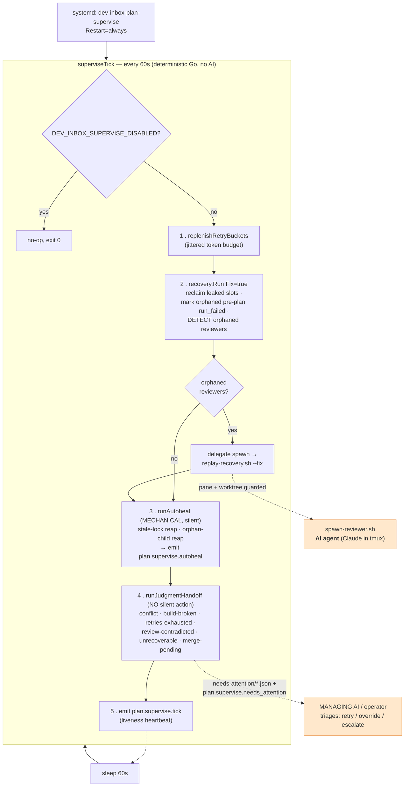

> `dev-inbox-plan-supervise` is a **plain compiled Go process — no AI, no LLM
> calls.** It is the watchdog/janitor for the orchestration machinery: a
> deterministic 60-second tick that self-heals stuck runs so a plan can reach
> completion **unattended**. It never reasons; it heals mechanically, or escalates
> to a human / the managing AI. Source:
> [`cmd/plan-managerd/supervise.go`](https://github.com/Jeffrey-Keyser/dev-inbox/blob/main/cmd/plan-managerd/supervise.go),
> design record:
> [`design/resilient-unattended-orchestration/`](https://github.com/Jeffrey-Keyser/dev-inbox/blob/main/design/resilient-unattended-orchestration/design.md).

## Tick flow (as built)



The two dotted edges are the **only** places intelligence enters. The daemon
itself is 100% deterministic — it can *launch* an agent (orphan-reviewer respawn)
or *hand a decision* to the managing AI (judgment faults), but it never reasons.

## The core idea — two recovery classes

| Class | Examples | Daemon behavior |
|---|---|---|
| **Mechanical** (one correct outcome) | stale lock held by dead PID, orphan `tail` child, leaked slot, orphaned reviewer | **Auto-heals silently** inside the tick |
| **Judgment** (many possible outcomes) | merge conflict, broken build, retries exhausted, contradicted review, unrecoverable state, merge-pending | **Never acts silently** — writes a `needs-attention` handoff artifact + event for a human / the managing AI |

## What each tick does

1. **Replenish retry buckets** — refills per-plan jittered token budgets.
2. **Recovery pass** (`recovery.Run`, `Fix:true`) — reclaims leaked concurrency/dispatch slots, marks orphaned pre-plan runs failed (`run_failed` + `failed.json`), and **detects** orphaned reviewers. Go *decides*; when an orphan exists it delegates the side-effecting respawn to the bash `replay-recovery.sh --fix` (pane + worktree guarded, so no spurious spawn).
3. **Mechanical auto-heal** — stale-lock reap (`.slices.lock` / `.retry-bucket.lock` held by a dead process) and orphan-child reap (safelisted `tail/watch/less/sleep/nc/socat`). Emits `plan.supervise.autoheal` per action; idempotent.
4. **Judgment detect-and-handoff** — classifies judgment faults and writes one idempotent `plans/<id>/needs-attention/*.json` (evidence + recoveryRefs + suggestedActions) + emits `plan.supervise.needs_attention`. No silent retry/merge/dispatch.
5. **Heartbeat** — emits `plan.supervise.tick` to `results/supervise-events.jsonl`.

## Guardrails

- **No silent merges.** Terminal `complete` gates the integration merge behind verify-pass **and** managing-AI sign-off; absent either → `merge-pending` handoff + exit code 2, **no** `git merge`.
- **Crash-only.** Holds no authoritative in-memory state — all truth is the durable event log, so kill/restart loses nothing (`Restart=always`).
- **Kill-switches.** `DEV_INBOX_SUPERVISE_DISABLED` (whole tick no-op), `DEV_INBOX_SUPERVISE_NO_AUTOHEAL` (mechanical heals off, detect-only).

## Why it exists

Before this daemon, the recovery primitives existed but `replay-recovery.sh` had
**no timer** — so the dominant stuck-cause was simply "recovery wasn't running."
This is the always-on timer that runs them, and — critically — separates silent
mechanical healing from judgment calls that genuinely need a brain.

## Operate

```bash
systemctl --user status dev-inbox-plan-supervise
systemctl --user restart dev-inbox-plan-supervise
journalctl --user -u dev-inbox-plan-supervise -f
```
